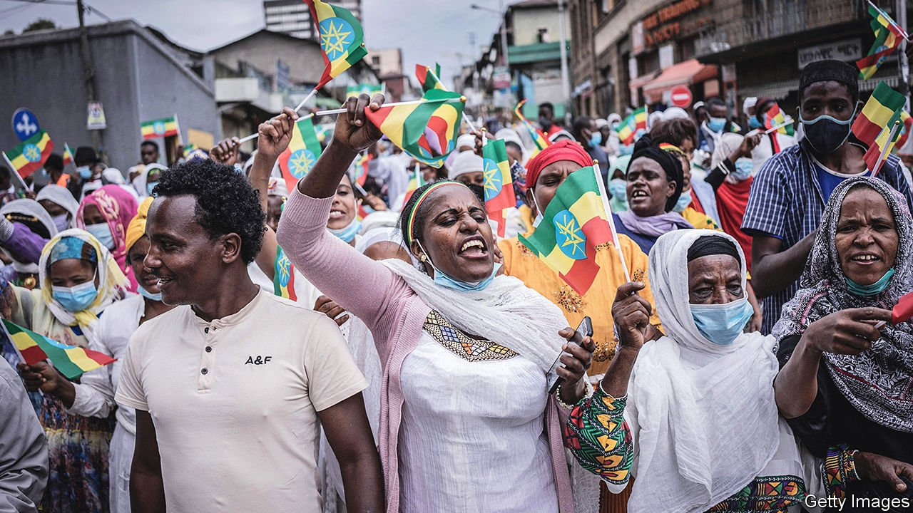

###### Abiy against the world

# Ethiopia is losing friends and influence 

##### An essential Western ally now faces sanctions and isolation 

 

> Oct 9th 2021 

IT WAS ONE of the grandest ceremonies that Meskel Square had ever witnessed. Part military parade, part cultural jamboree, the spectacle in the heart of the Ethiopian capital, Addis Ababa, was so lavish that one might have mistaken it for the inauguration of a president or the crowning of a monarch.

In fact, the focus of the pomp was Abiy Ahmed, Ethiopia’s prime minister. He came to power when his predecessor resigned amid massive protests in 2018. Although the early months of his tenure involved mending relations with the opposition and signing a peace deal with Eritrea (for which he won a Nobel prize in 2019), his rule has since been marred by ethnic unrest, a slowing economy and a devastating civil war in the northern state of Tigray. The event on October 4th marked the start of his first full five-year term as prime minister, following elections in July.


The ceremony was in part a riposte to those questioning Abiy’s legitimacy, above all the Tigrayan People’s Liberation Front (TPLF), which once called the shots in the country and is now at war with the central government. “We have reached a new era,” Abiy told cheering crowds (pictured), one in which power “emanates only from the genuine voice of the people via the ballot box”. But the voice was somewhat muffled by an opposition boycott and the decision to call the election off in a fifth of districts because of violence. Small wonder that Abiy’s Prosperity Party won more than 90% of the seats contested.

The show was also aimed at an international audience. Relations between Ethiopia and many Western countries have sunk to their lowest point in decades. Last month America said it would slap sanctions on officials involved in the war in Tigray if the parties (which also include Eritrean troops fighting alongside Ethiopian forces) did not start talks or allow food to reach those cut off by the government’s blockade of the state. Martin Griffiths, the UN’s humanitarian chief, warned on September 29th that hundreds of thousands could starve. Abiy’s response was to expel seven senior UN officials, accusing them of “meddling” in Ethiopia’s affairs.

In his speech Abiy declared that Ethiopia would never submit to foreign pressure. In the past such prickly talk typically masked a great degree of pragmatism, as Ethiopia attempted to win friends and gain international influence. For instance, it championed IGAD, a regional bloc, and contributed more peacekeeping troops to the UN than almost any other country. It also cultivated close ties with China and America, becoming the latter’s eager ally in its “war on terror”. Ethiopia enjoyed such clout in Washington that when it invaded Somalia in 2006 to topple an Islamist government, America joined in.

The picture now is very different. Abiy’s decision to cosy up to Eritrea’s dictator, Issaias Afwerki, has divided IGAD. Ethiopia’s relations with Sudan have soured, leading to border clashes. Even more spectacular is the falling out with the West. Barely a week goes by without a rally against alleged foreign interference, or a statement by a senior official denouncing “foreign enemies”. A stream of conspiracy theories floods state media: that America is supplying TPLF fighters with drug-laced biscuits, for example, or that UN agencies are smuggling weapons. In August the government halted the work of Médecins Sans Frontières and the Norwegian Refugee Council, two aid organisations.

Three factors are contributing to Ethiopia’s growing isolation. The first is Abiy’s capricious approach to foreign policy, which is characterised by personal relationships rather than engagement with institutions. He has sidelined the foreign ministry and closed or downsized dozens of embassies. He has alienated foreign leaders with a string of unkept promises, such as those to allow aid to reach Tigray or to eject Eritrean troops. And he has infuriated America by buying drones from Iran and snubbing American envoys.

The second factor is the West’s perceived double standard. From 1991 to 2018, when the TPLF dominated the Ethiopian government, America routinely turned a blind eye to its ally’s human-rights violations. Because the Ethiopian army was helping fight jihadists in Somalia, a brutal campaign against separatists in Ethiopia’s own Somali region drew scant condemnation. “The West emboldened the TPLF and whitewashed its past sins,” argues Zelalem Moges, an Ethiopian lawyer. More recently, the administration of Donald Trump sided with Egypt and Sudan in their dispute with Ethiopia over a huge dam it is building on the Blue Nile. “Abiy genuinely believes the United States is trying to overthrow him,” notes an American diplomat. “He believes that he is this pro-American, liberalising market reformer that we have shunned.”

Most important is a disagreement about the wisdom of continuing the war. “Our demands are quite simple: end the war and our relations are by definition better,” says a European diplomat. African officials, though quieter, tend to agree. Even Russia and China, which Abiy hopes will plug any financial holes left by cuts in Western aid and military assistance, have been reticent. Both have opposed punitive measures in the UN Security Council. China has also criticised American sanctions. But neither has offered Abiy much by way of practical support.

Abiy has hinted privately that he might be open to negotiations with the TPLF. The special envoy of the African Union (AU) to the Horn of Africa, former Nigerian President Olusegun Obasanjo, has reportedly been given permission to sound out the Tigrayan leadership. But the TPLF, which considers the AU biased against it, may not accept its mediation. The prime minister, for his part, made no mention of talks in his inaugural address and seems determined instead to launch a new offensive. That may force the hand of America, which is deciding whether to suspend duty-free access for Ethiopian goods under the African Growth and Opportunity Act. Already bad, relations between Ethiopia and its allies are set to sink further. ■

