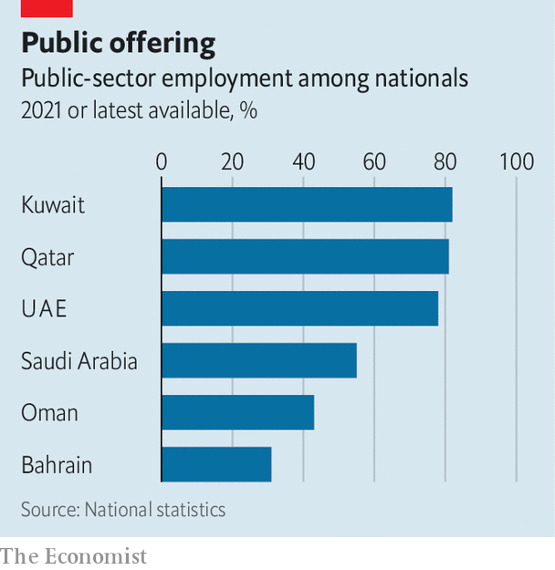

###### When nine-to-five is a stretch

# Gulf states are trying to increase private employment 

##### But subsidising pay is proving costly and ineffective 

 

> Oct 7th 2021 

BY NOW GULF rulers have tried almost everything. For much of the region’s modern history well-paid government jobs have been a birthright for citizens. This perk forms the core of the region’s social contracts: cushy, lucrative employment in exchange for the deprivation of political rights. Worried about growing populations and uncertain oil revenues, though, Gulf states have spent the past two decades trying to persuade and prod their pampered subjects to work for privately owned firms. It has been a real-world experiment in economics—and a largely unsuccessful one at that.

In September the United Arab Emirates (UAE) announced its latest attempt, a programme that will cost 5bn dirhams ($1.3bn) a year (0.3% of GDP). At its core are wage subsidies of up to 8,000 dirhams a month for the first year and up to 5,000 dirhams a month for the next five years, for citizens who take private jobs.


Like its neighbours, the Emirati government is keen to trim its own workforce. In 2019, 78% of Emiratis in employment worked in the public sector, even though these made up just 10% of the country’s total jobs. Only 8% of citizens worked solely at private firms. These numbers have changed little over time: in 2008, 80% of Emiratis worked for the state.

 


This makes sense: governments tend to pay better. While few publish detailed statistics, the IMF puts the public-to-private wage gap in the Gulf at 30-50% for nationals. Public employees have easier schedules—seven hours a day in the UAE, compared with eight at private firms—and better benefits. The government of Dubai recently gave employees an extra six days of paid leave to celebrate the world expo that began on October 1st. Private-sector workers had no such luck. Moreover, public jobs offer not only lifetime employment but also annual raises (and other benefits) that often outpace both inflation and pay increases at private firms.

But wage subsidies are often ineffective at tempting nine-to-fourers to give up their cushy life. For proof the UAE need only look to nearby Kuwait, which has offered them since 2001. Depending on education and family size, some Kuwaitis can take home almost $5,000 a month in salary top-ups. The IMF estimated in 2015 that subsidies cost the government $2bn a year (some of that is siphoned off by “ghost workers”, who collude with employers to share the payout).

What subsidies have not done is reshape Kuwait’s workforce. Since 2005 the share of public-sector employment amongst citizens has fallen by just nine percentage points, to 82%. For the past five years, numbers have moved in the wrong direction: the number of private-sector jobs decreased by 3% from 2015 to 2020, whereas the civil service swelled by 22%, to 338,000 employees.

One reason subsidies fail is that they generally target the wrong people. A Kuwaiti with a specialised degree receives a subsidy two or three times larger than a high-school graduate, and almost seven times more than someone who did not finish high school. But wage gaps in the Gulf tend to be lowest for highly skilled jobs. An engineer with a university degree needs less incentive to join a private firm than a high-school graduate competing with poorly paid migrants. Employers also complain that many job-seekers have the wrong skills. Universities in the Gulf churn out lots of graduates with degrees in business or the humanities, neither of which are in high demand.

Subsidies also put governments in a bind. Though they may lower the initial wage gap, they are meant to be temporary inducements. In time governments must choose whether to remove them, which could lead some workers to quit, or keep paying them, which is expensive. Some economists suggest instead setting a minimum wage for citizens, which would, in effect, pass the costs of subsidies to employers, with quotas or prohibitive fees to stop them from hiring foreigners. Others wonder about a universal basic income, which would still be expensive but would avoid distorting the labour market.

For all the money they lavish on public employees, though, Gulf governments do not get much value, in part because of a system that rewards workers based on seniority rather than merit. Saudi Arabia spends 6% of its GDP on education, well above most countries, but it ranks poorly in international educational rankings.

The UAE seems to have taken some of these issues to heart. It plans to spend 1.3bn dirhams on vocational training in such fields as property management and accountancy and to offer scholarships for nursing degrees. Some of its subsidies will also be targeted at finance, health care and property, which have the potential to employ lots of people. But those jobs still need to be made more attractive than their cushy public-sector counterparts. Perhaps the most useful thing governments can do is to make their own pen-pushers work more for less. That would certainly be a cheaper way to shrink the wage gap. ■

