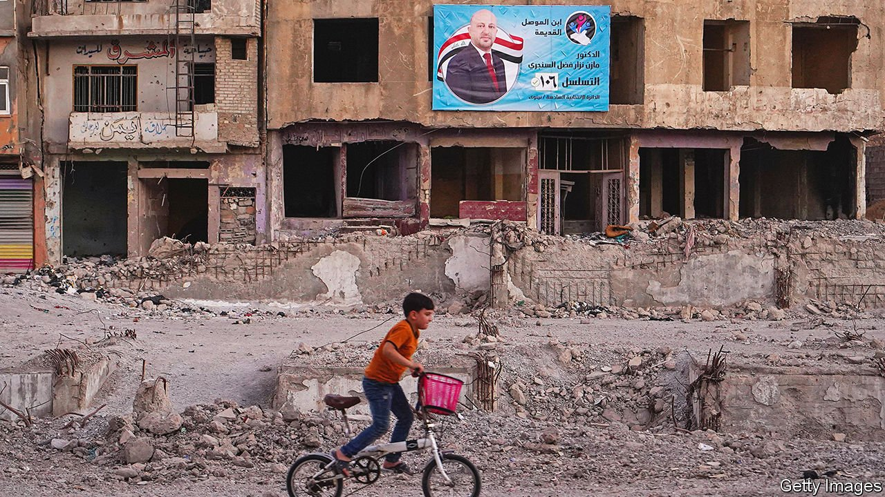

###### Boycott the boycott

# Iraq’s election could be worthless if few turn out to vote 

##### A threatened boycott may merely help the militias 

 

> Oct 7th 2021 

A FATWA ISSUED by Ali al-Sistani, an influential Grand Ayatollah, was all it took to push Iraq’s Shia Muslims into risking death in battle with the jihadists of Islamic State in 2014. But his edicts seem to be having less success at persuading Iraqis to stroll sedately to the ballot booth to vote on October 10th. Although parliament bowed to the demands of young protesters for an early election, it now seems that most Iraqis will boycott the event. If that happens, sectarian and ethnic militias, especially those closest to Iran, will probably tighten their grip all the more.

Iraqis’ previous exercise in democracy was less than edifying. In 2018 only 44% of those eligible bothered to cast their ballots. Some compensated for the low turnout by voting again and again. Days after parliament ordered a recount, a warehouse storing a million ballots went up in flames. Since then Iraq has worked to make the coming vote more credible. It has increased the number of constituencies, which ought to benefit independent candidates. Some 70% of voters will have biometric cards, which should reduce fraud. And there will be five times as many foreign monitors as there were in 2018, including, for the first time, a contingent from the European Union.


Yet apathy and cynicism still prevail. Many of those in the vanguard of mass protests two years ago are calling for a boycott. “The politicians don’t respect us, so I don’t respect them,” says one of them, convinced that Iraq’s armed factions will never cede power at the ballot box.

The commonest worry is that, even if the election itself is fairer than usual, the horse-trading afterwards will result in yet another corrupt carve-up between the main factions. Ministries are still likely to be divided between the biggest parties, with oil revenues treated as a cash-cow to be shared out, including to party militias. “They sit in a closed room and choose a malleable fig-leaf to represent them,” says a businessman in Baghdad, referring to the present prime minister.

Shias, who make up the majority of Iraqis and live mainly in the centre and south, have lost the most faith in politics. Two years ago hundreds of thousands of them joined the protests, demanding free and early elections to break the militias’ hold. But the country’s armed groups have since grown in power, shooting hundreds dead with impunity, chasing the protesters off the streets and quashing their efforts to form a political movement by killing, kidnapping and intimidating them.

Moreover, lots of independent candidates who claim to represent the protesters are splitting the vote, with the result that few, if any, will win seats. “Each candidate feels he alone is king of the protest square,” says Yasser Mekki, a dentist who joined the protests in the city of Najaf. Some have looked to the West to help create a secular bloc, but America seems to have tired of its democratising mission.

Further dividing the country is the fractiousness of Iraq’s three main groups: Shia, Sunni and Kurd. The Shias sport an array of parties, many of which are armed. Sairoun, which is led by a podgy cleric-cum-militia-leader, Muqtada al-Sadr, won the biggest share of the vote in 2018. But his campaign in his old base—the shantytowns of Baghdad and the cities of the south—has flagged. This is perhaps because of his party’s failure to use its clout in parliament to improve the lot of its supporters. Other armed factions closer to Iran are bidding for his former voters. Qais al-Khazali, the leader of Asaib Ahl al-Haq, a powerful chain of militias that broke away from Mr Sadr, now sings to the tune of Ali Khamenei, Iran’s supreme leader. Kataib Hizbullah, another armed Shia group known for firing rockets at America’s embassy, is standing for the first time. Several Shia militias have sought Iran’s guidance to save them from splitting their vote.

One consolation is that the election has been surprisingly free of violence. But its outcome will depend on whether people heed the experience of Sunnis, who lost out in earlier polls. “We’ve learnt our lesson,” says Nada Jabouri, a Sunni candidate in Baghdad. “Boycotts don’t work.” ■

