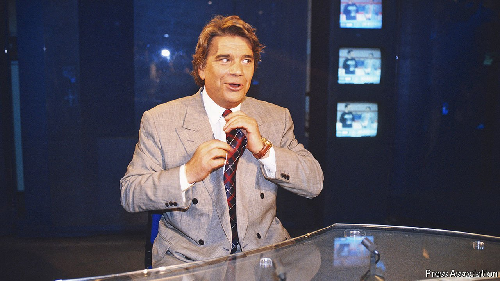

###### Coeur de lion

# Obituary: Bernard Tapie, a colourful and controversial French businessman 

##### The entrepreneur, crooner, football magnate and television star, died on October 3rd, aged 78 

 

> Oct 9th 2021 

IN THE SPRING of 1985, Bernard Tapie appeared in a new French television programme, “Le jeu de la vérité” (Game of Truth). It usually starred entertainers such as Alain Delon and Elton John; Mr Tapie was the first businessman to take part. A painful austerity plan was squeezing the economy. On the show he took calls from factory owners who had lost their businesses, from workers cast out of their jobs. None of them could quite believe what had happened. Firm, yet trying to be fair, he listened carefully before replying. And then it was his turn to bare his soul, for intimate revelation was what “Le jeu de la vérité” was really all about.

Stepping onto the stage, he swayed gently to the beat. His three-piece was more a costume than a suit: the jacket a little boxy, the plum square peaking out of his pocket like a tongue in search of a kiss. His tie gleamed pearly-pink, and his buoyant chestnut hair shone brighter than Julio Iglesias’s. He closed his eyes and stretched out an arm. “J’aurais voulu être un artiste,” he crooned. “Pour pouvoir faire mon numéro…” Standing before a rose-lit, double white staircase that ascended who knew where, he seemed to be wearing lip gloss.


Born in 1943 under the German occupation, he grew up with his younger brother in a flat with mean little windows, the upper part of a small two-storey house in a suburb of Paris. Not as blue-collar as neighbouring La Courneuve, nor as weighed down by history as Drancy to the south, where France’s Jews were rounded up before being deported to extermination camps in Germany and Poland, Le Bourget was home to France’s first civilian airport. Like many of the newly prosperous travellers who passed through, without looking up, on their way into the city, from an early age he wanted out. In a school photograph, pals drape an arm about his shoulders as he puffs out his chest with attitude.

To some he was Robin Hood in a blazer, to others a short-trousered Antichrist. A born ringleader, he was often in trouble. Later he would boast of having an engineering degree, but he barely finished high school. He wanted to be Jean Gabin, star of the Moulin Rouge and lover of Marlene Dietrich. This gosse de banlieue, the boy from the wrong side of the tracks, poured his energy into getting gigs singing at clubs while selling TVs on the side. His first single, “Je ne crois plus les filles” (I don’t believe girls anymore), did quite well, but the next two were a flop.

What he was good at, he found, was hustling and making money. In his 20s he had his first tax audit, his first bankruptcy (of a small business that sold hi-fi and home appliances), and his first run-in with the authorities (while driving an untaxed Lamborghini). Starting with two companies that made paper, he moved into buying distressed businesses, sometimes for as little as one franc, stripping out the assets and letting them founder or turn over and rise up again. He even starred in a TV ad for one of his firms, a battery-maker called Wonder. In the clip he moves like a tornado through an office. “What keeps Tapie going?” the tagline asks. “Me? I run on Wonder!” In the final seconds, an assistant takes out his batteries and he keels over. As he hits the floor, he winks.

Success brought him to the attention of bankers, politicians and opportunists. Sport, with television, was the new nexus of power, not only in France but wherever young men and women hungered for a different kind of hero. Backed by his bank, state-owned Crédit Lyonnais, he bought Adidas, a sports-shoe brand with a great history, but which had fallen on hard times. Within two years he had started to turn it around. He restored a long, elegant sailing yacht, and in 1988 it made the fastest monohull crossing of the Atlantic. The Tour de France cycling race was won twice by a team sponsored by his firm, La Vie Claire, a chain of shops selling health products. At the same time, Olympique de Marseille (OM), his football club, began its bid to win the French championship four years in a row. In 1993, on the second attempt, OM beat the favourites, AC Milan, 1-0 in a surprising final, the first time a French team had ever won the European Champions League. As he stumbled onto the pitch, he wiped away tears.

Marseille is a city of immigrants. As his reputation grew among the Marseillais, it was inevitable that he began to interest the country’s most powerful politicians. Gaston Defferre, the mayor of Marseille, was a close friend of the socialist president François Mitterrand. When the two men, the intellectual president and the performer-capitalist, met for the first time for lunch, they talked for nearly four hours. He persuaded him to run for office. His bravura attack in a television debate (where else) on the National Front leader, Jean-Marie Le Pen, proved his political nous.

Naming him urban-affairs minister to address the malaise in poor areas of high unemployment was inspired. Ever the performer, he would head into the banlieues, and shout at those who watched him from behind closed windows. “Come on down. And I’ll tell you what the plan is.”

Mitterrand was impressed by his energy. But when weakening, physically and politically, the aged president was no longer able to protect him. Having witnessed how a working-class outsider could confound the established French system of politics and patronage, many both on the left and the right were glad to see him brought low, first by charges of corruption and match-fixing in football, then by more than 20 years of litigation with Crédit Lyonnais over the sale of his shares in Adidas, and by the collapse of much of his business empire. He even went to prison.

From the ashes

Marina Zenovich, who spent three years following him for her documentary, “Who Is Bernard Tapie?”, says he had the “charming good looks of Warren Beatty, the bravado of Donald Trump, the charisma of Bill Clinton. And he fell from grace like O.J. Simpson.” The day he died, his eldest son, Stéphane, who knew him better than most, posted a photo on Instagram of the two of them, mic in hand, jamming together onstage: “Au revoir mon Phénix.”■

