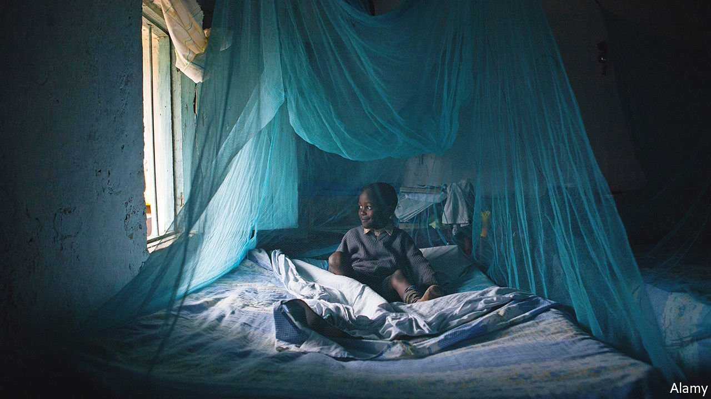

###### Ready to roll

# A malaria vaccine is approved by the World Health Organisation 

##### It reduces the number of severe malaria cases by 30% 

 

> Oct 7th 2021 

MALARIA IS ONE of medical science’s most formidable foes. The search for a vaccine has been going on for decades. Dozens of candidates have been tested in recent years. But so far only one, a jab called RTS,S, made by GlaxoSmithKline, has proved effective in the final stages of clinical trials. On October 6th the World Health Organisation (WHO) recommended RTS,S for use in childhood vaccination in places with transmission of Plasmodium falciparum, the deadliest of the five parasites that cause malaria, and the most common in Africa.

The WHO reached its decision after reviewing results from Ghana, Kenya and Malawi, where more than 800,000 infants were vaccinated with a four-dose regimen. In these countries RTS,S was included among the routine childhood vaccines distributed by primary health-care centres. This implementation programme, in which RTS,S reduced by 30% the number of cases of severe malaria which led to hospital admissions, therefore measured what kind of efficacy can be expected if the vaccine is rolled out widely across Africa.


Some may think that 30% efficacy is not much. But in parts of sub-Saharan Africa children contract malaria six times a year on average. Each year more than 260,000 African children die of it before their fifth birthdays. Those who survive often suffer lifelong harm, including stunting, a form of impaired growth that affects the ability to learn. The impact of RTS,S will thus be huge.

Crucially, the WHO says that the vaccine was found to be safe after more than 2.3m doses had been administered—clearing the air on three “safety signals” that had popped up in an earlier trial. It also says the jab is highly cost-effective. The next step is therefore for GAVI, an international organisation that buys vaccines for poor countries, to decide whether it will add RTS,S to its portfolio.

An early version of this article was published online on October 6th 2021

