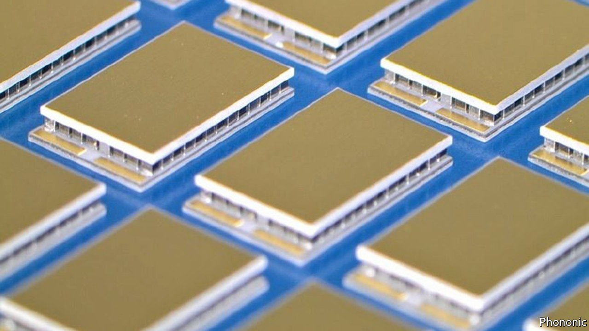
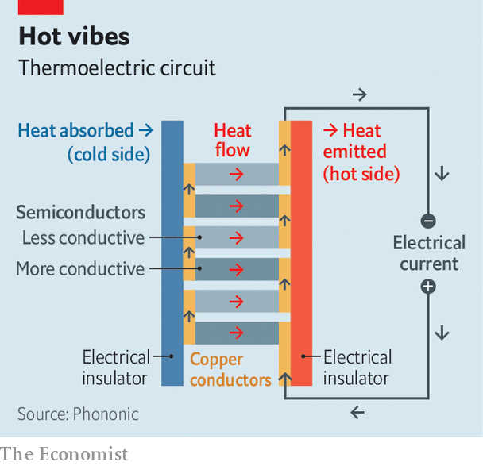

###### Thermoelectric heat transfer

# A novel way to heat and cool things 

##### A new approach to carrying heat around as an electric current 

 

> Oct 7th 2021 

REFRIGERATORS AND air-conditioners are old and clunky technology, and represent a field ripe for disruption. They consume a lot of electricity. And they generally rely on chemicals called hydrofluorocarbons which, if they leak into the atmosphere, have a potent greenhouse-warming effect. Buildings’ central-heating systems, meanwhile, are often powered by methane in the form of natural gas, which releases carbon dioxide, another greenhouse gas, when it is burned, and also has a tendency to leak from the pipes that deliver it—which is unfortunate, because methane, too, is a greenhouse gas, and one much more potent than CO.

One potential way of getting around all this might be to exploit what is known as the thermoelectric effect, a means of carrying heat from place to place as an electric current. Thermoelectric circuits can be used either to cool things down, or to heat them up. And a firm called Phononic, based in Durham, North Carolina, has developed a chip which does just that.


The thermoelectric effect was discovered in 1834 by Jean Charles Peltier, a French physicist. It happens in an electrical circuit that includes two materials of different conductivity. A flow of electrons from the more conductive to the less conductive causes cooling. A flow in the other direction causes heating.

 


The reason for this is that electrons are able to vibrate more freely when pushed into a conductive material. They thereby transfer energy to their surroundings, warming them. When shunted into a less conductive one, electrons’ vibrations are constrained, and they absorb energy from their surroundings, cooling those surroundings down. An array of thermoelectric circuits built with all the high-conductivity materials facing in one direction and all the low conductivity ones in the other can thus move heat in either direction, by switching the polarity of the current. For reasons buried in the mathematics of quantum physics, the heat thus flowing does so in discrete packages, called phonons. Hence the name of the firm.

The thermoelectric effect works best when the conductors involved are actually semiconductors, with bismuth and tin being common choices. Fancy cameras contain simple cooling chips which use these, as do some scientific instruments. But Phononic’s boss, Tony Atti, thinks that is small beer. Using the good offices of Fabrinet, a chipmaker in Thailand, he has started making more sophisticated versions at high volume, using the set of tools and techniques normally employed to etch information-processing circuits onto wafers made of silicon. In this case, though, the wafers are made of bismuth.

The results are, admittedly, still a long way from something that could heat or cool a building. But they are already finding lucrative employment in applications where space is at a premium. At the moment, the fastest-growing market is cooling the infrared lasers used to fire information-encoding photons through fibre-optic cables, for the long-distance transmission of data. They are also being used, though, in the 5G mobile-phone base stations now starting to blanket street corners, to keep the batteries of electric vehicles at optimal operating temperatures, and as components of the optical-frequency radar-like systems known as LIDAR, that help guide autonomous vehicles.

The crucial question from Mr Atti’s point of view is whether semiconductor-based thermoelectronics can break out of these niches and become more mainstream, in the way that semiconductor-based electronics and lighting have done. In particular, he would like to incorporate heat-pumping chips into buildings, to provide them with integral thermoregulation.

In their current form, thermoelectric chips are unlikely to replace conventional air conditioning and central heating because they cannot move heat over the distances required to pump it in and out of a building in bulk. But they could nonetheless be used as regulators. Instead of turning a big air-conditioning system on or off, to lower or raise the temperature by the small amounts required to maintain comfort, with all the cost that entails, thermoelectric chips might tweak matters by moving heat around locally.

Phononic has already run trials of such local-temperature-tweaking chips in Singapore, in partnership with Temasek, that country’s state-run investment fund. In 2019 SP Group, Singapore’s utility company, installed eight of the firm’s heat pumps, which comprise an array of chips pointed down at people, pumping heat out of the air above them, on the boardwalk on Clarke Quay in the city. Phononic claims the devices lowered the temperature in their vicinity by up to 10°C and, as a bonus, consequently reduced humidity by 15%. If that can be scaled up, it would certainly be a cool result. ■

