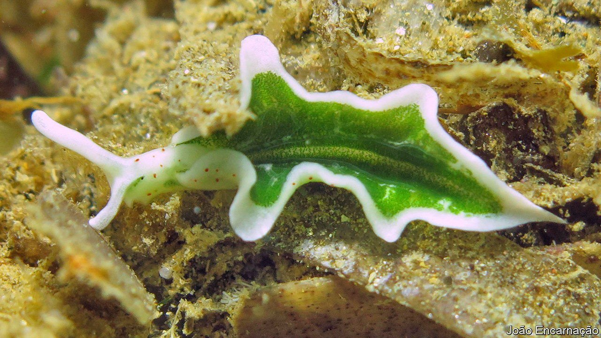

###### Sea slugs and chloroplasts

# One of nature’s strangest symbioses gives up its secrets 

##### An animal has added bits of algae to its reproductive system 

 

> Oct 7th 2021 

UNLIKE THEIR terrestrial cousins, sea slugs are widely regarded as among the most beautiful animals on Earth. In some cases, part of that beauty comes from subcellular structures called chloroplasts, which they extract intact from the algae they eat and then sequester in gut diverticula for purposes of their own.

Chloroplasts are the distant descendants of photosynthetic bacteria that became symbiotic, a bit less than 2bn years ago, with an organism ancestral to today’s algae and plants. From their hosts’ point of view, their purpose is to use energy from sunlight to split water into hydrogen and oxygen, and then react the hydrogen with carbon dioxide to form molecular precursors of glucose. Further reactions turn these basic materials into other biochemicals, too. Rearranging the carbon, hydrogen and oxygen atoms and adding nitrogen, for example, results in amino acids, the building blocks of proteins.


The best guess, therefore, was that slugs sequester chloroplasts in their diverticula in order that they might continue photosynthesising there. But the details were obscure. So, to shed more light, as it were, Sónia Cruz of the University of Aveiro, in Portugal, and her colleagues collected some sea slugs and ran a few experiments.

As they write in a paper in the Proceedings of the Royal Society, they supplied the slugs with simple chemicals (sodium bicarbonate and ammonia) containing unusual carbon and nitrogen atoms. Instead of normal carbon, which has six neutrons, the bicarbonate contained seven-neutron carbon. Similarly, the ammonia contained nitrogen with eight neutrons instead of the regular seven. Molecules with these rare isotopes can be detected using a technique called mass spectrometry, so the fates of the atoms involved are easy to follow.

Having thus treated their slugs, the team exposed half of them to light for 36 continuous hours and kept the other half in the dark. As they expected, they saw the unusual isotopes of carbon and nitrogen enter the chloroplasts of slugs exposed to light. By contrast, little of the heavy nitrogen and none of the heavy carbon entered the chloroplasts of slugs kept in the dark. What intrigued them, though, was the subsequent fate of those isotopes.

A naive assumption would be that the products of the captured chloroplasts would be scattered around a slug’s body, and thus made available to all of its organs. In fact, most of them ended up in a structure called the albumen gland, which produces nutrients that are then incorporated in the animal’s eggs (the species concerned, Elysia timida, is a hermaphrodite, so all individuals bear eggs). The rest migrated directly into the slugs’ gonads.

This result suggested that, rather than helping with an animal’s general weal, chloroplasts have been co-opted by Elysia for a specific role in reproduction. To check that idea, the team conducted a further experiment. They kept pairs of slugs for 28 days either in normal light or in conditions of greatly reduced illumination and counted the number of eggs laid.

Pairs exposed to normal light averaged 238 eggs per week over the course of the experiment. Those kept almost in the dark averaged 129. This pretty-much clinched the idea that the ingested chloroplasts have, somehow, become extensions of Elysia’s reproductive system, and that chloroplasts, those superbly adapted symbionts of algae and plants, have been able to adjust, too, to life as part of a very different host indeed. ■

An early version of this article was published online on October 6th 2021

