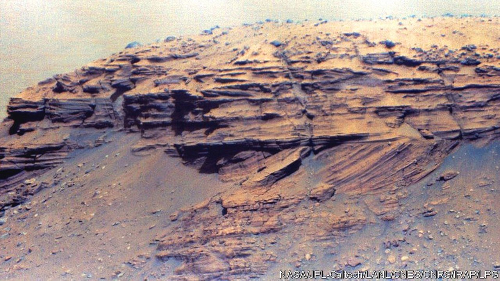

###### New from the solar system

# The Moon and Mars give up more secrets 

##### A Chinese and an American mission report their latest results 

 

> Oct 7th 2021 

THIS PICTURE of a set of sedimentary rocks, just published in Science, could have come from any geology textbook. Its illustration of the bottomset-foreset-topset transition found in river deltas is a classic of stratigraphy. Except that, technically, it is not a geological feature at all. The word “geology” derives from the Greek for “Earth discourse”. The rocks in question, however, are on Mars.

Specifically, they are in Jezero crater, which was once, when Mars had liquid water, a lake that had rivers flowing into it. The photograph was taken by Perseverance, NASA’s latest Mars rover, which landed in February, and adds to understanding of Mars’s watery past. The three groups of rocks—the gently inclined bottomset, with a more steeply sloping foreset above and a horizontal topset capping the lot—show, as might be expected, that Martian river deltas were similar to terrestrial ones.


The field of selenology (Moon discourse) also had a boost this week with the publication, again in Science, of results from China’s Chang’e-5 lunar-sample-return mission. This landed on December 1st 2020, on the Moon’s largest lava field, Oceanus Procellarum, the Ocean of Storms, and returned its samples to Earth on December 16th. Though now dead calm, in the distant past this was indeed a stormy place, for it was covered with liquid rock that subsequently solidified into the dark plain now visible to the naked eye in the Moon’s north-western quadrant.

The question is, when did all this happen? And the answer provided by Che Xiaochao of the Beijing SHRIMP Centre, a part of the Chinese Academy of Geological Sciences, and his colleagues, is just under 2bn years ago. That is quite a long time, but is less than half the Moon’s age. Orbital evidence from crater counting had already suggested parts of Oceanus Procellarum were the youngest lava fields on the Moon. Recent features have a lower density of craters than do old ones. But estimates based on crater counting had ranged from 1.2bn to 3.2bn years. An exact date for the region’s formation helps calibrate the technique, which is used not only for the Moon, but also for Mercury and Mars.■

