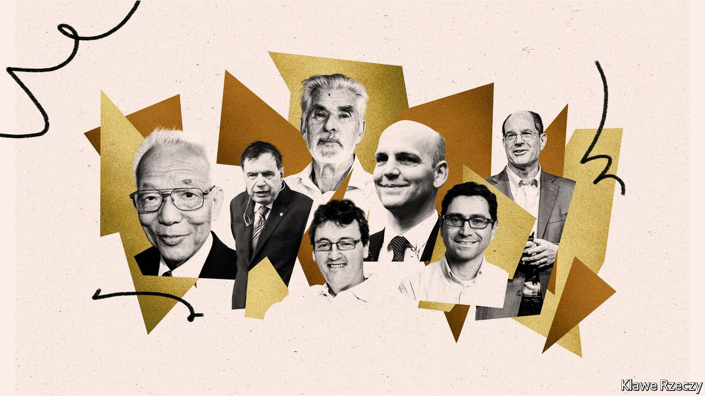
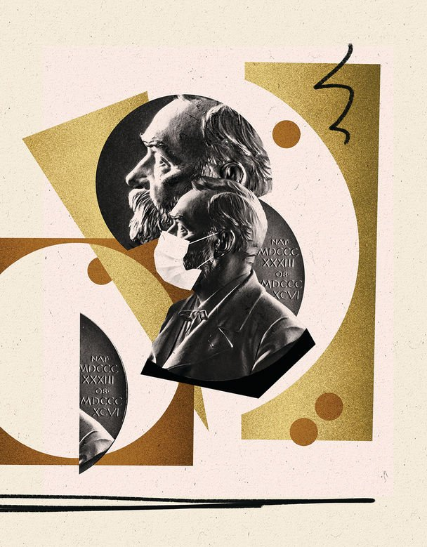

###### The 2021 Nobel science prizes

# This year’s Nobel prizes brought both delight and disbelief 

##### Important work was honoured, but there was a surprising omission 

 

> Oct 9th 2021 

SCIENTISTS SOMETIMES refer elliptically to winning a Nobel prize as “the trip to Stockholm”. Not this year, it isn’t. The white-tie award ceremony in the Concert Hall, the splendid banquet in the City Hall and—for those who can last the pace, the equally splendid unofficial after-party in the students’ union of one of Stockholm’s universities (they rotate the honour) are all cancelled, just as they were last year. That will probably not, however, diminish the joy of this year’s laureates. They will be on cloud nine already, having snagged the most famous awards in science.

The physics prize went to three researchers who have studied complex, chaotic and apparently random systems and developed ways to predict their long-term behaviour, with implications ranging from how to study the climate to the exploitation of exotic materials. Half of the award of SKr10m (about $1.1m) was shared by Syukuro Manabe of Princeton University and Klaus Hasselmann of the Max Planck Institute for Meteorology, in Hamburg. The other half went to Giorgio Parisi of Sapienza, the principal university in Rome.


Drs Manabe and Hasselmann laid the foundations of the modelling of Earth’s climate that led to “quantifying variability and reliably predicting global warming”, according to the Nobel Committee for Physics of Sweden’s Royal Academy of Science. Dr Parisi was awarded his share for discoveries around the “interplay of disorder and fluctuations in physical systems from atomic to planetary scales”.

Heat and light

In the 1960s Dr Manabe, an atmospheric scientist, wove together emerging strands of understanding of the dynamics and thermodynamics of Earth’s atmosphere to make the first reliable prediction that doubling the level of carbon dioxide present would also increase the planet’s surface temperature. His work led to the development of physical models of Earth’s climate and laid the foundation for the climate models used today.

Around the same time, scientists such as Edward Lorenz of the Massachusetts Institute of Technology were beginning to describe weather as a chaotic system—in other words, something that had so many interacting individual components, such as temperature, pressure, humidity and wind speed, that even small variations in initial conditions could result in enormous differences at a later stage. In this description, weather evolved rapidly and became essentially unpredictable even just a few days into the future.

In the 1970s Dr Hasselmann developed models to show how weather, despite being chaotic and unpredictable in the short-term, could yield reliable models to foreshadow Earth’s climate over much longer periods. In describing his work he made an analogy to Brownian motion, the jostling movement of pollen grains in water that was first observed down a microscope by Robert Brown, a botanist, in 1827. Almost 80 years later, Albert Einstein posited that the slow zigzagging of such grains could be explained by their continual bombardment by much tinier, fast-moving water molecules. The large-scale climate can similarly be seen as a consequence of numerous smaller events.

Around 1980 Dr Parisi found some of the rules that govern apparently random phenomena. He studied a type of material called “spin glass”, in which, for example, iron atoms are mixed at random into a matrix of copper atoms. The iron atoms each behave as tiny magnets but, whereas in a normal lump of magnetised metal their north-south poles all point in the same direction, in a spin glass they do not. Dr Parisi devised a way to understand how they find their optimal orientations. His mathematical ideas not only help explain some of the complex systems of Earth’s climate, as described by his two fellow laureates, but also illuminate other apparently random phenomena in fields as diverse as animal behaviour, neuroscience and machine learning.

This year’s physics prize is the first scientific Nobel awarded for understanding of the climate. Asked if this was a not-so-subtle message to world leaders ahead of the upcoming COP26 climate summit in Glasgow, members of the award committee said the prize was meant to celebrate the discoveries themselves. But, they added, it also showed that the modelling of the climate and the notion of global warming rest on solid physical science. Human beings can no longer say they did not know how or why Earth is heating up.

Ringing the changes

The chemistry prize was shared by Benjamin List, of the Max Planck Institute for Coal Research, in Mülheim an der Ruhr, and David MacMillan, of Princeton University. Their prizewinning work, published in 2000, was conducted independently, and unknown to each other at the time, but with the same end in mind. This was to break the stranglehold of enzymes and transition metals on the field of catalysis.

Some chemical reactions proceed with alacrity. Most, though—including many that are industrially important—need a helping hand in the form of a catalyst. Evolution has provided a goodly range of these in the form of enzymes, which are large, complicated and sometimes temperamental protein molecules, but which have the advantage that they can create pure versions of what are known as optical isomers. These are molecules that have two forms which are mirror images of each other. This is important in the drug industry, for the different versions, known as enantiomers, can have different effects in the body. Also, if you choose the right enzymes, it is often possible to carry out multi-step reactions in only a few stages.

Transition metals are those in the middle of the periodic table—copper, nickel and iron, for example. The structures of the electron shells surrounding the nuclei of their atoms are complicated, meaning they are chemically versatile. This is what makes them good catalysts. Some transition-metal catalysts are the metals themselves. More often, they are small molecules that include a transition-metal atom. Transition-metal catalysts can be easier to handle than enzymes, but usually fail to distinguish between enantiomers. Also, transition-metal compounds are frequently toxic, with all the environmental consequences that entails. And multi-step reactions involving them can be long-winded.

Dr List and Dr MacMillan found a way to have the best of both worlds: small-molecule catalysts that have no metal atoms in them, can turn out pure enantiomers, and often simplify multi-step reactions. That has significant industrial implications.

Dr List worked on an enzyme called aldolase A. This catalyses what is known as the aldol reaction, an important way of forging molecular bonds between carbon atoms. Aldolase A is made of 350 amino acids, the building blocks of proteins, but the bit that does the work consists of only three of these: lysine, glutamic acid and tyrosine. The rest of the enzyme is packaging. He therefore wondered if he could isolate the enzyme’s active centre and yet preserve its activity. In fact, he did better. He showed that the aldol reaction can be catalysed by a single amino acid, proline. And, crucially, this retains the enantiomeric purity of the enzyme-mediated reaction.

Dr MacMillan came from the other end of the problem. He wanted to remove the metal (in this case copper) from the catalyst involved in a different process, the Diels–Alder reaction. This is a way of joining two molecules into a six-carbon ring. One of the reagents contributes four carbon atoms to the ring and the other contributes two. Six-carbon rings are ubiquitous in organic chemistry, and by putting different side groups onto the reagents a vast variety of them can be turned out. Dr MacMillan found he could catalyse Diels-Alder reactions using a type of metal-free molecule called an imidazolidinone to activate the two-carbon component, meaning that it combines enthusiastically with its four-carbon compadre.

 


The result of these two pieces of work is a field called asymmetric organocatalysis (the asymmetric part of the name referring to its ability to generate pure enantiomers), that is now rippling through industrial chemistry. And, since industrial chemistry, in one form or another, underpins most economic activity, it is also rippling, however invisibly, through life.

Sense and sensibility

The idea that there are five senses goes back at least as far as Aristotle. But it is not quite true. Four of the senses are obvious, if only because each is associated with a particular organ: sight with the eyes, hearing with the ears, taste with the tongue and smell with the nose. But the fifth classical sense, touch, is distributed over the whole surface of the body, albeit that it is concentrated in the fingertips.

Touch, moreover, is only one such distributed sense. Others perceived consciously include pain, heat and cold. And modern science has shown there are also unconsciously perceived senses, known collectively as proprioception. These keep track of the position and movement of the body and its parts. This year’s Nobel prize for physiology or medicine went to the discoverers of the molecular mechanisms of two of these distributed senses—temperature and mechanical stimulation.

The winners were David Julius of the University of California, San Francisco and Ardem Patapoutian of Scripps Research, a biomedical institute in San Diego. Dr Julius did the pioneering work on temperature. He and Dr Patapoutian, acting independently, then advanced this work. After that, Dr Patapoutian moved on to look at mechanical stimulation.

Dr Julius’s chosen tool for his investigation, which he began in the late 1990s, was capsaicin. This is the active ingredient of chilli peppers. By a chemical coincidence (as was then assumed and is now known) capsaicin reacts with, and thus stimulates, one of the body’s heat-receptor proteins. Dr Julius set out to discover what this protein was. To do so he made millions of fragments of genetic material for proteins known to be active in heat-receptor cells. He then introduced these fragments into other cells, to encourage them to manufacture the relevant protein fragments. That done, he tested the modified cells for sensitivity to capsaicin.

The fragments which induced capsaicin sensitivity turned out to be parts of a protein now called TRPV1. This belongs to a class of proteins called ion channels, which do many jobs in the body. As predicted, TRPV1 turned out to be heat sensitive. When the temperature rises above 43°C, the channel through it opens, permitting ions of calcium and sodium to pass. That chemical signal stimulates a nerve impulse which tells the brain about the temperature change.

TRPV1 turned out to be one of several temperature-sensitive ion channels, some of which register heat, and some cold. It was one of the cold-sensitive varieties, TRPM8, which was discovered simultaneously by Dr Julius and Dr Patapoutian.

Dr Patapoutian then went on to look at the sensation of touch. Molecular biology having advanced in the interim, he was able to work with whole proteins—or, rather, the genes for whole proteins. He identified 72 proteins, expressed in a mechanically sensitive cell line, that looked like potential touch-sensitive ion channels. He tested them one at a time, by silencing the genes that encode them and poking the resulting cells. The first 71 silencings had no effect. But the 72nd proved to be of the protein he was looking for. He called that protein PIEZO1.

In nature, PIEZO1 is found not in sensory neurons, but rather in organs like the bladder where pressure sensitivity is important. But Dr Patapoutian discovered a similar channel, PIEZO2, which is, indeed, found in nerve endings. It is this that is responsible for touch and proprioception.

Fascinating work, then. And important. It is through the senses, and the senses alone, that people are able to perceive the world. But to some the award came as a surprise. In a year of covid, they had been expecting the honours to go elsewhere—perhaps to the inventors of mRNA-vaccine technology. Like God, however, the various Nobel-prize committees work in mysterious ways their wonders to perform. ■

