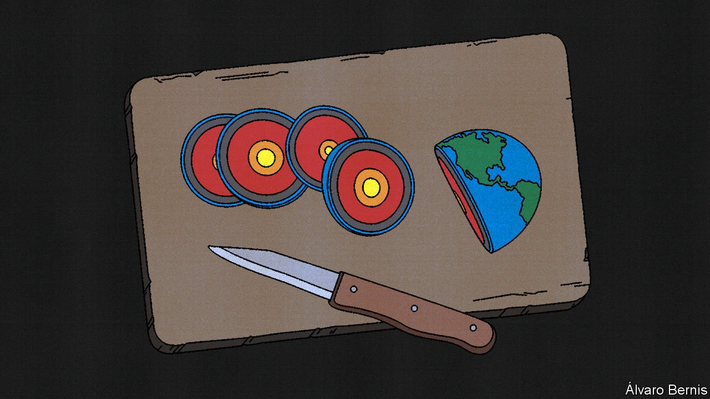

###### The new rules

# A changed world 

##### International commerce needs firmer underpinnings 

 

> Oct 6th 2021 

WHAT IS THE biggest threat to world trade? Stressed supply-chain managers might say new logistical bottlenecks that have seen the cost of shipping rocket recently. Macroeconomists could offer demand change, notably the depressive effect of a possible renewed pandemic. But those taking a longer view might point to the new order of trade policy, which involves more intimidation, discrimination and ultimately, isolation. In short, the very foundations of the multilateral trading system are under assault, from several directions at once.

Some of this reflects adaptation to changed political objectives, such as new concerns to respond to human-rights abuses or to climate change. A back-of-the-envelope calculation based on estimates by the OECD suggests that a carbon tariff based on a CO price of $75 a tonne may represent an average extra cost of only around 2%. That seems manageable. When the risk of shocks is rising, whether from natural disasters, pandemics or the willingness of foreigners to weaponise their economic clout, it makes sense to work up strategies for coping. That could mean diversification through trade deals, constructive co-ordination over standards, or sensible stockpiling.


But as well-intentioned governments try to co-ordinate new ways to add non-trade goals to commerce, the risk of mismanagement or the proliferation of special interests is high. Economic nationalism crafted behind trade barriers could coddle companies, impede technology transfer or limit the profits available for research and development. Subsidies could distort trade flows and generate tensions between allies as they fight over who should bear the cost of supply that is greater than demand. Over the long run, the extra anxiety around international supply chains could mean that national borders come to matter more in practice than they should do in theory.

Push all this to its limits, and there is a risk that the forces of globalisation could even go into reverse. That supply chains now so often criss-cross international borders actually raises the cost of trade barriers. If the EU had cut off vaccine exports to Britain in early 2021 amid a heated row over scarce supplies, it might have jeopardised crucial inputs for its own production. But that could be changing. Reshoring supply chains may, ironically, increase the likelihood of new trade barriers in future as it makes them less costly. And that could raise the incentive to start unravelling today’s close economic relationships.

Questions that need answering

If global leaders are to prove the trade pessimists wrong, they need to offer clearer answers to three big questions. First, where are the limits to what trade tools can achieve? Sometimes there is a tendency “to overload the boat a bit”, comments Mr Dombrovskis, the EU’s trade commissioner, warning of the need for a balance between the idea of setting new tests for trade deals and the feasibility of passing them. Some humility when it comes to unilateralism may be in order. If countries trying to export their standards or to exert their power are only a slice of suppliers’ markets, they may do little to produce change in rich countries while disrupting business in poor ones.

Second, what happens when the increasingly complex stew of non-trade objectives has internal contradictions? Those eager for greater resilience or most worried about human-rights abuses may argue for trade barriers against solar-panel imports, to shift sourcing from China. But that could conflict with short-run efforts to fight climate change with cheap renewable energy. Bernard Hoekman, an academic at the European University Institute, who is leading a project on the effects of EU trade policy on non-trade policy goals, warns of misdirected resources, away from aid that goes directly towards improved economic governance or telecoms and logistics links.

Third, how should the consequences of new trade barriers be managed and contained? That job was for some years done by the WTO, which allowed limited retaliation if governments were in breach of their obligations. In its absence, governments should know that protection has consequences, if only in the form of possible retaliation. Since 2016, there is evidence of a rise in the share of global trade that is subject to trade restrictions, even excluding those related to the US-China trade war.

If and when answers to these three questions emerge, the trading system that they suggest may be quite like the one that is now slowly being dismantled. It ought to include mutually agreed rules overseen by independent arbiters, to deliver legitimacy and stability. It must allow clearly defined exceptions, to prevent abuse and allow adaptation. It needs to respect the use of trade tools to help deliver geopolitical, security, environmental and human-rights goals. But it should also recognise the risks of asking trade to do too much. And it would, logically, point to revitalising and reinforcing the WTO, rather than undermining it further, as several members are continuing to do. ■

Full contents of this special report


The new rules: A changed world*

