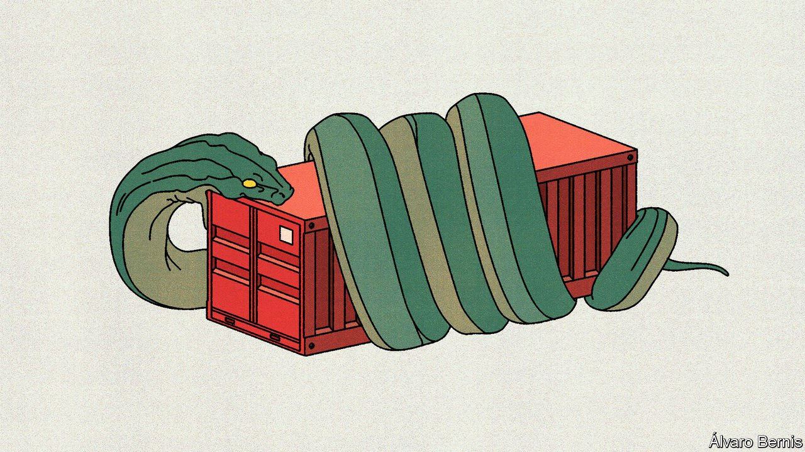
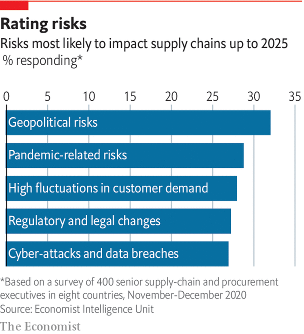

###### Trade law

# A fraying system 

##### In global trade, power increasingly trumps rules 

 

> Oct 6th 2021 

MITCHELL TAYLOR, an Australian winemaker, got advice from his agent when he tried to uncork the Chinese market in the 1990s: “it’s all about relationships.” But after Australia became China’s top wine supplier in 2019, this fruitful relationship soured. In November 2020 the Chinese government imposed tariffs on wine from Australia of more than 200%, allegedly because it was being “dumped” on its market at excessively low prices, but in reality as a response to the Australian government’s call for an investigation into the origins of covid-19. Mr Taylor lost a third of his export sales. He reckons the Chinese were sending a message to the world: “don’t upset us.”

This is by no means the first time that China has flaunted its market power. But today’s context is different. Over the past few years, even as China has defied the spirit, if not the letter, of the WTO’s rules, America has also broken the organisation’s dispute-settlement mechanism, brandished tariffs against allies and imposed trade restrictions for national security. As the two giants have become locked in economic conflict, both have flouted the underlying principle of the multilateral system, which is that trade should be governed by rules not power.


America has long been central to the system, as both an architect and an enforcer. Despite flirting with unilateralism in the 1970s and 1980s, it accepted that a more stable trade system served its interests. After helping to write the WTO rules in the early 1990s, it beckoned China into the club in 2001. And it worked to preserve the WTO’s core principle of non-discrimination. Between 1995 and early 2017 American governments filed 114 complaints against other countries at the WTO, over four-fifths of them for problems that affected other members too. (For comparison, over half of the 434 disputes filed by other countries were purely bilateral.)

Yet critics always said this permissive approach hurt American workers. And in 2017 they came to power. Robert Lighthizer, a former United States Trade Representative (USTR), reckons one of the Trump administration’s big contributions to trade politics was its interest in matters other than maximising company profits. In 2017, rejecting the idea that rules-based dispute settlement serves American interests, it began blocking appointments to the WTO’s appellate body. If the government thought another country was undermining its interests, it would decide unilaterally on suitable punishment. France received tariff threats after proposing to tax American tech giants, and China was hit with tariffs.

Mr Lighthizer says the second contribution was to see that “China is an adversary and not a friend.” China’s economic model, with its murky relations between state and private sector, had long strained the legalistic WTO system. The autocratic tendency of China’s president, Xi Jinping, shifted American thinking. Under the Obama administration, China’s prosperity was thought to be good for America and the world, but now it was often seen as conflicting with the goal of maintaining American military, technological and economic supremacy. That implied less open trade and more investment screening, plus tariffs and export controls.

The Biden administration is chummier towards allies. But on China and the WTO, it is not much different from its predecessor. Enforcement of rules through the WTO does not seem to be part of its plan, so it continues to block appointments to the appellate body. Based on a narrow view of self-interest, this may seem to make sense, as it has no big offensive disputes to win, and faces defensive ones it might lose. (One example is China’s complaint about America’s tariffs, which the Trump administration sent into legal limbo by appealing against it last October.) There is a perception that European-minded lawyers in Geneva read more into rules than America wishes, and have been too eager to constrain its use of defensive trade remedies. “It’s not going to be a quick fix,” comments a USTR official.

Nor does a tougher approach to China include efforts to update multilateral rules. There is little appetite in America to join the Comprehensive and Progressive Agreement for Trans-Pacific Partnership (CPTPP), which has provisions on state-owned enterprises and competition policy once aimed at China. Trilateral talks between America, the EU and Japan to rewrite rules against subsidies that China might sign up to have stalled. One USTR official says the path from either the CPTPP or the trilateral process to a change in China’s behaviour is “very amorphous”, and “agreeing to rules among ourselves is not imposing those rules on China.”

All this makes the future of trade relations between the world’s two biggest economies extraordinarily murky. For now, American tariffs are in place on hundreds of billions of dollars of Chinese imports. (Mr Lighthizer calls this a defence against Chinese subsidies.) On October 3rd the Biden administration announced frank conversations with its Chinese counterparts about their delivery of the deal forged by the Trump administration. If those talks go badly, it promised no action would be off the table. An official also pledged to address the harm caused by Chinese industrial policies “as we see fit”. That could mean even more trade restrictions.

As economic relations sour, the distinction between them and national security concerns grows blurrier. The conception of risk over China has broadened from narrow concerns of military rivalry and intelligence gathering to include American technological leadership. Acting on such a broad front is hugely complicated. Stephanie Segal of the Centre for Strategic and International Studies (CSIS), a Washington-based think-tank, points out that, in areas America’s allies are unlikely to join, or where China is already at or near the technological frontier, disengagement can be self-defeating. If Chinese companies can simply buy elsewhere, the only result will be lower American profits and less innovation.

 


This is tricky for firms eager to sell in China. Export controls appear to have become a bit more predictable under the Biden administration, but Craig Allen of the US-China Business Council (USCBC) still concludes that “it’s becoming very, very difficult for American companies to figure out who they can do business with in China.” Scott Kennedy, also from the CSIS, blames the conflict for the Chinese expanding their own techno-nationalist approach. A survey of USCBC members found that 39% thought that American-Chinese trade frictions had accelerated preferential support for China’s private and state-owned enterprises.

The Chinese government forcefully rejects the idea that it is anything less than a responsible stakeholder in the multilateral global trading system. Last year it signed the Regional Comprehensive Economic Partnership (RCEP) trade deal and agreed the EU-China Comprehensive Agreement on Investment (CAI). In September it formally asked to join the CPTPP. But China is in no rush to loosen its grip at home. The RCEP is shallow, a hoohah over sanctions has put the CAI into the deep freeze, and existing members of the CPTPP are well aware of China’s divergence from their standards. China is also beefing up its own unilateral defences, with new laws to punish those people and companies that comply with foreign sanctions.

Not choosing sides

Elsewhere in the world, many see America and China brawling outside the WTO’s rule-based system, and braying to allies to join in support. China is too central to Asian supply chains for this to be wise. Shortly before America’s vice-president, Kamala Harris, met Pham Minh Chinh, the Vietnamese prime minister, in late August, Mr Chinh had pointedly promised the Chinese ambassador that his country would not pick sides. Moon Chung-in, a senior adviser to South Korea’s president, says American pressure on South Korean companies to move away from China would be an “outright violation of WTO norms and principles”.

Yet security-minded thinking is spreading. In 2020 Japan opened an economic section in its national security secretariat, where officials consider how to counter the economic statecraft of countries with different values. Louise McGrath of the Australian Industry Group, a business association, says there are more briefings from Australian security agencies, as “they realise they can’t just keep saying that China is a threat without actually talking to business.” Since the start of 2020 the United Nations counted at least 25 countries and the EU reinforcing screening regimes for foreign investment or adopting new ones. As many as 34 countries, accounting for 50% of global direct investment flows, now screen them.

Those with the heft and inclination are arming themselves. The Biden administration has paused but not rescinded planned retaliation to European digital services taxes. Even ardent multilateralists in the European Commission recognise that, if such a threat re-emerges, they cannot wait 18 months for the result of a WTO action. China’s harsh treatment of Australia has not gone unnoticed, nor its threats to EU members for their negative attitude to Huawei. Officials are exploring a new anti-coercion tool to deter bullying of individual EU countries. In July 2020 Britain tweaked its legislation to avoid the need for authorisation under international law to raise tariffs during a trade dispute.

Many would prefer America to repair the WTO’s dispute-settlement system. Mr Moon says the WTO is “one of the greatest inventions of the human race, but we are destroying it.” Some 121 WTO members, including China, make monthly appeals to America to restore appointments to the appellate body. Damien O’Connor, New Zealand’s trade minister, calls this the only way to ensure fairness, and warns of a return to a lawlessness “that allowed the big countries to simply dominate and often destroy opportunities for others.” Fully 25 WTO members, including China and the EU, have tried setting up their own appeal system. But big traders like Britain, Japan, India, Russia and South Korea have not joined up, so as of June it was being used in only seven of 60 active disputes.

In a world without secure dispute settlement, the risk of miscommunication or of trade being dragged into geopolitical fights has risen. Industries affected by trade sanctions account for half of Australian exports to China. Dan Tehan, Australia’s trade minister, wishes his Chinese counterparts would explain their concerns. The danger is that trade disputes descend into politically toxic accusations of bullying. The WTO is not perfect, but as a mutually agreed set of rules it has more legitimacy than a system based on warring giants carving up trade as they see fit. Yet even as it weakens, it is also being tested by the pandemic. ■

Full contents of this special report


Trade law: A fraying system* 


