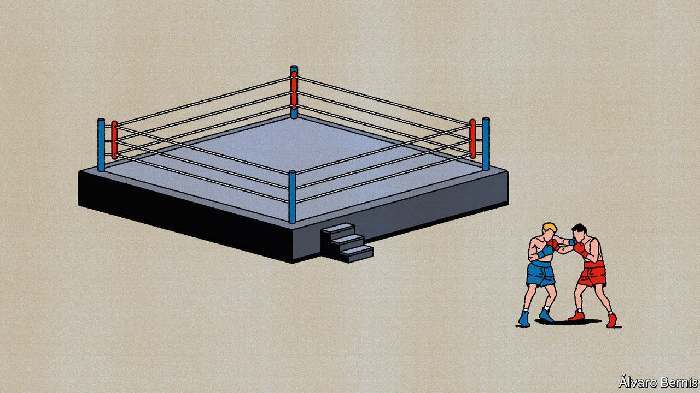
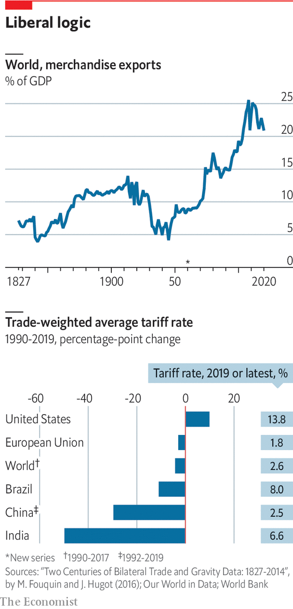

###### World trade

# The new order of trade 

##### Trade has been about growth and efficiency. Now other goals are competing for attention, says Soumaya Keynes 

 

> Oct 6th 2021 

THIS NEWSPAPER was founded in 1843 to campaign for the repeal of Britain’s protectionist corn laws (which was achieved three years later). The case it made for free trade was that tariffs enrich the wealthy at the expense of the poor, and that discrimination against foreigners leads to copycat retaliation, making everybody worse off. Our introductory issue lamented that governments, classes and individuals “have been too apt to conclude that their benefit could be secured by a policy injurious to others”.

For over 200 years, economists have largely accepted such arguments, although some politicians have displayed an atavistic fondness for protection. But after 1945, most leaders around the world converged on support for freer trade. Taken by the idea that more open markets promote innovation, competition and growth, they pursued them, first in the General Agreement on Tariffs and Trade (GATT), founded in 1948, and then after the GATT was transformed into the World Trade Organisation (WTO) in 1995.


The WTO was an extraordinary achievement. For the first time—and almost uniquely for international institutions—the system included binding dispute settlement, so that victims of rule-breaking could win redress. No longer could big countries throw their weight around and assume that any injury to others was consequence-free. Such was the faith placed in the new institution that, when China belatedly joined it in 2001, many in the West hoped that it would lead to economic and political convergence with rich democracies.

Exceptions were permitted within the rules-based system, but they were carefully policed. One for national security was invoked sparingly, as everybody saw it could too easily be abused. Environmental protection was allowed as a justification for some trade restrictions, but no more than was absolutely necessary. Labour lobbyists complaining of unfair competition were denounced as protectionist by those who saw cost differentials as legitimate forms of comparative advantage. Indeed, economic integration was seen as a way to help achieve these other goals. Not only would economies benefit from being bound together, but faster growth would mean higher environmental and labour standards.

All this translated into generally lower tariffs. Between 1990 and 2017 the trade-weighted average global tariff applied under WTO rules fell by 4.2 percentage points. The drop was greatest in poorer countries: in the same period China’s tariffs fell by 28 points, India’s by 51 and Brazil’s by 10. It also prompted a push for bilateral and regional trade deals, which expanded from around 50 in the early 1990s to as many as 300 in 2019. These have cut trade-weighted applied tariffs by a further 2.3 percentage points.

This system supported an explosion of global trade as a share of gross output, from around 30% in the early 1970s to 60% in the early 2010s. Over the same period complex global supply chains grew from around 37% to 50% of total trade. The stunning collapse in transport costs boosted international commerce. But so did stability. After China joined the WTO, one study by Kyle Handley of the University of California, San Diego, and Nuno Limão of the University of Maryland found that reduction in uncertainty was responsible for around a third of the growth in Chinese exports between 2000 and 2005.

As those early campaigners predicted, freer trade has brought higher living standards. A report by the World Bank in 2019 concluded that a 1% rise in participation in global value chains is linked with an increase in income per head of more than 1% in the long run. A survey of the literature by Douglas Irwin of Dartmouth College found that poor countries which liberalised trade enjoyed higher growth of 1-1.5 percentage points, cumulating to 10-20% after a decade. The United States International Trade Commission, an independent government agency, reckons America’s bilateral and regional trade agreements have raised real incomes by 0.6%.

Stretch and protect

Some moves towards further liberalisation have continued. In November 2020 15 Asia-Pacific countries signed the Regional Comprehensive Economic Partnership, the world’s biggest trade block. Trading in the African Continental Free Trade Area, a deal ratified by 38 countries, began on January 1st this year. Post-Brexit Britain is trying to cover 80% of its trade with preferential deals, albeit after erecting large new barriers with its closest neighbour, the European Union. And America and the EU are discussing common international standards for the digital economy.

Yet the appetite for freer trade is not what it was. There has not been a general round of liberalisation since the mid-1990s. Other dealmaking has also slowed. Partly that is down to a widespread perception that the ideology of free trade has failed to deliver its promises. In the rich world, politicians have seen furious backlashes against trade agreements and complaints that liberalisation has created losers as well as winners, leaving many workers behind. President Donald Trump embodied a rejection of the rules-based trade system. Although the Biden administration no longer hands out random tariff threats, few think America is incapable of electing a protectionist like Mr Trump again.

 


Meanwhile the WTO faces gridlock. Many believe that China took most of the benefits they were promised without offering enough in return. It has become impossible to update the rules in a group with 164 members that all need to agree. And the system that is meant to stop trade disputes spiralling out of control no longer works. The covid-19 pandemic has revealed how quickly panicked nationalism can gum up global supply chains. Over two-thirds of countries applying export controls on medical devices in 2020 still had restrictions in place in August 2021.

For all the post-war embrace of free trade, political support for it seems to rest on fragile foundations. That could jeopardise growth. According to one study, the uncertainty associated with Mr Trump’s trade wars may have depressed global growth by 0.75 percentage points in 2019. The WTO’s economists reckon that between 2000 and 2016 the cost of trade associated with policy fell from the equivalent of a 9% tariff in 2000 to a 6% tariff in 2016, but this includes an uptick since 2012. A simulation from the IMF found that the equivalent of a 10% tariff would reduce global output by around 1% after three years, and by 1.5% if productivity losses from the protection of inefficient firms are added.

As freer trade loses favour, other priorities have crowded in. There was so much focus on liberalisation and what it would bring that, as time went on, “trade became a negotiating thing—trade for trade itself,” says Ngozi Okonjo-Iweala, director-general of the WTO. Now, she notes, non-trade goals that had lost out to the cause of greater liberalisation are coming back. This special report explores how trade policy is being used to achieve non-trade objectives, including greater resilience, human rights and a healthier planet. And it asks whether the open trading system can survive this shift. The place to start is with a look at the strains created by America’s turn away from the rules-based multilateral trading system that it did so much to create.■

Full contents of this special report

World trade: The new order of trade* 


