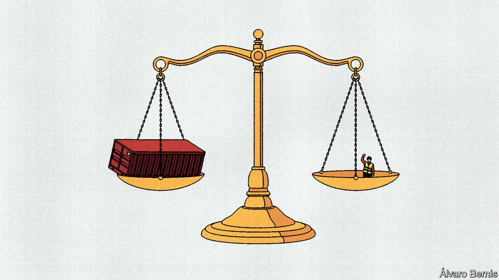

###### Labour rights

# The urge to protect 

##### How trade restrictions are being used as a tool to protect human rights 

 

> Oct 6th 2021 

ON AUGUST 19TH Ms Tai, the US Trade Representative, claimed a success. Over the preceding two days, thousands of pickup-truck makers in Silao, Mexico voted to reject the union claiming to represent them, rerunning an earlier vote in April that they said was neither free nor fair. Ms Tai was fighting their corner. In May she triggered a “rapid response mechanism” in the USMCA, a trade deal between America, Canada and Mexico, which could have led to tariffs of 25% on exports to America—or worse. In her eyes, the vote showed that the threat had delivered “prompt and meaningful results for workers”.

The case is part of a shift to the use of trade policy as an instrument to deter human-rights abuses. Led by America, this is happening in three ways: reciprocal trade deals like the USMCA; the special access richer countries grant to poorer ones; and most explosively, unilateral bans. There have long been complaints in rich countries about shoddy labour standards in poor countries. But when it comes to the narrower issue of human rights, these are now turning into action.


Over the past couple of decades reciprocal trade deals have increasingly included labour-related provisions on collective bargaining rights, forced labour, child labour and employment discrimination. Evidence that these have much effect is scarce. One study in 2021 into the impact of the EU’s non-trade provisions found no consistent effect on respect for workers’ rights. In some cases the offer of a trade deal with America seemed effective in encouraging trade partners to pass labour reforms, but after the deal was signed, implementation stalled.

For labour advocates, there is an obvious explanation: the virtuous commitments embedded in trade deals lack teeth. America, which boasts the toughest language in its deals, lost the only dispute it filed, on the grounds that, although the Guatemalan government had failed to enforce its labour laws, it had not done so in a way that affected trade. The EU, which enforces trade deals with dialogue and stern statements, has struggled to get Vietnam to stick to labour commitments made as recently as June 2019.

Arguments against sanctions often turn into claims of old colonial meddling in countries’ sovereign affairs, of vulnerable workers losing their jobs and of abuse by protectionist interests. But the European Commission is reviewing its trade deals to consider sanctions if countries do not live up to their commitments or (as the French and Dutch suggested in 2020) to offer tariff cuts as a reward for pursuing reforms. America is further ahead with the USMCA, which was implemented in July 2020 and includes lower legal thresholds that make disputes easier to win, as well as a rapid-response mechanism. Eric Gottwald, a trade specialist at the AFL-CIO, an American union group, dismisses concerns about protectionism as an “easy way to dismiss the work that we’re doing”, which is dealing with unfair competition and preserving Mexicans’ human rights.

The USTR sees enforcement of the USMCA as a core part of its “worker-centred trade policy”, and boasts that it is already yielding results. Besides the vote in Silao, it announced in August that it had used the rapid-response mechanism to defend workers’ rights at a Mexican car-parts maker, agreeing a deal to give them back pay and “a commitment to neutrality in future union elections”. Sometimes this looks like pandering to domestic political constituents, chief among them the AFL-CIO. And the extent to which it reinforces Mexico’s labour reforms is still unclear. A monitoring report in July found that, although the Mexican government was meeting its obligations as part of the USMCA, many of its promised changes “remain to be implemented”.

USTR officials expect the volume of cases to increase as labour advocates in America and Mexico learn how to bring them, but hope that it then falls as Mexico’s institutions advance. That is not much comfort for companies that are worried about disruption to supply chains. The US Chamber of Commerce, an industry group, has complained about a lack of clarity over enforcement, which could lead to products being blocked at the border within 120 days of a case being filed. “The regulations are clear,” says one USTR official. If companies are insufficiently aware of whether rights in their Mexican facilities are being respected, she adds, “sorry, you don’t get certainty.”

The second way governments are toughening sanctions over human rights is through non-reciprocal trade deals between rich and poor countries. The EU is strengthening its generalised system of preferences, which makes tariff cuts for developing countries conditional on a swathe of labour standards and better human rights. That should mean more stringent conditions and more careful monitoring. In 2017 the Trump administration announced a more “proactive” approach to enforcement, and later it launched investigations into workers’ rights in Azerbaijan, Bolivia, Eritrea and Zimbabwe. Since the scheme lapsed in December 2020, Congress has been discussing the addition of conditions including non-discrimination and women’s empowerment.

The evidence that this type of enforcement actually improves respect for human rights is thin, though in the EU’s case that may be because it has rarely been used, and in America incentives are blunted by the scheme’s expiry every few years. In theory too many strings attached could be counter-productive. Britain’s Department for International Trade is mulling a reduction in the number of conventions of the International Labour Organisation that developing countries must ratify to win enhanced access, reasoning that if conditions are easier to meet, governments are likely to make more effort.

Both these turns in trade deals have been driven largely by political dynamics in rich countries, and a sense that they are necessary to sustain support for free trade. The third form has a different root, in Xinjiang, China, where a vast number of Uyghurs, a mainly Muslim ethnic group, are being detained in camps and forced to work. Many are also sent to work in factories and farms outside Xinjiang. Since China does not allow independent, unfettered inspections of camps or factories where forced labour is suspected, it is impossible to gauge the extent of the problem.

Xinjiang blues

Governments around the world are co-ordinating in a bid to tell businesses to get out of Xinjiang. In June G7 leaders stated their common concern over forced labour in supply chains, “including in the agricultural, solar and garment sectors,” all areas of activity in Xinjiang. In July American government agencies including the State, Treasury and Commerce departments formally advised businesses with supply chains in Xinjiang, China, of the risks for those with investments there. Japanese businesses are also being warned by the government to be careful about supply chains through the area.

At the same time, governments are pushing companies to gather more information about their supply chains—and dealing in it themselves. Following similar French and German efforts, the EU is working on “due diligence” legislation obliging firms to check that their operations and suppliers are not engaging in human-rights abuses. America’s Customs and Border Protection (CBP) authorities have started to quiz importers about their supply chains. And G7 trade ministers are discussing ways to help smaller firms tell which suppliers are operating in problematic places.

Behind these requests is a growing number of bans, either in place or in the works. Once again, America is at the forefront, as a law change in 2015 allows the CBP to block imports suspected of being made with forced labour, unless the importer can prove otherwise. Between 1953 and 2016 the CBP issued 58 of these “withhold release orders” (WROs). In 2020 alone it issued 15, and so far this year it has issued five more, including on cotton, tomatoes and silica products from certain Chinese suppliers. That means T-shirts made with the offending cotton, or solar panels or semiconductors made with the offending silica, are affected as well.

Congress is itching to go further, and is pushing a bill that would block all imports from Xinjiang unless importers show that they were not made with forced labour—a high hurdle. Canada and Mexico have committed to bans of their own. Recently the European Commission’s president, Ursula von der Leyen, promised to put forward a ban on imports made with forced labour. In August the Australian Senate passed a bill banning all goods made in part or in whole with forced labour, though Senator Eric Abetz represented the government’s position when he said “my heart says yes to this bill but my head says not yet.”

The goal does not seem to be to eliminate unfair competition, but to establish moral grounds to block goods made in terrible conditions. The biggest difficulty lies in knowing what to stop. It is reasonably straightforward to seize raw materials shipped directly from Xinjiang, but much more complicated to block products when abuses happen earlier in the supply chain. Xinjiang produces around 20% of the world’s cotton, and in 2020 made 50% of the world’s polysilicon, an ingredient in the manufacture of solar panels. So far only $370m of imports has been detained under all WROs since October 2020 (up from an annual average of $1m between October 2016 and October 2019). But if applied strictly, the scope of the bans could be greater.

There are examples where import bans have changed behaviour. In 2020 the CBP issued WROs against Top Glove in Malaysia, the world’s biggest rubber-glove maker. Two weeks later the company agreed to refund workers’ recruitment fees and improve their accommodation. Yet less than a year on, the CBP issued another WRO against imports from the same company. A study by the Modern Slavery &amp; Human Rights Policy &amp; Evidence Centre concluded that, in cases where the implementing country was a large source of demand, bans could have short-term effects (shipments from the two subsidiaries affected by the first WRO accounted for 12.5% of the company’s sales), but added “there is still limited evidence on their longer-term impact.”

It seems less likely that bans will change the Chinese government’s behaviour, even in the short term. Its spokespeople have reacted furiously to the advice for businesses to disengage. Sanctions on individuals and companies connected to forced labour applied by America and the EU have already elicited Chinese counter-sanctions. Any economic fallout may be only temporary. Polysilicon supply from the rest of China is growing so fast that it could conceivably supply all foreign demand.

As this type of enforcement increases, policymakers must grapple with the hard realities of monitoring and evidence-gathering while studying what they are actually achieving. Shutting tainted goods out of markets may be enough, in a case where the Chinese Communist Party’s actions amount to a crime against humanity. But in other fuzzier cases, it may not be, and trade restrictions as a simple answer to a complex problem could easily fall short. That risk applies in spades to the use of trade policy as a tool to promote greenery.■

Full contents of this special report


Labour rights: The urge to protect* 


