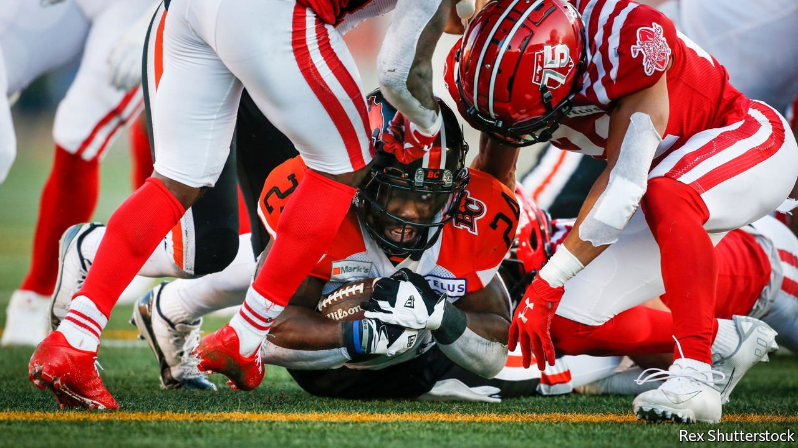

###### Shrinking balls, shrinking interest

# A venerable Canadian sport is wasting away 

##### Ageing fans are a threat to the Canadian version of American football 

 

> Oct 9th 2021 

IN CANADA, FOOTBALL (meaning the Canadian version of the American sort) generally comes far below ice hockey in terms of the emotions it generates. The latter occasionally sparks riots by demented young fans; the former is watched mostly by a dedicated but older crowd, who huddle in cold stadiums with Thermos flasks. But it is not for lack of effort by its promoters. In the 1990s the Canadian Football League’s (CFL) marketers tried to attract American football fans with the slogan “Our balls are bigger”. Last year the pandemic stopped the league entirely, but this year the games restarted and they are trying again. October 11th, Canadian Thanksgiving, will be a big day of sport. It is a chance to boost the fanbase.

Canadian football differs from the American variant in that its teams are of 12, not 11, players and the playing field is somewhat larger (the balls were bigger once but since 2018 have been the same size). The rules slightly differ too. The season usually starts in June, when the NFL, America’s league, is not running. The sport has been in decline for years, particularly beyond the interior plains, its heartland. The BC Lions, a team based in Vancouver, drew an average of 18,000 fans to its games at BC Place in 2019. Fifteen years ago they routinely had twice as many. Derek Mager, a data analyst who consults for CFL teams, describes the fans as mostly hardy old timers: “They’ve been doing it for as long as they can remember and as long as their grandparents can remember.”


Executives such as Amar Doman, the new owner of the BC Lions, hope that they can bring in new blood. In 2019, before the pandemic shut things down, the league recruited players from Europe and Mexico in the hope of bringing in an audience outside Canada. It has also signed television broadcast deals in the United States and in Mexico to simulcast Canadian games. Earlier this year the CFL announced that it was in talks on a partnership with the XFL, an alternative American football league owned in part by Dwayne “The Rock” Johnson, a Hollywood star. It came to nothing.

Years ago the NFL and the CFL used to compete for talent, most notably in 1991 when Raghib “Rocket” Ismail, a star player for Notre Dame, an American university, passed up a spot in the NFL and took $26m to play in Toronto instead. Nowadays salaries in the NFL are over 30 times higher than further north. Canadian football has to compete not only with other sports, but also with Netflix and the like. It will take more than a Hail Mary pass to turn it around.

