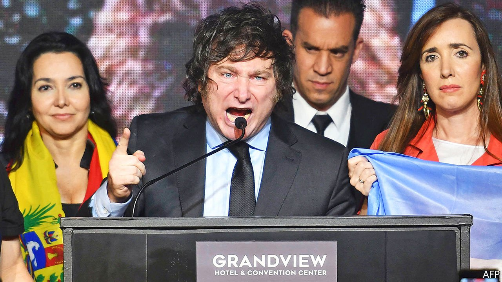

###### No me pises

# Javier Milei, a libertarian, may be elected to Argentina’s congress 

##### His rise in Buenos Aires hints at disaffection with Peronism 

 

> Oct 7th 2021 

“LONG LIVE liberty, goddammit!” proclaimed Javier Milei, a 50-year-old economist, at a meeting of comic-book aficionados in Buenos Aires in 2019. He went dressed as General Ancap, a character he invented who is the fictional leader of Liberland, a plot of land covering seven square kilometres that is disputed between Croatia and Serbia and which a Czech libertarian politician declared sovereign in 2015. Ancap is a portmanteau for anarcho-capitalist, a strand of libertarianism that seeks to abolish the state in favour of unfettered free markets. Mr Milei’s superhero mission is to “kick Keynesians and collectivists in the ass.”

Today Mr Milei is poised to become a national deputy for the real country of Argentina. In the first round of voting on September 12th (technically a form of primary) the alliance he leads got the third-highest number of votes in the city of Buenos Aires, the only place where it was on the ballot. It had been registered less than two months before the election. If the results are repeated in November, which is likely, it could win two seats in Congress. This would make Mr Milei the first self-described libertarian in Argentina’s legislature, says Martin D’Alessandro, a political scientist at the University of Buenos Aires.


Mr Milei won recognition as an eccentric guest on talk-shows, eventually becoming the country’s most interviewed economist on television and radio. A self-styled professor of tantric sex and one-time frontman of an obscure rock band, he claims not to have brushed his hair since he was 13, preferring to let “the invisible hand” do the work. His five mastiffs are named after economists, including Murray Rothbard, an anarcho-capitalist, and Milton Friedman, a more conventional one. To “make Argentina a great power again”, he wants to reduce regulations, lower taxes and eliminate the central bank. He dislikes abortion, believing liberty to be unattainable if one cannot first be born. But same-sex marriage should be legal, as should most narcotics.

Libertarianism is finding fertile ground among youngsters. One candidate on Mr Milei’s list for city legislators is 18 years old and still in secondary school. “My generation has grown up in recession—obviously that makes me think that what we have tried so far isn’t working,” says Iñaki Gutiérrez, a 20-year-old who voted for Mr Milei. Lilia Lemoine, a cosplayer who has over 100,000 followers on Instagram and is Mr Milei’s make-up artist, promotes his ideas by occasionally posting raunchy selfies wearing T-shirts with such slogans as “Free Market &amp; Private Property”.

Some analysts see Mr Milei as part of a resurgence of liberal ideas of all sorts. Ricardo López Murphy, a liberal economist and former presidential candidate, competed after a ten-year hiatus from politics and got 11% of the votes in the capital (he ran within the main opposition coalition). José Luis Espert, a liberal candidate in the wider province of Buenos Aires, where a third of the country’s voters live, got 5% of votes there. In Argentina’s crowded primaries those are big numbers. “This is a response against the Peronist logic of solving all problems through the state,” says Lucas Romero, a political analyst, referring to the movement that has governed Argentina for most of the past 70 years.

The interest in libertarianism also reflects a backlash against conventional politics. The particular brand of Peronism promoted by the current vice-president, Cristina Fernández de Kirchner, who was president from 2007 to 2015, left Argentina with a currency nobody trusts, sky-high inflation and economic stagnation. The opposition, in power between 2015 and 2019, piled up debt but failed to improve things. “If Kirchnerism has become the establishment, libertarianism has become the reaction to the status quo,” says Juan Germano, head of Isonomía Consultants, a pollster. Almost half of voters do not identify with any of the big parties, up from 39% in 2019. Turnout was the lowest it has been since such elections were introduced in 2011. Mr Milei, who attacks government and opposition members together as a “political caste”, is a big winner, but other parties, such as Marxists, got record results too.

Indeed, many of the people Mr Milei draws in are more conventionally right-wing, opposed to government policies such as legalising abortion and creating a quota for trans people in government jobs. “I will ally with all those who believe that the left is the enemy,” Mr Milei told The Economist. He recently signed a letter sponsored by Vox, an ultranationalist party in Spain, that rails against “the advance of communism” in the Spanish-speaking world. Even climate change, he claims, is a “socialist lie”. Eduardo Bolsonaro, the son of Brazil’s president, and José Antonio Kast, a far-right presidential candidate in Chile currently polling in second place, have endorsed Mr Milei.

Will this growing popularity last? “If the next government manages to stabilise the economy, Milei’s discourse will lose its appeal,” says Sergio Berensztein, a political consultant. Third parties have done well before in the capital, especially in times of crisis, only to implode soon after.

Nonetheless, Mr Milei is having an impact. The head of the main opposition party has adopted his term “political caste”. Even President Alberto Fernández seems nervous. He told a young audience shortly before the primaries that being rebellious should mean embracing “hippy and rock culture” and “May 1968”, not “liberal” ideas that, he said, “caused catastrophe and penury for millions”. Liberland may be no match for Argentina’s 2.7m square kilometres, but General Ancap is conquering ground in the battle of ideas. ■

