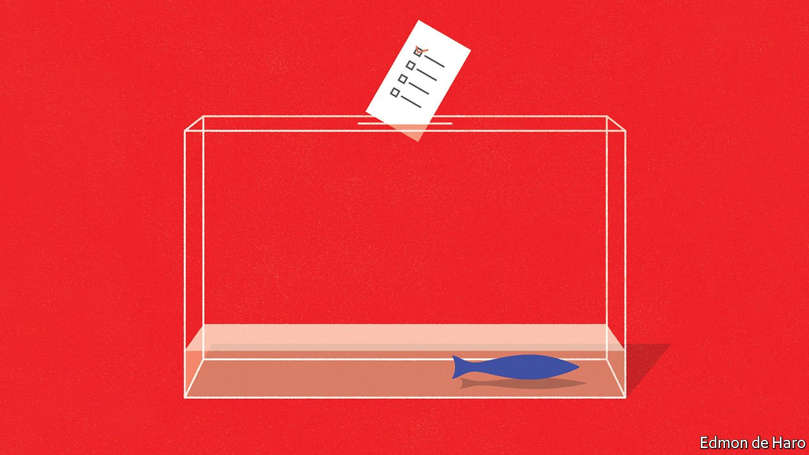
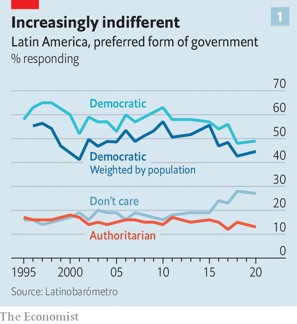
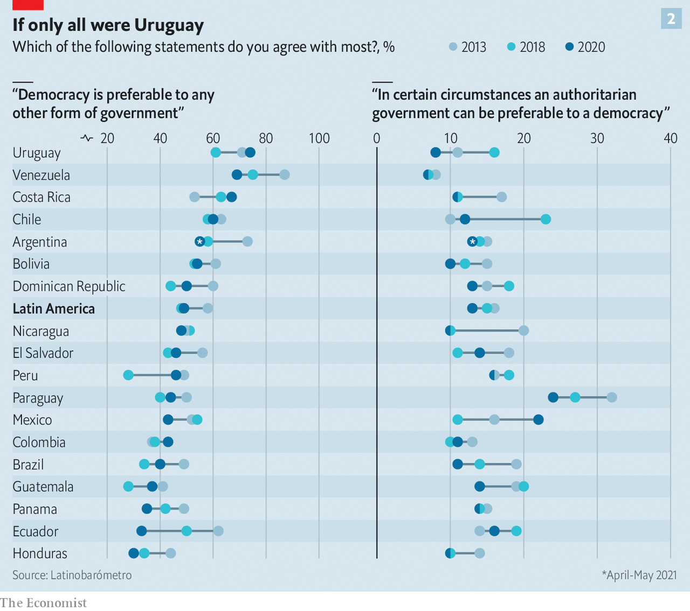
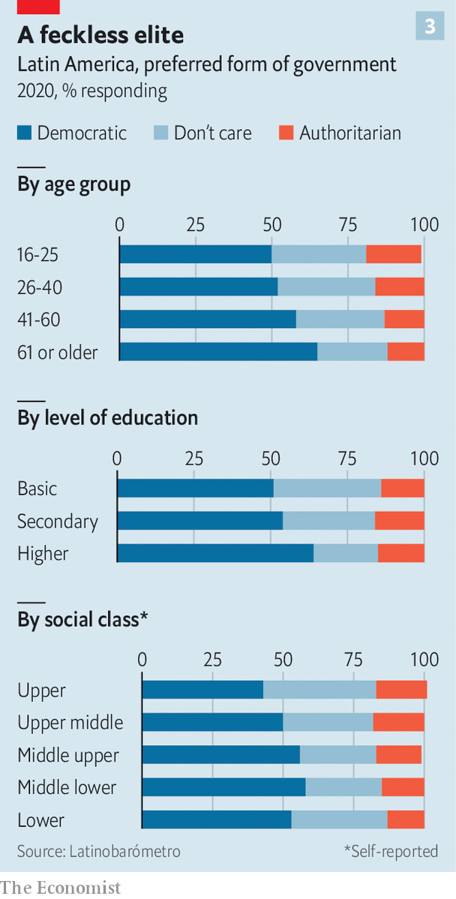
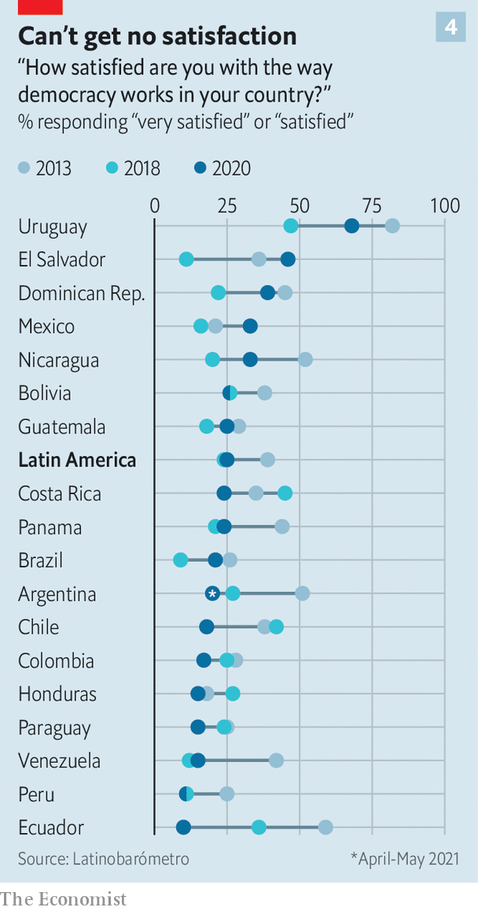
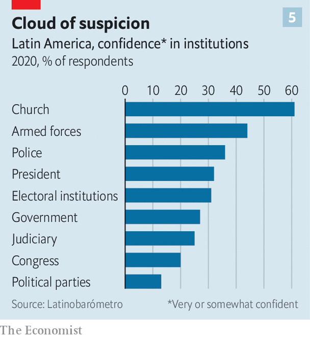
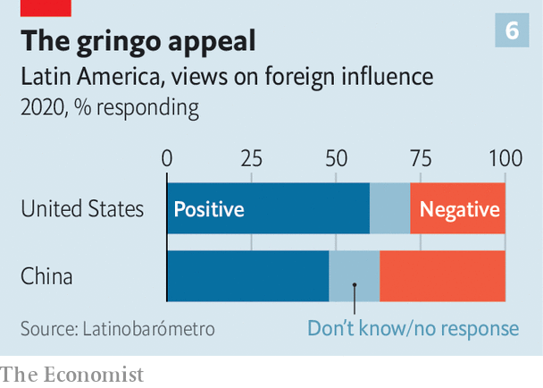

###### The Latinobarómetro poll

# Latin American democracy is in poor but surprisingly stable health 

##### The pandemic has fuelled indifference more than authoritarianism 

 

> Oct 5th 2021 

LESS THAN half of Latin Americans are committed democrats and a growing number are indifferent towards their country’s political regime. A large majority remain deeply dissatisfied with the way their democracies work in practice and they place little trust in their institutions or in each other. They are opposed to military government but a growing number are prepared to accept elected caudillos (strongmen). And they continue to have more trust in the United States than China.

 


These are some of the findings of the latest Latinobarómetro poll, taken in 18 countries and published exclusively in The Economist. Because the poll has been taken regularly since 1995 it does a good job of showing how attitudes in the region are evolving. The latest poll reflects views after the first seven months or so of the pandemic, which complicated the fieldwork. Face-to-face interviews were conducted in 17 countries between October and December 2020. That was not possible in Argentina, because of a prolonged lockdown. Online interviews were conducted there in May 2021.


The pandemic has hit Latin America disproportionately hard: with 8% of the world’s population it has suffered around 32% of officially recorded deaths. Despite this shock, the poll did not show a drastic change in political attitudes compared with . “I expected a fall in support for democracy,” says Marta Lagos, Latinobarómetro’s director. That this didn’t happen may reflect “the sense of solidarity” the pandemic generated, at least in its early months. 

 


But the broad trend, expressed in recent protests in several countries, comes over loud and clear. Compared with the late-1990s, when the transition from dictatorship to democracy was still fresh in many countries, support for democracy in the region has waned (see chart 1). Only 49% say that democracy is their preferred form of government. Support for authoritarian government is low, at 13%. But, worryingly, more than a quarter of respondents say they don’t care whether or not their country is democratic, a figure that has risen from 16% in 2010. Ask the question in a different, Churchillian, way and 63% think that while democracy may have problems it is the best system, down from a peak of 79% in 2013.

 


Support for democracy is highest where it is most consolidated, in Uruguay, Costa Rica and Chile (see chart 2). It is high, too, in Venezuela, which is now a dictatorship. Changes of government following elections tend to bring fresh hope in democracy. That applied in 2020 to El Salvador, Guatemala and Paraguay. El Salvador is an example of a demand for strong populist leadership: Nayib Bukele was elected president in 2019,  in 2020 and imposed a tight lockdown against the pandemic. His reward is that 66% of respondents in El Salvador think the country is progressing, compared with a regional average of just 19%.

Support for democracy in Brazil and Mexico, Latin America’s two giants, is well below the regional average. Another worrying trend concerns the profile of the typical democrat in Latin America. Younger people and especially those of the upper classes tend to be indifferent towards the political regime (see chart 3). That points to the disdain of elites for democracy.

 


In 2020 70% of Latin Americans were dissatisfied with the way their democracy works in practice (chart 4). That is little changed from 72% in 2018. However, those are the two highest numbers since the poll began.

The reasons for disillusionment are not hard to detect. Only 22% say their country is governed for the benefit of everyone, rather than the powerful few, though that is up from 17% in 2018, reflecting the common effort to fight the virus. Only 17% think the distribution of wealth in their country is fair. Clear majorities think that access to health care, education and justice is unequal. In Chile 93% think access to health care is unfair—an issue that has been .

 


Approval of governments rose significantly, to 40% from 32% in 2018. That again reflects a rallying round in the early months of the pandemic. But trust in institutions in general continues to fall (see chart 5). And only 12% of respondents say they trust most people, the lowest figure ever. Not surprisingly, economic problems and unemployment top the list of public concerns. The majority of respondents (58%, down from 62% in 2018) continue to think a market economy is the only way for their country to develop. Although China plays a much bigger role in Latin American trade and investment than in the past, more respondents think its influence is a negative one compared with that of the United States (see chart 6).

 


In summary, while their faith in democracy has been tested, Latin Americans want to vote and want their voices to be heard. Despite the sense of solidarity generated by the pandemic, their underlying discontent is hardening. The politicians have been warned.


An early version of this article was published online on October 5th 2021

