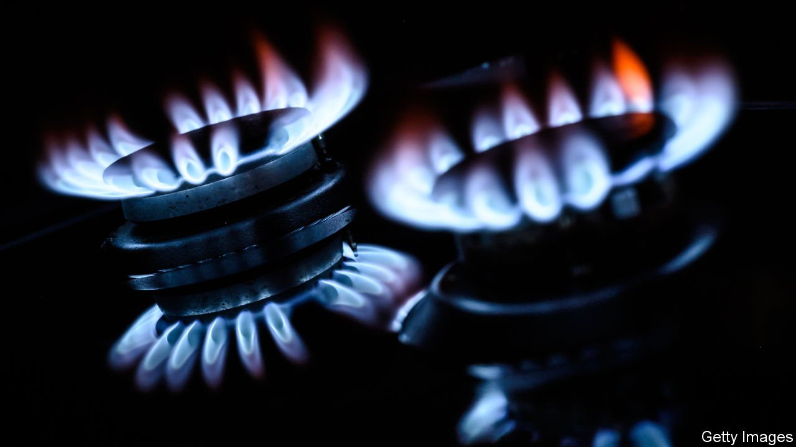
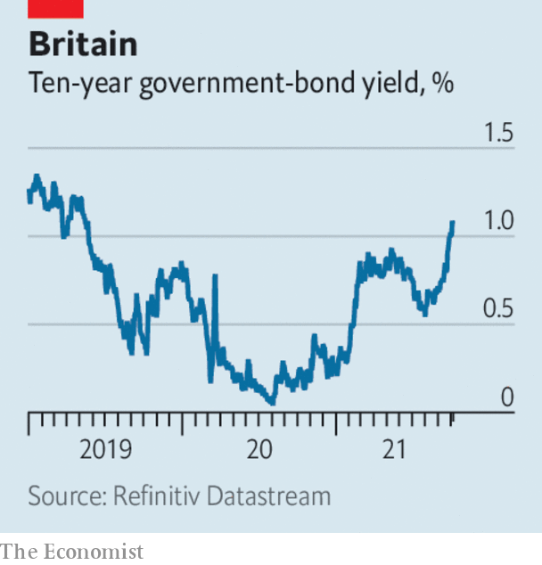

###### 

# Business this week 

#####  

 

> Oct 9th 2021 

It was another roller-coaster week for energy prices. After OPEC and its allies resisted calls to increase output, the price of Brent crude surpassed $80 per barrel and reached its highest level in three years. The cartel said it would stick to the gradual increases in output it agreed to over the summer. The  rattled other financial markets too, as investors worried about the fallout. In America and Europe government bond yields climbed. In Britain the yield on ten-year gilts jumped to its highest since May 2019.

 


In Europe the price of natural gas front-month futures jumped by more than 60% in two days. But prices soon reversed when Vladimir Putin, the Russian president, hinted that his country could supply additional gas to Europe.


In Asia the coal shortage dragged on. Power cuts have been reported across China. Authorities there have told miners to increase production. India is braced for power shortages. Half of its coal-fired power plants are on alert for blackouts.

In the euro area rising energy prices contributed to high . In September the euro area’s inflation rate rose to 3.4%, the highest level in 13 years. In Germany consumer prices rose by 4.1% in the same month, a 29-year high.

America’s trade deficit in goods and services grew to a record $73bn in August, up 4.3% from the previous month. Imports rose by $4bn from July, because of an increase in consumer demand. But trade in vehicles and car parts fell, as a result of the semiconductor shortage.

Leaks and outages

users experienced a long outage this week. The social-media platform and its subsidiaries, WhatsApp and Instagram, were down for several hours. The firm’s share price fell by 4.9% on Monday. It blamed an internal malfunction and said there was no evidence that users’ data had been compromised.

Meanwhile, Frances Haugen,  who is now a whistleblower, testified before a Senate subcommittee. She claimed that Facebook’s products “harm children, stoke division [and] weaken...democracy”, and that documents she leaked to the Wall Street Journal showed the company is aware of this. In a statement Mark Zuckerberg, Facebook’s boss, said that the firm’s work and motives have been mischaracterised.

Tesco, Britain’s biggest food retailer, announced a share buyback worth £500m ($678m). Operating profits in the first half of the year reached £1.3bn, a 29% increase on a year earlier. Last year the covid-19 pandemic hurt the supermarket’s wholesale arm, which sells to restaurants and pubs, and added to costs, such as extra cleaning in its stores.

The Hong Kong stock exchange suspended trading in shares of Evergrande, an indebted Chinese property developer, and Hopson Development, a rival. Chinese state-backed media suggested that Hopson is considering taking a majority stake in Evergrande’s property-services unit. Trading of the subsidiary’s shares was also suspended.

, a Swedish carmaker owned by Geely, a Chinese auto firm, said it will raise $2.9bn through an initial public offering on the Stockholm stock exchange. The listing will value the firm at around $30bn. Volvo was sold by Ford, a carmaker, to Geely in 2010. Since then it has raced ahead in electrification.

The European Medicines Agency, a regulator, endorsed covid-19 booster shots. It said that in most cases the Pfizer-BioNTech vaccine could be given as a booster to those aged 18 and over, at least six months after their second dose. In America Johnson &amp; Johnson, a pharmaceutical firm, asked the Food and Drug Administration, another regulator, to authorise its booster.

Foxconn, the Taiwanese firm that assembles iPhones, bought an electric-vehicle manufacturing plant from Lordstown Motors, an Ohio-based carmaker. It is Foxconn’s first such plant in America and it comes as part of a deal that includes a minority stake in Lordstown.

Syniverse, a firm that processes hundreds of billions of SMS text messages every year for firms including Verizon, Vodafone and China Mobile, revealed to American regulators that hackers had access to its systems for five years, beginning in 2016. It was not clear whether the text messages themselves had been compromised by the hack.

Cleaning the cesspool

Later in the week Twitch, an online video platform owned by Amazon, was hit by an attack that leaked a full copy of the site’s source code as well as payment records for its broadcasters. The hacker claimed that the aim of this act was to inject more competition into the online streaming industry, which he described as a “disgusting toxic cesspool”.

