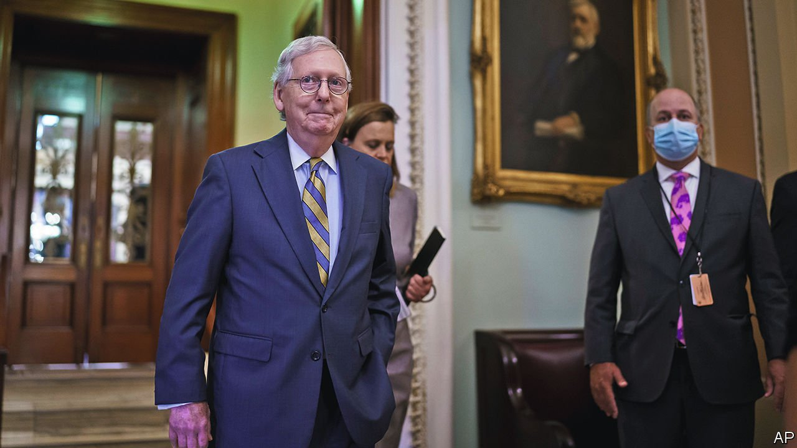

###### 

# Politics this week 

#####  

 

> Oct 9th 2021 

A congressional stalemate over whether to raise  showed signs of easing. Mitch McConnell, the top Republican in the Senate, said he would support raising the limit until December, avoiding a sovereign default as early as October 18th. As a condition, he wants Democrats to raise the borrowing cap by a fixed amount, rather than suspend it altogether until some future time. December may bring another round of brinkmanship.

A federal judge blocked an abortion law passed in Texas that allows anyone in America to sue anyone who helps someone in the state abort a fetus older than six weeks. Robert Pitman, whom Barack Obama nominated to the bench in 2014, forbade state courts from accepting suits under the law. Texas filed an appeal. The conservative-majority Supreme Court last month declined to prevent Texas from enacting the law.


UN investigators accused Russian mercenaries working for Wagner, a security firm, of killing and torturing migrants in Libya. Separately America warned Mali against signing a deal with Wagner, reportedly worth almost $11m a month, for it to supply 1,000 mercenaries to train Mali’s army and protect officials.

Somalia’s long-delayed elections, which had already been rescheduled for October 10th, were postponed again. Tensions have increased between government ministers and the president, Mohamed Abdullahi Mohamed, who is accused of stalling the vote to stay in power.

ordered the expulsion of seven senior UN officials involved in humanitarian relief in the northern region of Tigray after accusing them of “meddling” in its internal affairs. The UN’s humanitarian agencies estimate that 400,000 people in Tigray are on the brink of starvation.

The World Health Organisation endorsed use of  for children at risk of infection. It said that the jab, called RTS,S and made by GlaxoSmithKline, was safe and reduced by 30% cases of severe malaria in young children. Infants in much of sub-Saharan Africa contract malaria several times a year. A child under five dies of it every two minutes.

Following Germany’s election on September 26th, three-way “traffic light” coalition talks were set to begin between the Social Democrats, the liberal Free Democrats and the Greens. If they succeed then Olaf Scholz, currently the finance minister, will take over from Angela Merkel as chancellor. The negotiations are expected to take weeks.

A two-year independent report commissioned by  concluded that between 1950 and 2020 at least 216,000 children were sexually abused by Catholic clergy in the country. If crimes by laypeople with roles in church activities are included, it found, there may have been as many as 330,000 victims.

Boris Johnson, Britain’s prime minister, closed  with a speech focused on “levelling up”. His signature policy aims to close gaps between the rich parts of Britain, mainly London and the south-east, and the rest of it, in particular northern constituencies that switched to the Tories in the most recent general election. Mr Johnson promised to change Britain’s economic model to one where immigration is low and wages, skills and productivity are high.

The commissioner of  announced a review of its standards and culture. The force’s handling of crimes against women has come under scrutiny after an officer was sentenced to life for abducting, raping and killing a woman in March. The murder of Sarah Everard also prompted calls for stronger laws to help protect women from violent men.

Thrilla in Manila

Rodrigo Duterte, the Philippines’ president, said that he would retire from politics. Mr Duterte, who is forbidden from running for a second term by the constitution, had declared his candidacy for vice-president in elections in May. His retirement paves the way for his daughter, Sara, to contest the top post, although she has not yet registered to do so. Ferdinand “Bong Bong” Marcos Jr, the son of a former dictator; Manny Pacquiao, a world-champion boxer; and Isko Moreno, Manila’s mayor, have said they are running.

China said it was investigating a former minister of justice, Fu Zhenghua, for “serious violations of the law and of party discipline”. Mr Fu had also served as a deputy minister of public security.

’s defence minister, Chiu Kuo-cheng, said tensions with China were at their highest in 40 years. He was referring to a series of sorties involving almost 150 Chinese military aircraft near Taiwan in recent days.

 


A mega-leak of documents to the International Consortium of Investigative Journalists revealed the financial affairs of dozens of world leaders, public officials and billionaires. Among those facing awkward questions in the wake of  are Andrej Babis, the Czech prime minister, and Wopke Hoekstra, the Netherlands’ finance minister, both alleged to have used shell companies in tax havens for their investments. Jordan’s King Abdullah II and Uhuru Kenyatta, Kenya’s president, were also linked to offshore companies.

Andrés Manuel López Obrador, the president of Mexico, unveiled plans to change the constitution to take more control of the energy industry. Two regulators will be abolished and a big share of the power market will be reserved for the state electricity company. The state also proposes to nationalise the production of lithium, a mineral used in batteries.

Home runners

At least nine members of the Cuban team at the under-23s baseball World Cup in Mexico defected during the tournament. In 2018 a deal to allow Cubans to join teams in North America’s Major League Baseball was cancelled by Donald Trump, in an attempt to put pressure on the communist regime. Cuban officials described the defections as “vile abandonments”.

