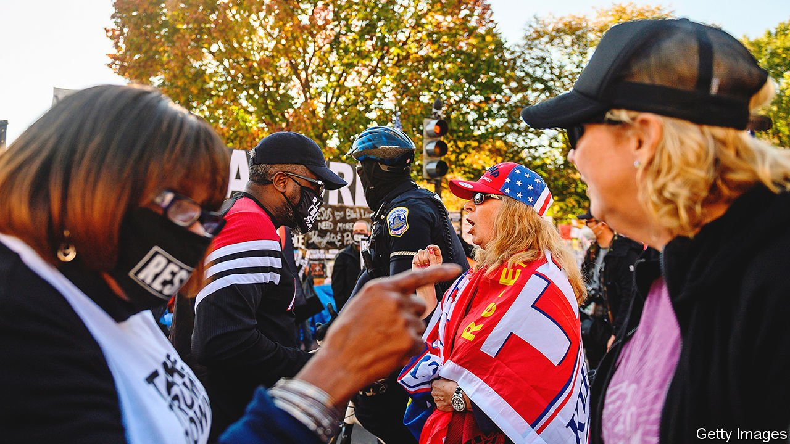

###### Polarisation explorers

# America’s political scientists are worried about “lethal partisanship” 

##### About 40% of partisans consider supporters of the other side to be downright evil 

 

> Oct 7th 2021 

THE TAGLINE for the annual meeting of the American Political Science Association (APSA) held in Seattle last weekend read “Promoting Pluralism.” Under the sunny geometric windows of the city’s convention centre, and through the poorly lit rectangles of Zoom rooms, scholars met to discuss, among other things, the various threats to American democracy, and whether the country’s polarised political parties could peacefully coexist. Like experts on the use of nuclear weapons during the Cold War, the spectre of some disastrous future hung over the discussions and was made only slightly less alarming by the technical language used to describe it.

Scholars of American politics are particularly dismayed by rising levels of “affective polarisation,” the political science term for the hostility one person feels towards members of the other party relative to the feelings they have towards members of their own party. Levels of affective polarisation have risen more than two-fold since the 1970s when the American National Election Studies, a quadrennial academic survey started at the University of Michigan, began asking citizens to rate how they felt about members of either major party. In 1978, according to the survey, the difference between Americans’ ratings of members of their own and ratings of members of the other party on a 100-point “feeling thermometer” scale was 27 points. The gap had widened to 56 by 2020.


Lilliana Mason of Johns Hopkins University calls this phenomenon “identity-based” polarisation. In her 2018 book “Uncivil Agreement” Ms Mason crunched a mass of survey data to reveal how ideological, religious and racial identities have become “sorted” into overlapping mega-identities captured almost entirely by the words “Democrat” and “Republican.” One result, she concludes, is that isolated and warring tribes have become “relatively unresponsive to changing information or real national problems.”

That problem—that people’s political affiliations determine what information they absorb, rather than the other way around—is bad enough. Yet the degree of contempt partisans have for each other is even more troubling. In a paper Ms Mason presented at the conference alongside Nathan Kalmoe and Julie Wronski, two of her frequent co-authors, the researchers conducted a series of experiments to gauge the extent to which Americans thought certain groups deserved life-saving aid if they were infected with covid-19; if the economy should be reopened even if it would hurt certain groups; and whether disproportionate deaths among the opposing party were deserved or not. They found that respondents were much likelier to say disproportionate deaths among supporters of the other party were more acceptable than deaths among their own.

Discounting suffering on the other side destroys the empathy that liberal democracies require. In a 2019 paper, Mr Kalmoe and Ms Mason studied the extent to which voters rationalise partisan violence against their opponents or express outright support for it—what they call “moral disengagement” and “lethal partisanship”. They also found that 60% of partisans said the opposition was “a serious threat to the United States”, and 40% said opponents were “downright evil”. People with strong attachments to either political party were more likely to exhibit such views.

Between 5% and 15% of Americans in either party endorse violence depending on the circumstances. Mr Kalmoe and Ms Mason are updating their work on partisan violence for an upcoming book, “Radical American Partisanship”. According to new data, Americans of both parties have become more morally disengaged and more likely to endorse violence since the authors’ first study in 2019. They also find that since the 2020 elections Republican voters have become more likely to hold these views, and to endorse violence against political leaders—presumably because their champion lost.

Even though the strength of these feelings is striking, polarisation is such a familiar problem that merely mentioning it can act as a mental sedative. Suggestions as to how to lessen polarisation sometimes have the same quality, though the assembled political scientists deserve credit for trying. Erin Rossiter, of the University of Notre Dame, has found that even imagining a conversation with an opponent can cause at least a temporary reduction in hostility to supporters of the other party. Ms Mason and Mr Kalmoe find, in a final set of experimental studies, that telling Republican voters that Mr Trump had asked them to abstain from violence decreased the share of them that thought it was acceptable in pursuit of political goals. What party leaders say, and how they conduct themselves, really matters.■

