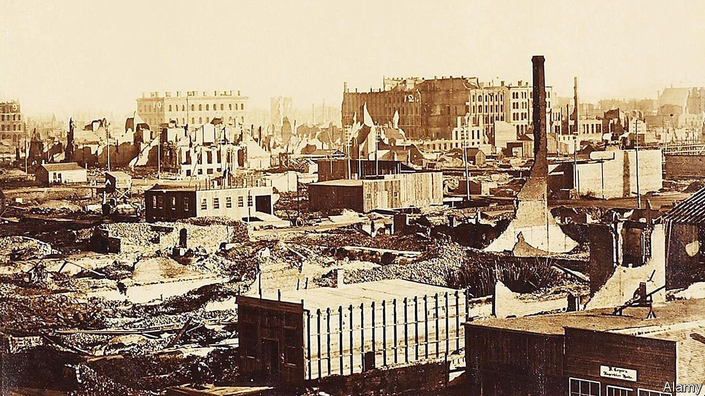
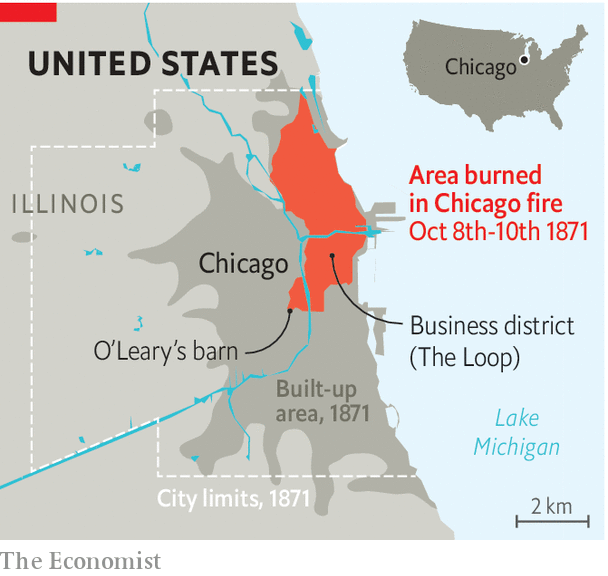

###### From the ashes

# Chicago re-examines its origin story 150 years after the great fire 

##### What does the city’s creation myth reveal about its history? 

 

> Oct 9th 2021 

ON OCTOBER 8th 1871 Catherine O’Leary’s cow kicked over a lantern and sparked the fire that incinerated one-third of Chicago—or so legend has it. The story of the blaze and Chicago’s triumphant rebuilding is often retold with more than a dash of Whiggish inevitability: the fire was the catalyst by which Chicago became America’s commodity capital. But this year, on the 150th anniversary of the great fire, Chicagoans are looking anew at their city’s creation myth, and finding the truth to be much more compelling.

The fire was a disaster. Property records were destroyed when the courthouse burned, but Carl Smith of Northwestern University estimates the damage done in his book “Chicago’s Great Fire: The Destruction and Resurrection of an Iconic American City”. An area roughly three square miles was scorched, levelling nearly 18,000 buildings and killing about 300 people. About one in three Chicagoans was suddenly homeless. The entire business district—now known as the Loop—was torched, resulting in about $200m in property damage (about $4.5bn today).


It turns out the popular history of the fire is flawed. But its two central myths give some insight into the city then and now. First, consider poor Mrs O’Leary and her cow. Historians are sure the fire originated near the O’Learys’ barn, but have exonerated Catherine herself. Yet her supposed culpability persists, says Mr Smith, and reveals the prejudices that roiled America in the late 19th century. “Who could be a better scapegoat than an Irish-Catholic woman?”, he asks.

 


The second myth is that the breakneck pace at which the city rebuilt (the downtown was revived in two years) changed Chicago in a way that sparked the city’s rapid growth. In reality, the fire accelerated shifts already underfoot. After the civil war Chicago became an entrepot that was integral to the national economy, thanks in large part to its location. About 30,000 people lived in Chicago in 1850; that number ballooned to 300,000 by 1870 and reached 1m by 1890. “The fire is a speed bump on that upward trajectory,” says Julius Jones of the Chicago History Museum. “It doesn’t fundamentally alter the city.”

As Chicago reflects on the anniversary, it is tempting to compare the tragedy to that of covid-19, which has killed more than 12,000 Chicagoans. Both crises revealed inequality (some could not afford to rebuild their charred homes) and provided funds to rebuild. But drawing other parallels is tricky. In 1871 “the lesson people took away from the destruction of Chicago was that it was indestructible,” says Mr Smith. Today Chicago’s trajectory is less clear.

The city’s population grew by 2% in the past decade, a welcome change from the 7% decline seen between 2000 and 2010. But the pandemic has left Chicago’s unemployment rate roughly twice as high as it was in 2019 and nearly 17% of downtown offices are vacant, according to Colliers, a property firm. After the fire, says Mr Jones, Chicago’s residents likened their city to a phoenix, “resurrected from its own ashes to be better than it was before.” Some of that same spirit is needed again.

