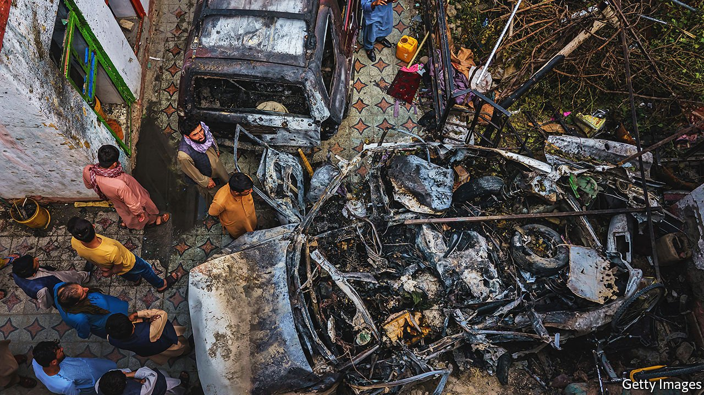

###### Droning on

# President Biden is weighing how extensively to use drones 

##### More civilian casualties abroad seem the likeliest outcome 

 

> Oct 7th 2021 

DRONES HAVE BEEN a common sight in the skies above Afghanistan, but rarely had one trained its gaze on the capital, Kabul. On August 29th, as America was hastily withdrawing its remaining soldiers and Afghan refugees through the city’s airport, a drone struck a white Toyota Corolla. After the strike, General Mark Milley, America’s top military official, called it a “righteous” strike, and the Pentagon claimed it had thwarted an imminent attack on American forces. In fact no terrorists had been killed and seven of the ten victims were children. President Joe Biden broke with his former boss, Barack Obama, in withdrawing troops from Afghanistan. Like Mr Obama, he now faces a choice on how extensively to use drones to replace soldiers and pilots.

Mr Biden has pledged to conduct “over-the-horizon” counterterrorism operations, chiefly using armed drones, in Afghanistan, to pursue terrorists while reducing the toll of the war on terror on Americans. Yet as the experience of Mr Obama and his successor, Donald Trump, suggests, drone strikes have hardly proved a strategic success. As Samuel Moyn of Yale University argues in his recently published book “Humane,” such attempts to make the war less lethal may have made it harder to end. Mr Biden’s strategy appears to be just the formula for a more sustainable, but no less brutal, war on terror.


As troop casualties mounted and the public opinion turned under President George W. Bush, drones emerged as a means of long-distance fighting. First deployed just weeks after September 11th, it was Mr Obama who greatly expanded their use. The rationale was clear. America would no longer rely on vulnerable ground forces. Drones could strike as far afield as Pakistan, Libya, Yemen, and Somalia—places where America was not, officially, at war. Killing terrorists, rather than seizing them in battle, could also solve the Guantánamo problem. “If no one was captured, no one could be mistreated,” writes Mr Moyn.

Keen to withdraw troops from Iraq and, eventually, Afghanistan, Mr Obama directed more drone strikes in his first year than Mr Bush had in his entire presidency. A brief prepared in March of 2009 by the Department of Justice laid out the administration’s contorted legal justification. It declared that the war on terror operated on a global battlefield. Nor would it be limited to al-Qaeda and “associated forces”: even those with tenuous ties like al-Shabab in Somalia, were fair game. Mr Moyn argues this gave permission to strike targets that did not pose an “imminent” threat, as international law demands. At the height of Mr Obama’s drone campaign in 2010, America’s armed forces launched 128 strikes in Pakistan alone.

Despite Mr Obama’s insistence that drones could precisely target America’s enemies, the rising volume of strikes ensured civilian casualties rose also. With up to 560 civilian deaths in Pakistan alone from 2009 to 2011, the UN and civil society called for reform. Guidance issued by the White House in 2013 attempted to place limits on the lethality of the drone campaign beyond Afghanistan and Iraq. The document pledged strikes would not occur without a “near certainty” that non-terrorists would not be killed.

It helped stem the worst excesses: by 2016, strikes caused fewer than ten civilian deaths in Pakistan, Somalia and Yemen combined. On the battlefield in Afghanistan, Iraq and, after 2014, Syria, military lawyers counselled commanders on targeting decisions—above a certain threshold for predicted civilian casualties, a strike would require permission from higher authorities. Mr Obama expressed hope that this “legal architecture” could ensure “any president’s reined in.”

President Donald Trump easily discarded Mr Obama’s rules in his first year in office, giving commanders greater flexibility in choosing their targets. The tempo of operations rose, and their reach expanded to new places like Niger. Nowhere was this escalation more dramatic than in Afghanistan, where as many as 130 civilians perished in strikes in 2017. Even so, their effectiveness is open to debate. In the two decades since 2001, estimates the Centre for Strategic and International Studies in Washington, DC, the number of Sunni Islamic militants grew fourfold, though thankfully they have not pulled-off a devastating attack on American soil. “The assumption that there was no substitutability was wrong,” says Sarah Kreps of Cornell University, with new terrorist leaders replacing the dead.

Buzz on

Mr Biden has sought to rein in the excesses of his predecessor and return to a more restrained policy. While his administration prepares new guidance, Mr Biden has required the Pentagon and CIA to seek White House approval for strikes outside Afghanistan, Iraq and Syria. But Mr Biden has no intention of ending their use. He boasts that even without a presence in Afghanistan, his administration will continue to strike terrorist organisations in Afghanistan from the safety of America’s ships at sea and bases in the Middle East.

Such a strategy may not prove effective, or humane. As General Kenneth “Frank” McKenzie, America’s top military official in the Middle East and Central Asia, admitted to Congress in testimony on September 28th, long-distance drone attacks necessarily rely on weaker intelligence without nearby bases and local partner forces. More mistakes, like the August 29th strike in Kabul, are thus likely even after the Pentagon completes its investigation. Ms Kreps is not sure Americans will give drones much mind. “After the dust settles, we will still be using them.”■

For more coverage of Joe Biden’s presidency, visit our dedicated 

