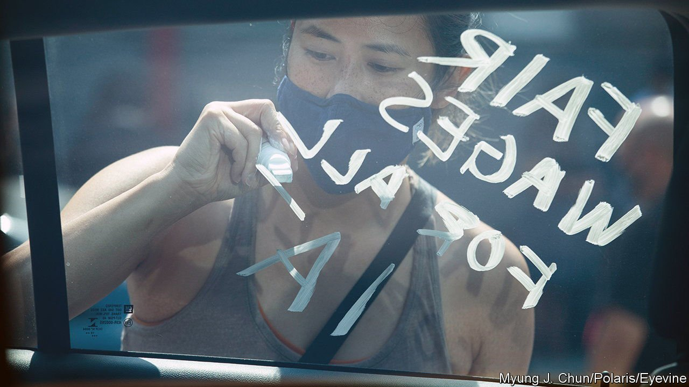
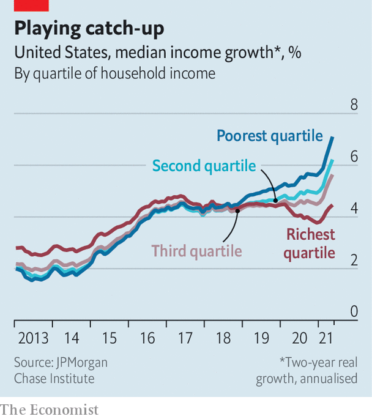

###### Piketty lines

# The incomes of America’s poorest are growing faster than those of its richest 

##### Ever-widening inequality is not an immutable law of a modern economy 

 

> Oct 9th 2021 

THE PAST year and a half has served up a reminder, if one were needed, of how unequal America is. The wealthiest Americans have seen their assets increase in value thanks to a stockmarket rally, especially in the tech sector. At the opposite end of the ladder, millions of mostly low-wage workers have lost their jobs, while also facing a higher risk of death from covid-19. But there is also some good news to set against this: the incomes of poor Americans have grown more quickly than those of rich ones.

 


The earnings out-performance for poorer Americans started in 2018. JPMorgan Chase Institute, a think-tank within the bank, parsed data on more than 7m households. Early in the 2010s, as the economy recovered from the global financial crisis, the top quartile of income earners reaped the fastest income gains and the bottom quartile brought up the rear. However, a few years ago their positions flipped. And over the course of the pandemic the gap has widened, such that, by May, incomes for the lowest earners were growing by about 7% annually, compared with 4.5% for the highest earners (see chart).


What explains the shift in fortunes? Some of the credit goes to policymakers’ willingness to run a hot economy before the pandemic. Traditionally, economists have worried that low unemployment pushes up wages and, by extension, inflation. But even with unemployment rates below 4%, inflation remained subdued. At the same time, wage growth was most pronounced at the lowest rungs of the income ladder (given an additional boost in some states by higher minimum wages), a relationship that was first observed by Arthur Okun, an American economist, in a paper in 1973 about how “high-pressure” economies tend to promote upward labour mobility as companies pay more for workers.

The spread of covid-19 created a low-pressure economy, almost overnight. Unemployment, which would normally depress wage growth, soared. And without any help from the federal government, that is what would have happened. But thanks to an expansion of unemployment insurance as well as a series of stimulus cheques, the reality was very different. Poorer Americans have been the main beneficiaries, with far fewer suffering drops in incomes than would have otherwise been the case.

