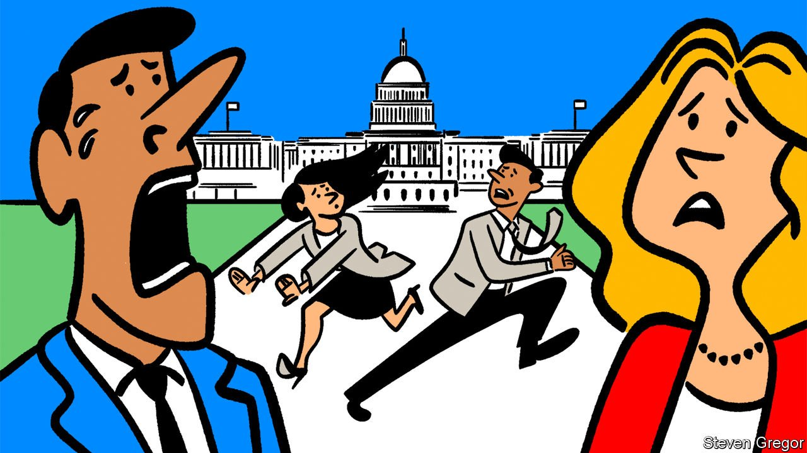

###### Groundhog days

# Why can’t America quit flirting with financial ruin? 

##### Nobody thinks defaulting on US sovereign debt is a good idea. And yet it prompts recurrent crises 

 

> Oct 9th 2021 

FOR GOOD REASON, countries avoid defaulting on their sovereign debts if they can. Argentina, Greece and Lebanon can all attest to the pain of that experience. America is exceptional, however. Every few years, it ends up precariously close to a partial default, only to yield right before taking the country’s full faith and credit (and global markets) over the precipice. The precipitating events are never economic, but always political. The most recent flare-up of this self-destructive habit was particularly senseless. And it is almost certain to not be the last.

The reason is an abstruse mechanism called the debt ceiling. Since 1917, Congress has, in one form or another, retained a limit on the amount of debt the Treasury can issue. Because Congress tends to run budget deficits, this has needed raising or suspension more than 100 times since its inception. The only other Western country to retain a similar debt limit is Denmark, though it is set much higher than actual debt and is thus not close to “binding”.


In contemporary America the nearing of a binding debt ceiling is perversely seen as a moment of maximal leverage. As the latest deadline became pressing, Republicans in Congress employed the filibuster (a parliamentary stalling tactic allowed in the Senate) to prevent Democrats from easily raising the ceiling. Janet Yellen, the treasury secretary, warned that the federal government could be nearing default as soon as October 18th. The Treasury calls the day that it no longer has the ability to pay for both its debt service and essential programmes like Social Security the “x-date”. Wall Street types cheerily call it the “drop-dead date”. On October 6th, a deal seemed at hand between stalemated Democrats and Republicans—who seemed poised to carry on the game of chicken until the moment of economic cataclysm was nigh—to push the problem off until December. At that point, the rigmarole starts up again.

Previous debt-ceiling fights have been destructive. In 2011, Republicans brought the country close to the brink of default in order to force budget cuts, resulting in a downgrade to the country’s credit rating for the first time. Borrowing costs for the federal government rose by $1.3bn in that year alone. Another near-miss came in 2013, when Republicans unsuccessfully tried to force Barack Obama to defund his signature health-care programme. This time, though, Republicans do not seem to have any policy objectives.

Before the standoff was put off, Republicans were insisting that Democrats trek around their filibuster using a special process called reconciliation. This was doable, though it would have wasted ten to 15 days of floor time on the Senate in order to complete. Mitch McConnell, the Republican leader in the Senate and the chief architect of debt-ceiling standoffs past and present, had argued against providing any “shortcut” to these procedural hurdles that he had erected. Reluctant to go that route, Democrats leapt on Mr McConnell’s later offer to table the matter until December.

That deal only offers a temporary reprieve to this maddening cycle. What were once emergency measures are now routine. The Treasury must employ “extraordinary measures” to stave off an imminent default (such as pausing payments on certain kinds of retirement accounts) so often now that they are barely noticed. These had been in effect since August. Another round may begin when the December deadline approaches but eventually they will be exhausted, a new x-date will arrive, and frantic negotiations will begin again.

The more often Congress plays this game, the higher the chances of a miscalculation. On the other side of it would be a painful economic crisis—all the more because it would be entirely self-inflicted. Without the ability to issue more debt and without any accounting gimmicks to secure more headroom, the Treasury would need to make difficult decisions. Daily outlays would have to match daily receipts, resulting in overnight spending cuts of as much as 40%. If the government prioritised paying interest on its debt, that would require cessation of vital payments like social security checks and health-care payments or salaries for soldiers and federal employees. That would certainly also invite lawsuits. But the risk of defaulting on the debt is potentially calamitous: a memo from researchers at the Federal Reserve written during the 2013 debt-ceiling crisis predicted that yields on American debt would spike, the dollar would plunge in value, equities would fall by a third and a mild recession would ensue.

Almost everyone agrees that this outcome is chaotic, destructive, and entirely senseless. So naturally Congress will be here again in a couple of months.■

