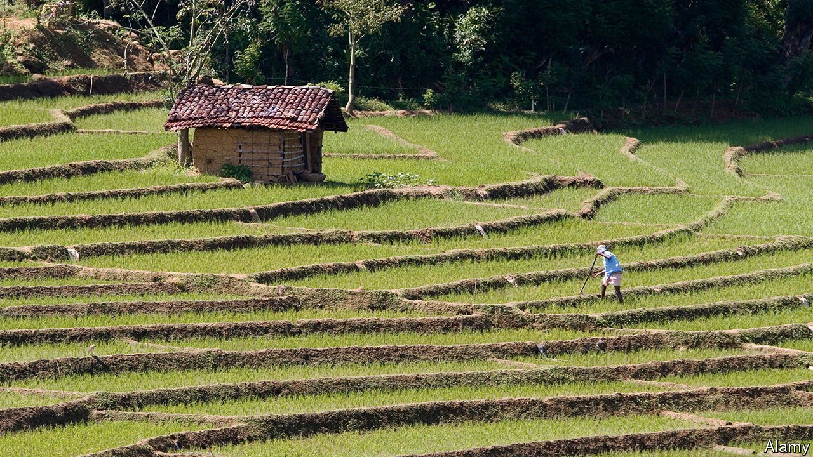

###### No more Mr Rice Guy

# A rush to farm organically has plunged Sri Lanka’s economy into crisis 

##### The ruling Rajapaksas have strong ideas and expect everyone to adopt them 

 

> Oct 16th 2021 

STARING GLUMLY at his paddy field in the depths of rural Sri Lanka, B. R. Weeraratne sighs. The regular incursions of greedy elephants have been bad enough. But the government’s outright ban on agrochemicals will, he fears, slash his yields of nadu and samba, two of the most popular varieties of rice. Though the 56-year-old likes the idea of organic farming in principle, he thinks “the soil, the plants and the farmers all need time to learn it.” It should be phased in. Otherwise farmers like him may be flung into destitution.

But Gotabaya Rajapaksa, Sri Lanka’s president, is adamant. The former army officer was elected in 2019 largely on his reputation for ruthless dynamism. In 2009, as secretary of defence under his brother Mahinda, then the president, he brutally ended a long civil war against Tamil rebels. As urban-development secretary he “beautified” cities by kicking thousands of people out of slums. As president he has taken a military approach to tackling covid-19 by bringing in the army alongside medical staff. More than 70% of over-11s have been double-jabbed.


Mr Rajapaksa’s military approach to turning Sri Lanka into the world’s first fully organic producer of food overnight looks less encouraging. For sure, his manifesto (“Vistas of Prosperity and Splendour”) did promise a revolution in fertiliser use. But it was to have taken ten years. So it was a shock to Mr Weeraratne when a total ban was announced earlier this year. No more agrochemical imports are to be allowed after stocks run out. The Planters’ Association predicts a drop in tea production and export revenue by around 25% in the next six months and thereafter by nearly a half. Sri Lanka is the world’s fourth-largest grower of tea, exporting $1.24bn of the stuff last year, or 1.5% of GDP.

More than 90% of Sri Lanka’s farmers use chemical fertiliser and 85% of them expect crop losses in the coming season, according to Verité Research, a local think-tank; nearly two-thirds broadly back Mr Rajapaksa’s policy but 80% of those say they need at least a year to adjust.

Meanwhile people still need to eat. Inflation is hovering near 6% and food prices are up more than 11%. Rising global commodity prices, declining foreign reserves and ceilings on domestic retail prices have been causing shortages of essentials such as sugar and milk powder. On August 31st the president declared a state of emergency and appointed an army officer to regulate the market, among other things by confiscating stockpiles.

As foodstuffs began to run out, on September 29th he lifted the ceiling on the price of rice, which promptly jumped 17-32%, depending on the variety. Price controls on milk powder, sugar, wheat flour and domestic cooking gas were lifted on October 8th. The government has also, at last, allowed some more imports. Yet its preferred solution for shrinking a trade deficit that has grown to 42% of GDP has been to curb imports, such as fertiliser.

Foreign reserves, at just $2.6bn or enough for six weeks of imports, are shrinking. Between now and July the government must pay $7bn to service its foreign debts. With short-term liabilities so far outweighing reserves, notes Deshal de Mel, an economist at Verité, and Sri Lanka’s credit rating cut to junk by the main agencies, borrowing in global capital markets is all but impossible. Basil Rajapaksa, the finance minister (another brother of the president), admits the situation is bleak. Covid, he says, has contributed to a loss of $8.6bn in revenue. Earnings from tourism, usually $3bn-4bn a year, have collapsed. Remittances from Sri Lankans abroad have fallen 35% compared with a year ago.

Most independent economists reckon that an IMF-backed restructuring programme is the least bad way out. But the government would find it hard to accept conditions that undermine the country’s much-vaunted sovereignty—and above all would squeeze voters such as Mr Weeraratne, who are already disenchanted. Like the country’s crops, the Rajapaksas are, to put it mildly, in need of a pick-me-up.■

