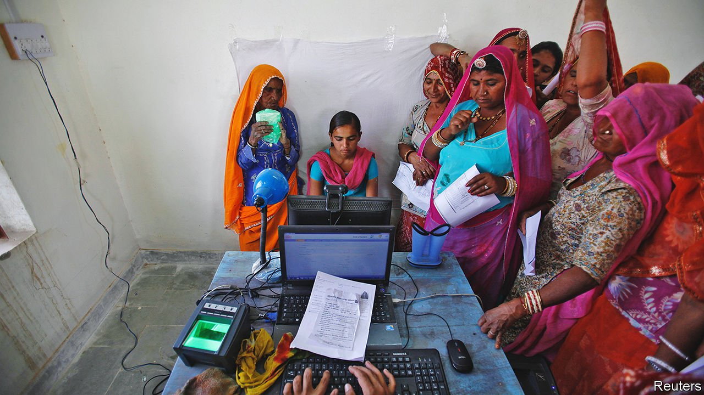

###### Seeing like a state

# India’s high-tech governance risks leaving behind its poorest citizens 

##### The government’s digital-first solutions are inaccessible to millions 

 

> Oct 16th 2021 

ACQUIRING A DRIVER’S licence in Delhi, India’s capital, requires a single 20-minute visit packing in a computerised exam and a brisk, efficient road test. The applicant’s phone pings as she exits the centre: “Congratulations! Licence will arrive by post within 24 hours.” At 8.30am the following morning a courier delivers the sleek, chip-enabled new card.

Such tip-top government service can be found in other poor countries too, but only by paying a bribe. The secret in Delhi is a national biometric identification system called Aadhaar. Rolled out over the past decade, it now covers all but a small fraction of India’s 1.4bn people. Everyone assigned a unique 12-digit number, backed by fingerprint and retina scans, enjoys instant proof of identity and residence. No more need for smudged birth certificates, crumpled utility bills or rental agreements.


Given India’s immense scale and complexity, and with its deep pool of highly skilled workers, its governments have increasingly turned to high-tech solutions for all sorts of problems. Generally these have eased burdens on both rulers and the governed, despite some expected glitches. Administrative infrastructure such as Aadhaar has propelled such conveniences as digital payments, internet shopping and online schooling. Yet precisely because of India’s size and poverty, tens of millions still are left out—because they are poor, illiterate, disabled, lack electricity, do not possess a smartphone or cannot connect to a mobile or Wi-Fi network.

Consider Reena Devi, a mother of two small children in Bihar, India’s poorest state. After her husband died last year, she should have been entitled to a widow’s pension and jobs programmes, among other things. But when Vyom Anil, a researcher, and Jean Drèze, an economist, met Ms Devi by chance, they found that since she had misplaced her Aadhaar card she had also lost all access to benefits. With no phone, no registered postal address and no record of her birth date, Ms Devi was unable to retrieve her unique number. The two academics spent four frustrating months trying to get Ms Devi re-registered. Finally a kind official made an extra effort, found her file and produced a new card.

Ms Devi was lucky to get help. In a few tragic cases those who have lost access to subsidised food because they cannot link their old ration cards to new Aadhaar cards, or because fingerprint readers in remote towns do not work properly, have starved to death. More commonly, poor people simply make do without the aid. Recent surveys by Lokniti-CSDS, a polling group, show that four-fifths of Indian families use public food-supply schemes, of which 28% say they have been denied rations at some point owing to problems with Aadhaar. The biometric ID has helped curb theft and corruption, but less so than non-tech reforms to the food system.

There are gaping holes in other government schemes as well. India’s covid-19 vaccination campaign, launched in January, quickly sagged, and not only because the government failed to order enough doses. Slots for shots could be booked only via CoWin, an online service. This proved easy for digitally literate people with at least some English. Most of those without such talents—the vast majority of Indians—had to wait until June, when the government quietly started admitting walk-ins. India is now close to giving its billionth jab—a notable achievement—but only a quarter of over-11s are fully vaccinated.

A social programme judged among India’s most successful, a decades-old network of some 1.35m free, one-room preschools that also provide meals, known as anganwadis, has suffered high-tech disruption, too. In March its workers, nearly all women paid less than $150 a month, were instructed to use a new, government-supplied smartphone app. Failure to upload classroom data could result in suspension of wages and of food supplies, threatening a vital source of nutrition for India’s poorest children.

The workers say the app is hard to use. It is only in English, which most do not understand, and takes up so much memory it crashes their cheap smartphones. Many do not even have a phone, or electricity or mobile reception in their villages. What was wrong with the old written ledgers they carefully kept for years, they ask? The change is that the government now wants more control and surveillance.

“In scheme after scheme we find that going digital has become a purpose of its own,” says Mr Drèze, the economist. Like many critics of the government’s technology push, Mr Drèze says he does not object to the principle. He points to a popular scheme in the southern state of Andhra Pradesh, phased out after Aadhaar, that had simply replaced old ration cards with smart cards. People liked them because they were simple and transferable.

The trouble comes when tech wizards in Bangalore forget that they live in what is still in parts a very poor country. This detachment is then compounded by politicians seeking quick, sexy solutions, who rush projects into action without proper study. Simpler approaches get ignored.

A recent randomised control trial by researchers at America’s National Bureau of Economic Research, for instance, looked at how anganwadis could be improved by employing an extra half-time worker at what are typically single-teacher operations. The results were dramatic. Teachers spent more than twice as much time on the children’s education and health, and on administration, too. Learning scores shot up. In anganwadis with an extra helper, severe stunting dropped a remarkable 42%. Yet whereas the government’s operating budget for anganwadis—meaning food and salaries—has stayed flat, its outlay on tech has soared. In its rush to become a modern, digital economy, India is leaving behind those who might benefit the most.■

