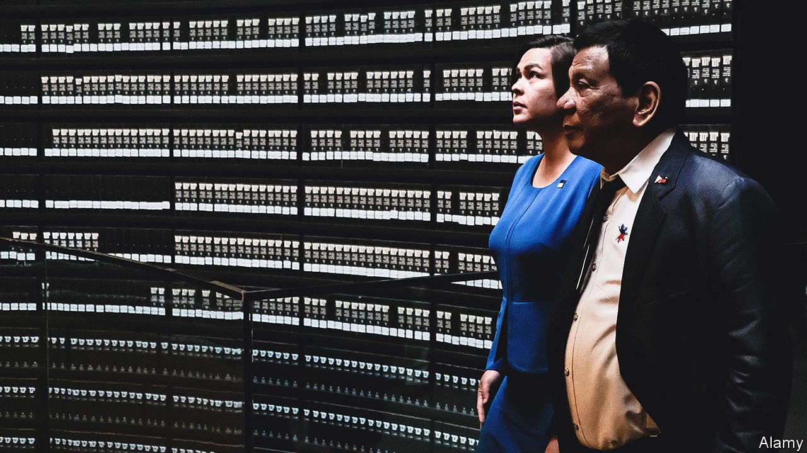

###### Duterte II: the sequel

# Rodrigo Duterte may pass on his job to his daughter 

##### Sara Duterte, mayor of Davao City, has so far shown reluctance to run for president 

 

> Oct 16th 2021 

THE LIST of 97 politicians who registered to run for president of the Philippines by the deadline of October 8th was missing one crucial candidate: the front-runner. An opinion poll conducted last month found that 20% of respondents wanted Sara Duterte, the mayor of Davao City, to replace Rodrigo Duterte, her father and the current president, when the single six-year term allowed to him by the constitution comes to an end in June. There is plenty of precedent for such a succession. Mr Duterte’s two immediate predecessors, Benigno Aquino and Gloria Arroyo, were themselves both presidential offspring.

Ms Duterte instead registered her candidacy for another term as Davao City’s mayor, insisting that was the post she wanted. Yet she has a way back into the presidential race. Senator Ronald dela Rosa, a former chief of the Philippine National Police (PNP) who led Mr Duterte’s bloody war on drugs, registered his candidacy at the last minute. The rules allow him to give up his place for another person until November 15th.


Ms Duterte herself has so far sent mixed messages. She first showed interest in running for president, then reluctance. Her father, for his part, indicated first that he was against her running, then that he was for it, then that she would definitely run, and then, after she caught covid-19 on October 9th, that she definitely would not.

All that posturing—including Mr dela Rosa’s candidacy—may be false coyness, part of a rigmarole meant to disguise the Dutertes’ ambition to prolong their hold on power. The idea would be to give the appearance that Ms Duterte is running only in response to persistent public demand. Mr Duterte used similar tactics himself when he ran for president six years ago, entering the race late and replacing a placeholder on the register of candidates.

The independent Commission on Elections will probably remove most of the 97 candidates from the register on the grounds that they are simply making a nuisance of themselves. But the latest survey indicated that several could be serious challengers to Ms Duterte. Her nearest rival is Ferdinand “Bongbong” Marcos, an ex-senator and the only son of Ferdinand Marcos, a corrupt and despotic former president. He was the choice of 15% of respondents. Another 13% said they would prefer Isko Moreno, the mayor of Manila. As a boy, Mr Moreno rummaged though rubbish for food, but grew up to be a film actor and eventually to run his home town. Senator Manny Pacquiao, a world-champion boxer, was the choice of 12%. Mr Pacquiao is backed by one of the two rival factions of the governing party, PDP-Laban. The other faction backs Mr dela Rosa.

Leni Robredo, the vice-president, who in effect is also the leader of the opposition, was the choice of less than a tenth of the respondents. Another also-ran was Senator Panfilo Lacson, another former chief of police. For a spell, Mr Lacson was a fugitive from justice, wanted on murder charges that have since been dropped. The survey was conducted before Mr dela Rosa emerged as a candidate.

Mr Duterte, for his part, says his plan after his term ends is to retire to Davao City and prepare a defence against the International Criminal Court (ICC), which is investigating whether his war on drugs amounts to a crime against humanity. If Ms Duterte were to become president, she would be in a position to perform an enormous service for her father, Mr dela Rosa and sections of the PNP by shielding them from the investigation. Among the other candidates, only Mr Marcos has declared that he would protect the drug warriors from international courts. The rest have indicated various degrees of openness to the ICC investigation. They are likely to split the pro-investigation vote. Yet Mr Marcos and Ms Duterte or Mr dela Rosa, whichever runs, may end up dividing those voters who are opposed to the investigation.

Such political currents make the outcome of the election in May uncertain. But Ms Duterte’s popularity gives her a better chance of winning than Mr dela Rosa. He, as well as Mr Duterte, would no doubt be happy if she leaves Davao City behind and follows her father’s trail to Manila.■

