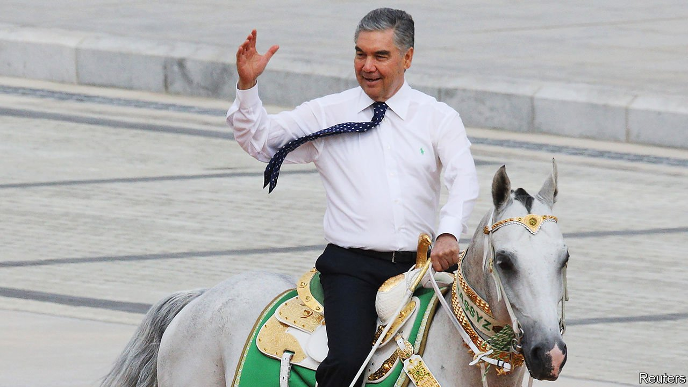

###### Tin-pot dynasty

# Turkmenistan’s horse-loving dictator is grooming his son 

##### Gurbanguly Berdymukhamedov wins elections with 98% of the vote and ruthlessly suppresses dissent 

 

> Oct 14th 2021 

NORTH KOREA is not the only supposed success story in Asia’s fight against covid-19. In the middle of the continent, on the eastern shores of the Caspian Sea, Turkmenistan too has seemingly managed to go the past two years without a single recorded infection. Under President Gurbanguly Berdymukhamedov (pictured) its lucky citizens have been living in an “Era of Might and Happiness”. What is more, their president entertains them too, roaring around in racing cars, scoring bullseyes on the rifle range and catching whoppers on fishing expeditions. The economy is said to have grown some 6% last year. The country’s 6m people are prospering.

That, at any rate, is the official picture. The reality is quite different. Wage arrears are rife. The black-market value of the manat, the country’s currency, is a seventh of the official rate. Even the usually upbeat president has fretted about Turkmenistan’s swelling debt, though its precise scale is kept secret. The Asian Development Bank reckons GDP grew a modest 1.6% in 2020 as energy prices slumped and Chinese demand for natural gas fell. Gas accounts for 90% of Turkmenistan’s exports; China for 80% of its trade.


Exports have bounced back with the recent surge in demand for natural gas, but an inflexible contract with China has prevented Turkmenistan from reaping the full rewards of skyrocketing prices. The Taliban’s takeover of neighbouring Afghanistan has made even more unlikely already stalled plans to build a pipeline to carry gas to new markets in South Asia. The militants say they want the pipeline to go ahead, but few foreign backers are keen.

Though the government’s propagandists try their best to present the country as a land of plenty, Turkmenistanis are all too aware of the real state of the economy. State television shows shops with overflowing shelves, but “in reality people go at 4-5am to queue at state food shops,” says Farid Tukhbatullin, who heads the Turkmen Initiative for Human Rights (TIHR), an advocacy group based in Vienna. Most citizens dare not complain “because they fear the person next to them could be an informer”, he says.

People who do question the official line are harassed by security men. Soltan Achilova, a 72-year-old journalist in Ashgabat, the capital, who earlier this year publicly criticised the government for shortages of flour and cooking oil, which are subsidised, has faced threats, attacks and arrest as a result of her reports to Chronicles of Turkmenistan, TIHR’s news website.

Last year a young man named Nurgeldi Halykov was jailed after sharing with Turkmen.news, an independent news outlet based in the Netherlands, a photo on Instagram that drew attention to a visiting delegation from the UN’s World Health Organisation. Officials continued to deny covid was present even after the British ambassador caught it last year. “Turkmenistan never fails,” the editor of Turkmen.news, Ruslan Myatiev, notes wryly. Social-media networks and news websites are blocked. Police surveil mobile phones for software that can circumvent such censorship. Turkmenistanis cannot even access Zoom.

Such heavy-handed repression has kept Mr Berdymukhamedov, who styles himself Arkadag (“The Protector”), in power since 2007, nearly half of Turkmenistan’s existence as an independent state. Yet the absence of credible information also causes wild rumours to circulate, such as when the president, whose health is said to be failing, disappeared from public view in 2019. Many Turkmenistanis believed he was dead.

Earlier this year Mr Berdymukhamedov appointed his 40-year-old son, Serdar, as deputy prime minister answerable only to the president. Two months later the younger Berdymukhamedov was made head of the country’s horse association. The local Akhal-Teke horses and Alabai dogs play an important role in the president’s personality cult. Photographs aired this summer showing Serdar astride a thoroughbred, a gift from his father, again fuelled speculation among Turkmenistanis about a coming succession. A dynasty appears to be in the offing.■

