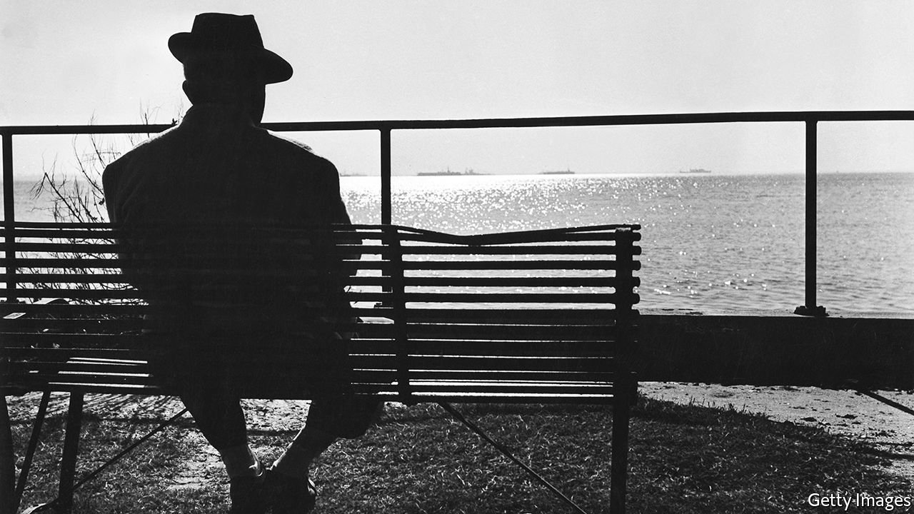

###### Spy fiction

# A posthumous novel from John le Carré 

##### “Silverview” is a worthy coda from a much-missed master 

 

> Oct 16th 2021 

Silverview. By John le Carré. Viking; 224 pages; $28 and £20

WHEN JOHN LE CARRé died last December, he left behind a prodigious oeuvre that spanned six decades and chronicled human betrayal and geopolitical turmoil with a winning blend of intrigue, insight and moral complexity. He also bequeathed an archive of unpublished material. In it was one complete, full-length novel called “Silverview”, which he had been working on in tandem with the last two books he published during his lifetime, “A Legacy of Spies” and “Agent Running in the Field”. Now, almost a year after his death, the novel—the British author’s 26th—is emerging into the light.


As with those two other late-career works, the bulk of the book plays out in le Carré’s native land. It introduces Julian Lawndsley, who has recently escaped from the rat-race in the City (“I came, I stole, I conquered”) to run a bookshop in a small seaside town. One evening, just before closing time, he receives a final customer who shows a curious interest in the shop’s basement. Edward Avon claims to be an old school friend of Julian’s late father, describing himself as “one of life’s odd-job men”. A connection is formed, after which Julian is invited to the Avon family home, Silverview, where he meets Edward’s wife Deborah and their daughter Lily.

Le Carré opens up a separate narrative strand. When a tiny technical blip turns into a full-scale security breach, spy boss and “chief sniffer-dog” Stewart Proctor is asked to hunt down the source of the leak. His investigations involve dredging up retired spies and trawling through old case histories, including a botched operation in communist Poland and a tragedy in war-ravaged Bosnia. Proctor homes in on his quarry in a certain seaside town, keen to learn more about the turncoat and the rationale for his treachery: “Who do we find when we’ve pulled away the layers of disguise? Or were you ever only the sum of your disguises?”

“Silverview” takes at least 50 pages to gather momentum. “But what on earth was the endgame?” wonders Julian of Edward’s intentions—a question some readers may ask about the novel as a whole in its early stages. When the plot takes shape, though, and motives come into focus, the story comes to life and acquires depth, pace and tension. There is a retro charm about proceedings—people keep diaries, write letters, send faxes and wear Homburgs—as well as a welcome array of familiar le Carré tropes, from sharply drawn characters to stimulating interviews and debriefings, plus a compelling denouement involving a wanted man on the run.

This book is by no means vintage le Carré. But nor is it the half-baked posthumous cash-in it might have been. Rather it is a worthy coda, a commanding farewell from a much-missed master.

