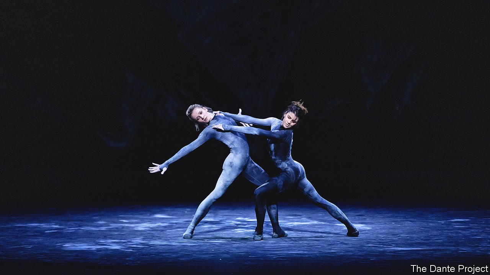

###### Dante andante

# A “Divine Comedy” ballet, 700 years after Dante’s death 

##### Thomas Adès, Wayne McGregor and Tacita Dean have created a phenomenon 

 

> Oct 16th 2021 

ARTISTS HAVE been reimagining the “Divine Comedy” for most of the 700 years since Dante Alighieri’s death. A silent-movie version of 1911 was the first of many attempts to adapt his masterpiece of temptation and redemption for the screen. It has inspired comics, manga series, death-metal albums and a video game. Now, seven years after the British composer Thomas Adès first mooted the idea to Wayne McGregor, an acclaimed choreographer, comes the first full-length Dante ballet.

They initially worked together 20 years ago. Mr Adès has since become best-known for his operas, particularly “Powder Her Face” and “The Tempest”. Composing for dance is different, emphasising rhythm, yet he leapt at the chance to do his first full-length piece for the Royal Ballet. Mr McGregor asked Tacita Dean, a British artist who works mostly with film, to design the production and costumes.


Composing for an orchestra is a slow affair. So rather than first writing a score, and only then developing the choreography and stage design, the trio began working on “The Dante Project” at the same time. The resulting show—which was to have its world premiere at the Royal Opera House in London on October 14th, after The Economist went to press—pulses with life, energy and ideas. For the audience it is less a conventional performance to be watched than a phenomenon to be experienced.

A poem in three parts, “The Divine Comedy” lends itself to theatrical staging. Ms Dean sketches the show’s arc, across three acts moving “The Dante Project” from monochrome to colour, and from pencil drawing through photography to film. The “Inferno”, the first part, which was staged separately in Los Angeles in 2019 (see picture), is set in an icy grey rather than a burning hell. The backdrop is an Antarctic seascape, bled of all warmth and turned upside down, literally: the dancers, when they appear, seem to be exploring a cave.

As the characters of Dante and Virgil, his guide, descend into the depths, Mr Adès digs into the past, to the era of Tchaikovsky and Liszt, for musical inspiration. On the stage, Mr McGregor unleashes a riot of bodies in dark geometric forms. Dressed head-to-toe in a black that is covered in white chalk, the deadly sins—Envy, Greed, Sloth, Pride, Gluttony, Wrath and Lust—writhe and tremble, self-harm and headbutt, chalk passing from body to body in a drama of violence and temptation.

By contrast, “Purgatory”, the next section of the poem, is set on Earth, as depicted by a huge green jacaranda tree that gives shade to a wide street. Mr Adès enriches the chant of a Sephardi cantor from Jerusalem with kettledrums and tambourines. The dancers appear in a dun colour, dust and wind adding to the sense of groundedness. As the second act progresses, rain turns the jacaranda mauve with flowers, conveying the optimistic view that life contains more joy than suffering. It is here that Dante meets his beloved Beatrice in a pas de deux that is as light as spun sugar.

In “Paradise”, Ms Dean uses film to conjure up the glow of other planets. Musically, Mr Adès could have gone for a brassy, triumphant finale. Instead chromatic scales impose a sense of unexpected wonder as, at the close of one of the first great premieres after the pandemic, the dancers reach out for undiscovered worlds. ■

