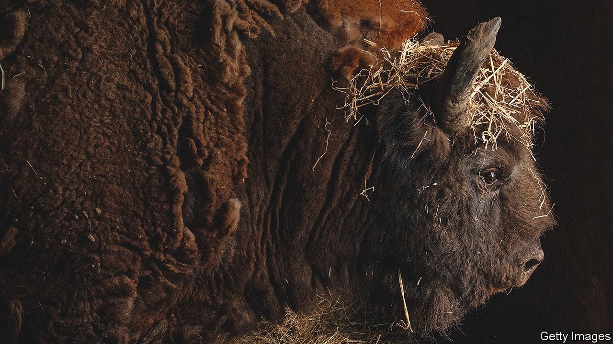

###### Evolution

# Humans have altered other species as well as the environment 

##### Beth Shapiro explains how in “Life as We Made It” 

 

> Oct 13th 2021 

Life as We Made It. By Beth Shapiro. Basic Books; 352 pages; $30. Oneworld; £18.99

HUMANS ARE a force of nature. This paradoxical thought is the glue that holds “Life as We Made It” together. But it is not the environment-changing effects of human activity on land, sea and air that intrigue Beth Shapiro—or not directly. Instead, she looks at how people have altered living organisms themselves, exerting an evolutionary pressure on other species.


If turning aurochs into cattle, wolves into dogs or teosinte into maize sounds like a sideshow compared with transforming the composition of the atmosphere, looting the oceans or destroying the rainforests, consider a few facts. The most common species of bird is Gallus gallus, the domestic chicken. Even excluding people themselves, the biomass of domesticated mammals exceeds that of the wild sort by a factor of 14. A third of Earth’s dry land (deserts and ice caps included) is devoted either to growing domesticated plants for human consumption or to the nutrition of domestic animals.

How this came about, and where it is leading, are Dr Shapiro’s topics. Her day job is as an evolutionary molecular biologist—a recent field, but one just old enough in 1999, when her research career got going, for lots of the good stuff to have been snaffled already. Mammoths, musk oxen, giant sloths, dogs, wolves, horses and even Neanderthals were all jealously guarded by other researchers. But, as her supervisor at Oxford pointed out, no one was studying bison.

Bison, it transpires, offer an excellent insight into human influence on other species’ evolution. They started in Asia but migrated to North America during the last Ice Age. For 100,000 years they thrived. Then people followed them across Beringia, and the massacre began. Unlike many other large American mammals, bison were not exterminated by the new arrivals. Instead, they evolved. Being large, and thus an easy target, was bad. Being small, and better able to survive in the marginal habitats into which they were driven, was good. So evolution shrank them by 30%.

Later, a second wave of humans arrived, this time by sea from the east. The diseases they brought, particularly smallpox, ran riot among the human population, permitting an explosion in the bison’s. But the newcomers also brought guns, railways and eventually another massacre. The last chapter of the bison’s story involves a human change of heart. Having reduced the species to a handful of individuals (125, Dr Shapiro estimates), Homo sapiens set about saving it—at another price to its gene pool. Most bison today are privately owned and raised for their meat. They are selectively bred, not least for docility, and share some cattle genes after crossbreeding that happened a bit over 100 years ago.

Even the few remaining “wild” bison are intensively managed and carry cattle genes. Shrunk, tamed, crossbred and eaten, are bison now a domesticated species? The answer is ambiguous; but the bison’s tale certainly matches that of other, clearly domesticated organisms, from cattle and sheep to wheat and peanuts.

Turning these (and dozens of similarly modified types of creature) into people, as Dr Shapiro summarises their edible fates, while harnessing others as workhorses, has permitted human domination of Earth. But it has also unleashed a demon. For it is only by continually improving the yield of domesticated species that all those extra mouths can be fed.

So far, selective breeding has kept up. But more is now needed. Though the engineering of genomes for agricultural purposes has, in the view of many, got off to a rocky start, new techniques can cut to the chase, circumventing the requirement for generations of selective breeding. Those same techniques promise other things besides. One is the idea of de-extinction—the creation of simulacra of organisms that no longer exist, such as mammoths, about which Dr Shapiro has written eloquently in the past. Another is the modification of human beings themselves.

That is a big and tortuous topic, and she does not dwell on it. But in an age when “technology” has become synonymous with the information kind, it is worth being reminded that other sorts are available. And with one of them people can, if they so choose, remake themselves. ■

