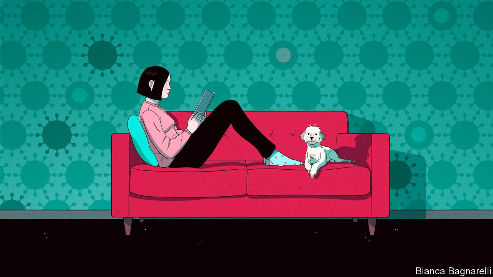
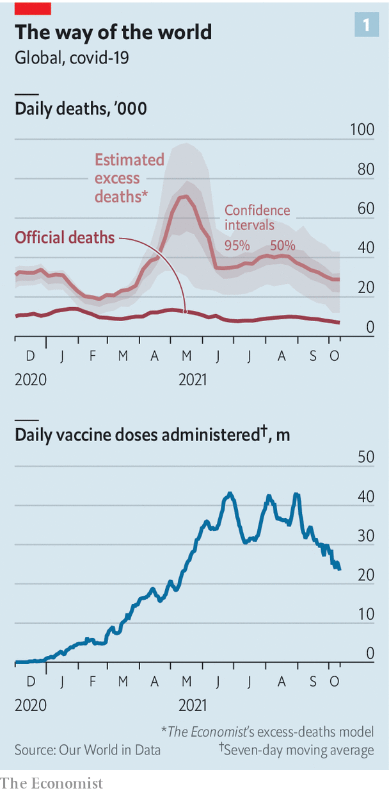
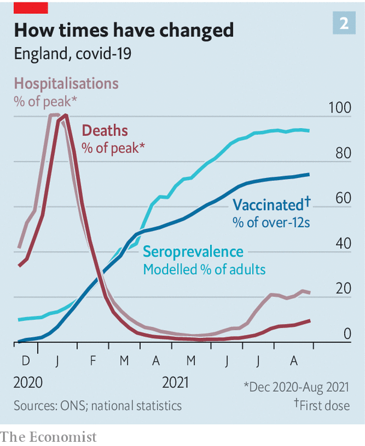

###### What lies ahead

# How the world learns to live with covid-19 

##### From pandemic to epidemic 

 

> Oct 16th 2021 

WINTER 2025 could, with luck, be normal. Health-care systems will come under strain, as always, from the spread of respiratory diseases that land people in hospital. Influenza will afflict the elderly. Respiratory syncytial virus will make some children gravely ill. And a newish seasonal disease will belong in the mix: covid-19. It will overwhelmingly sicken the old, even more than flu. But, outside hospitals, life will continue largely uninterrupted.

The world has experienced pandemics before. In the cholera outbreak of the 1830s nearly 3% of Parisians died from the disease in a single month. At the end of the 19th century around 1m people may have died from Russian flu, which some think was caused by a coronavirus. The Spanish flu that struck in 1918 killed around 50m in just a couple of years.


Covid-19 joins that list. The pandemic has probably killed 10m-19m people, with a central estimate of 16.3m, according to The Economist’s excess-death model. Covid is far from the deadliest disease humanity has faced. Many of those infected do not even know they have it. But it is new and it is everywhere. When it emerged the entire world was susceptible to it. That immunological naivety, combined with the nature of the virus itself, explains the speed of its spread and the awfulness of its impact.

But in the end, all pandemics burn out. Eventually, sufficient numbers of people develop immunity so viruses can no longer find new hosts at the rate they need to sustain their growth. And yet only one human disease, smallpox, has ever been completely eradicated. Others, such as influenza, measles and cholera, slowly became endemic, part of the landscape of disease around the world, checked but not eliminated by vaccines and medical treatments.

In that respect, covid is no different (see chart 1). What is novel about this pandemic is the speed at which science—in the form of both vaccines and treatments—is accelerating the disease’s journey to endemicity. The question now is how quickly it will become endemic and what the world will look like as it does.

 


Most governments accept that eradicating covid is impossible. The last large country in the world still pursuing a  is China. Yet eradication became impossible soon after the disease appeared, argues Maria Van Kerkhove, an epidemiologist at the World Health Organisation, because too many countries failed to fight the virus as strongly as possible.

The extreme transmissibility of the Delta variant has rendered that goal even more obviously futile. Endlessly repeated lockdowns and severe quarantines are the only alternative. All societies find these intolerable. Ultimately that will be true even for China. Instead every country will have to work out how to live with the disease.

Endemicity means that a virus circulates at a steady rate. Infections sometimes rise or fall but transmission is generally constant, stable and predictable. The disease does not overwhelm nor does it disappear. Infections reach an equilibrium where the proportion of the population becoming susceptible is in balance with the likelihood of transmission. Vaccination can push that equilibrium point lower.

Humans have done exactly this to polio and measles, two devastating diseases which were endemic throughout the world in the 20th century but which have now been eliminated from much of the planet. The overwhelming incentive for the vaccination campaigns was that both viruses harmed and killed children, who are born with naive immune systems. Covid is unlikely to follow the same path, not only because it causes relatively little harm to youngsters, but also because vaccinated people can still contract the disease and pass it on, although cases are usually mild.

Contrast that endemicity with that of the common cold, which can be caused by any of around 200 vi ruses. Most children who contract it do not get seriously ill. Most adults, even older ones, who contract it do so with some immunity from the string of colds they endure over the course of their life, and so are able to fight it off. And so colds persist as endemic diseases at a relatively high level of infection.

Influenza is different yet again. It is one of the most dangerous endemic diseases, killing 290,000-650,000 people every year, most of them elderly. Vaccines exist, and are widely given every year to protect vulnerable people. But there is no prospect of wiping it out, in part because vaccination drives are not comprehensive, and in part because the virus itself mutates faster than vaccines can consistently keep up with.

The harm from endemic covid may eventually fall somewhere between that of influenza and the other common coronaviruses. Trevor Bedford, a virologist at the Fred Hutchinson Cancer Research Centre in Seattle, has calculated that Delta reproduces twice as fast as H3N2, one of the most common flu strains. He also notes that, to date, SARS-CoV-2 has also evolved about five times faster than the flu virus (although that rate will slow as the disease becomes endemic and hence less prevalent). Dr Bedford believes that the burden of SARS-CoV-2 will come to resemble that of influenza in the next few years. Individual infections will be no greater threat, but covid’s higher transmissibility will mean more cases and more deaths. America alone could, by his estimates, see 50,000-100,000 deaths a year from covid. Flu kills about 12,000-52,000 people in America every year, according to the Centres for Disease Control and Prevention.

Others think that instead covid will look more like the other common coronaviruses that circulate widely yet barely trouble health-care systems or society. David Heymann, an epidemiologist at the London School of Hygiene and Tropical Medicine, notes that the spread of SARS-CoV-2 is closer to that of the common coronaviruses than it is to that of the common influenzas. Unlike flu, its outbreaks are not driven by children. And whereas flu vaccines prevent at best 40-60% of infections bad enough to merit a visit to the doctor, and need to be tweaked every season in light of new variants, the jabs for covid are much better at preventing serious illness and death and thus far have required no updates. All this may mean that endemic SARS-CoV-2 will end up more like the other endemic coronaviruses than flu. Jabs may still be needed periodically for the most vulnerable but Dr Heymann thinks that even in bad covid seasons deaths may not get anywhere as high as those from influenza (using current flu vaccines).

Regardless of where endemic covid ends up, the world is not yet there. Hospitalisations and deaths are soaring in eastern Europe where vaccination campaigns have been poor. Large swathes of the populations of New Zealand and Australia, which have had low infection rates as a result of stringent lockdowns and slow vaccination roll-outs, are still immunologically naive. Countless people have yet to be reached by either virus or vaccine. When the virus arrives in parts of the world without immunity, the result will be spikes in disease and death.

Not yet out of the woods

In the medium term even highly vaccinated places will see flare ups. Britain, which ditched its precautions earlier than most other European countries, shows that covid can bear down on hospitals even in places with the benefit of high levels of vaccination (see chart 2). In September covid patients occupied 25-35% of its intensive-care beds. They tend to stay there for two to three weeks, leaving less room for post-operative care patients, who need a bed for only a couple of days. But in Britain, as in the rest of Europe, 80-90% of those hospitalised with covid are unvaccinated. The divide between vaccinated and unvaccinated is even starker when it comes to death. Covid is now a leading cause of death among unvaccinated Britons. In the first half of 2021 just 1% of all deaths in fully vaccinated people in Britain were because of covid. Among the unvaccinated, the disease caused 37% of deaths.

 


Globally, these waves of infection will be dampened by the collective immunity that runs through and around the remaining pockets of the immunologically naive. Over time, these spikes will become ever rarer. And the world will stumble towards endemicity. What endemicity looks like and the speed with which countries get there will depend on three things: what proportion of a given population are immune to the virus and the quality and durability of that immunity; how the disease can be treated; and how the virus evolves.

Immunity is hard to measure. The immune system is complex and poorly understood. Both the quantity and quality of the antibodies it produces matter. “Up to six months after vaccination, the immune system is still in the process of optimising and perfecting its response,” says Ali Ellebedy, an immunologist at the Washington University School of Medicine in Missouri. “Antibodies induced in the first two or three months are being slowly replaced by much better antibodies in terms of binding affinity to the spike. That’s hard to see. Quantitatively there are fewer antibodies but qualitatively things are improving.”

Nor are antibody levels a definitive marker of protection. “People get covid with very high antibody levels. It’s not that there is an obvious cut-off where you can say ‘This high, you are protected’,” says Sarah Walker, an epidemiologist at Oxford University. But at a population level, a high prevalence of neutralising antibodies—which prevent a pathogen from infecting the body—means fewer infections.

Even without great insight into people’s individual or collective immunological state, the broader picture is clear. As the virus has spread through populations, the immune systems of those who survive have been training themselves on its shape, preparing antibodies to fight off future infection. The protection vaccines afford against infection wanes in the months after people receive them, but the training they give the immune system to prevent serious disease and death stays strong.

Vaccines have offered about a third of humanity a shortcut to endemicity, bypassing sections of the path that would otherwise have been far more deadly. Some 3.8bn people have had at least one shot, and 2.8bn are fully vaccinated. Add them to those who have survived infection and it looks as if over half the world’s population boasts some degree of immunity to covid.

Vaccines greatly reduce the risk of severe illness and death. They have saved hundreds of thousands of lives and let many health-care systems keep operating. Covid is the first pandemic for which the cyclical tussle between viral spread and evolution and developing immunity has been short-circuited so fast and on such a scale.

But the overwhelming majority of those who have acquired immunity in this less risky manner reside in wealthier countries. In poor places the majority have and will continue to do so via infection. The rate of vaccination, which surged through the first half of the year to reach some 43m doses administered per day in late June, had dropped to 30m doses per day by the end of September, although much of this decline is because of slowing vaccination in China. It is remarkable that humans have been able to administer vaccines faster than the virus is able to spread between people, but this now looks as though it is a phenomenon confined only to rich places.

At present, the world’s collective level of immunity to covid is nowhere near that for other endemic respiratory diseases. That is because all humans are exposed to older endemic diseases repeatedly through their lives, particularly as children. Every exposure offers a new chance to train the immune system. Dr Ellebedy says it will take decades for humanity to reach a comparable level of immunity to covid. The coming years, then, will be characterised by a slow process of cyclical decline that runs in tandem with a broadening and deepening of immunity through infection.

To everything there is a season

Eventually, once immunity is widespread enough, cases of covid will fall into a seasonal pattern similar to other endemic respiratory diseases that have been circulating for a much longer time. Rachel Baker of Princeton University, who studies how viruses respond to environmental conditions, says that she expects within five or six years the patterns of covid infections will become seasonal, like those of other endemic coronaviruses, rather than being driven by immunological naivety.

The fact that covid will almost certainly become a disease that humanity can live with is thanks not only to vaccines but also to the rapidly advancing treatments. Remdesivir, an antiviral, can reduce hospital admissions by 87% in high-risk patients if it is given in the first stage of covid. But it needs to be administered intravenously in a hospital setting. Antibody therapies, another kind of drug, are highly effective but are usually given in the same way.

AstraZeneca’s antibody drug, AZD7442, which is under regulatory review in America, solves some of these problems because it can be in injected in places like doctors’ surgeries. It will probably be expensive so will not be used widely. But it offers a quick shot of covid-fighting antibodies so will provide extra protection to those at risk even after vaccination such as the immunocompromised. A hit of antibodies will also be useful as prophylaxis both for those at high risk of catching the virus (such as health workers) and those likely to become very ill (those with underlying conditions such as cancer or diabetes or the elderly residents of care homes).

Cheaper oral antiviral drugs which will further reduce the burden that covid places on humans, and on the hospitals that treat them, are also on the way. Most promising is molnupiravir, made by Merck and Ridgeback, both drugmakers. Taken within five days of symptoms’ onset it reduced the risk of hospitalisation or death by about 50% in patients with mild or moderate covid.

Merck expects to supply 10m courses of the drug by the end of 2021. Pricing will be tiered, and so it will be affordable across the planet. Results from trials of similar drugs from Pfizer, Roche and Atea Pharmaceuticals could add to the antiviral arsenal.

Antivirals such as molnupiravir do not cure covid-19. But they make it much less dangerous. One worry, however, is that the virus will evolve to resist a single line of antiviral therapy. Peter Horby, a professor of emerging infectious diseases at Oxford University, warns of the need to consider using combinations of antivirals from the outset. HIV antiviral drugs showed that resistance to single therapies arises quickly.

 


These drugs will make covid easier to live with but governments and public-health authorities will still need to ensure that any outbreaks do not overwhelm health-care systems. Each winter the circulation of influenza will add to the challenge. It may make sense to once again take steps to reduce the transmission of the disease. In the rich world very few occasions should require going into the office with a respiratory complaint, especially in winter. Annual boosters and flu shots will help keep vulnerable people out of hospital.

Over all this hangs the inevitability of the coronavirus’s continued evolution, and the question of its impact. Any new variant that emerges is overwhelmingly likely to do so based on Delta, which has displaced virtually all the rest. If a new variant emerges which outcompetes Delta, it will eventually spread everywhere. The Beta variant, which is now being driven towards extinction, was better at defeating immunity than Delta is, but less good at spreading, and so receded.

A new variant that combined their traits would be a disaster. “Delta Plus”, a subvariant that has so far not taken off, has picked up mutations of the sort which characterised Beta, but no evidence suggests yet that this is leading to its wider spread or vaccine evasion. But the possibility of a Delta variant with Beta characteristics, as well as the need to keep people out of hospital, will always be a reason for limiting the spread of the disease. “We’re ill-equipped to predict the timeline,” says Daniel Altmann, an immunologist at Imperial College London, since coronavirus evolution is by its nature unpredictable.

No matter what mutations SARS-CoV-2 picks up in future, endemic covid will not exist in a vacuum. Viruses compete with each other. A study carried out by Public Health England on data gathered between January and April 2020 found that people already infected with influenza were 58% less likely to test positive for covid later—probably because the two viruses were jockeying for dominance within the human body. For a few vulnerable people, though, it was possible to get infected with both at the same time. For them the risk of death was almost double that of being infected with SARS-CoV-2 alone.

Even as endemicity sets in, the world still has a long way to go. It is not using all the tools—vaccines in the arms of all the vulnerable, masks and ventilation—to get there as fast and safely as possible. Covid will eventually become endemic. But it will throw up many challenges in the months and years ahead. The road to the new normal could yet be very bumpy. ■

Dig deeper

All our stories relating to the pandemic can be found on our . You can also find trackers showing ,  and the virus’s spread across .

