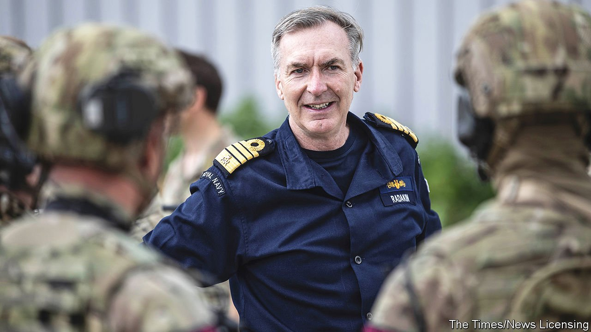

###### Master and commander

# British defence strategy is undergoing a naval tilt 

##### The promotion of an admiral to run the armed forces accentuates the turn to the seas 

 

> Oct 14th 2021 

IN A COUNTRY of grand titles, no official holds a loftier one than Britain’s first sea lord, the head of the Royal Navy, whose office predates that of the prime minister. Now Admiral Sir Tony Radakin, the incumbent, has been handed dominion over not just the oceans, but also land, air and space. On October 7th the government announced that he would become the next chief of defence staff, the country’s most senior military officer, to replace General Sir Nick Carter on November 30th.

Admiral Radakin, a trained barrister born in Oldham, in the north of England, will be the first naval officer to hold the top job in almost two decades. That is no coincidence. After 20 years of grinding land warfare in Iraq and Afghanistan—the latter concluding in disastrous fashion in August, with the fall of Kabul—British defence strategy is once more acquiring a pronounced naval flavour.


In March the government published a review of foreign policy that emphasised Britain’s role as a “maritime trading nation”. It promised to deepen the country’s connections to Asia, Africa and the Gulf and set out a “tilt” to the Indo-Pacific. A subsequent defence review said that the armed forces would be designed for “permanent and persistent global engagement”, not just preparing for big wars.

One manifestation of this maritime tilt is that while the army is being shrunk, the navy’s fleet is planned to grow to 24 frigates and destroyers by the 2030s, though with a lean period over the coming decade. In a speech in May Admiral Radakin hailed a “renaissance of British shipbuilding”.

Today’s ships are being worked hard. Last year the Royal Navy sent ships to the Barents Sea, the heart of Russian naval power, for the first time since the cold war. In August a British destroyer skirted Crimean waters, drawing fire from Russia’s coastguard. The crown jewel of the fleet, a carrier strike group built around HMS Queen Elizabeth, one of two new aircraft-carriers, is voyaging through Asia. On September 27th one of its destroyers passed through the Taiwan Strait, becoming the first British warship to do so in 13 years.

Some sailors will stay far from home. The Royal Navy plans to deploy two small vessels to Asia permanently. Though it will stretch the navy thin, a pair of “littoral response groups”, in essence a handful of commando-packed amphibious ships, will deploy in the North Atlantic this year, and to Oman, in the Indian Ocean, in 2023.

These strategic shifts—a maritime turn, greater attention to Asia and an emphasis on using the navy to make friends—came together in the AUKUS pact of September 15th, in which America and Britain agreed to help Australia build nuclear submarines to deter China. It cannot have hurt Admiral Radakin’s candidacy that he helped negotiate the agreement.

Meanwhile on land, the mood is glummer. Having provided six of the past ten defence chiefs, the British Army saw Admiral Radakin chosen ahead of two of its own: General Sir Mark Carleton-Smith, chief of the general staff (the head of the army) and General Sir Patrick Sanders, who leads Strategic Command, which controls special forces and cyber capabilities.

Despite its active role during the pandemic last year and its response to the fuel crisis this month, as well as its successful airlift from Kabul, the army is smarting from brutal cuts in the defence review. But it has also botched key projects. Ajax, an armoured reconnaissance vehicle that was supposed to serve as the digital hub for Britain’s future armoured division, is suffering from potentially crippling problems with vibration and may have to be scrapped. Francis Tusa, a defence analyst, says that some in the army are worried that it will not be able to deliver a high-readiness brigade (roughly 5,000 troops) to NATO by 2024, as promised, because of equipment shortages.

The army, caught between peacetime missions that require light infantry, and preparation for high-end warfare with heavier forces, “is in danger of no longer having a clear role—or being able to perform one”, warns Anthony King of Warwick University, who advises the army. Preserving inter-service harmony may require Admiral Radakin to pay close heed to the Royal Marines’ motto: per mare, per terram—by sea, by land. ■

