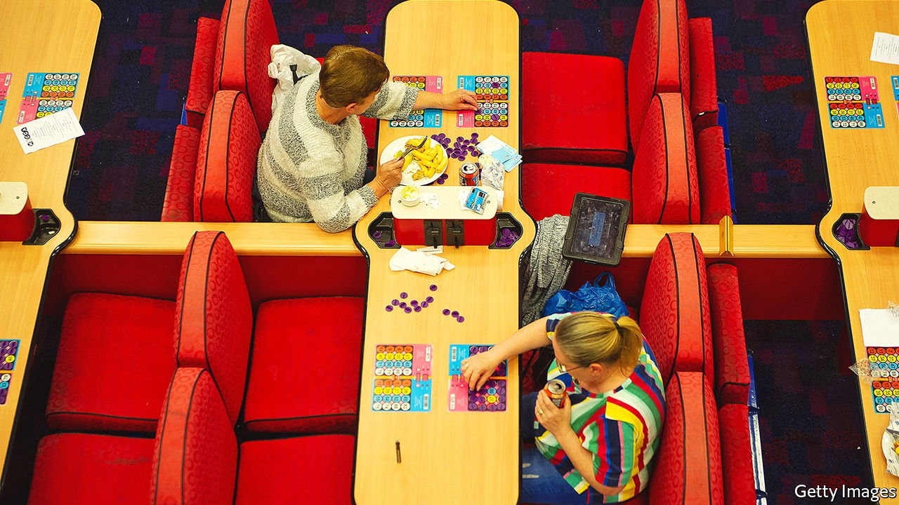
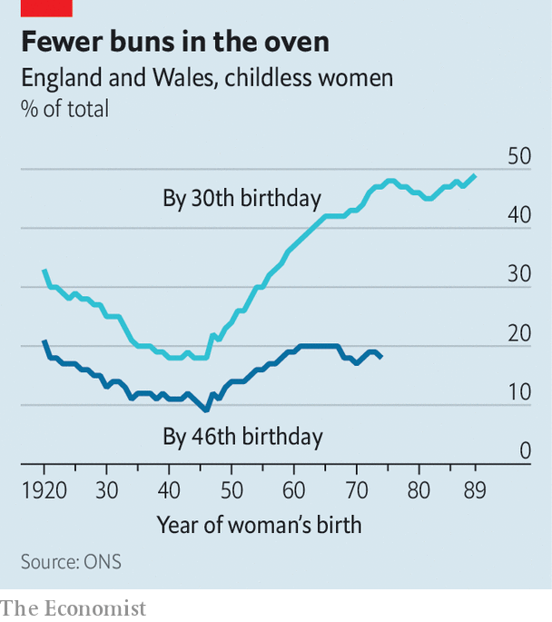

###### Demography and destiny

# In Britain, childlessness seems likely to return to 1920s levels 

##### That will strain the care system, and perhaps change the culture 

 

> Oct 14th 2021 

ANYBODY MULLING a career as a midwife or nursery manager might want to reconsider. On October 14th the Office for National Statistics reported that in 2020 the fertility rate in England and Wales, which is expressed as the number of children per woman, fell to 1.58, the lowest since records began in 1938. Babies are particularly scarce in inner London. Just 5,442 were born in the borough of Newham last year, down from 6,426 in 2012. And almost all were conceived before covid-19 made the prospect of going into hospital unappealing. The tally for 2021 may well be lower.

Birth rates can fall for several reasons. Couples may decide to stop at two children rather than going for a third. Gaps between pregnancies can extend. If women merely delay having children, the fertility rate will fall and then rebound, as happened to some extent in the 1970s and again around the turn of the century. But this time it looks as if people are going without altogether.


A recent article by John Ermisch, an Oxford University sociologist, finds that the drop in the English and Welsh fertility rate has been caused largely by a decline in first births. Women without university degrees, who have historically been more likely to have children, are emulating the better-educated. If the current pattern holds, Mr Ermisch reckons, 21% of women will have no children—back to the level of the cohort born in 1920 (see chart).

 


Although the stereotype of a childless woman is a trouser-suited careerist running too late to the IVF clinic, the reality is different. One study of Britons born in 1970 found that the two most important reasons for remaining childless, among both men and women, were that they did not particularly want children or did not meet the right partner. That hints at a broad change in norms and expectations. A new paper on America by Melissa Schettini Kearney and two other economists comes to similar conclusions. They think fertility is declining not because of economic pressures, but because people’s assumptions about life and families have changed. In particular, children are thought to require much more effort and attention than was the case in the past.

Few old people are childless today. Those celebrating their 80th birthdays this year belong to a cohort born in 1941, among whom only 11% ended up child-free. Falling fertility and growing lifespans mean that the number of childless 80-year-olds will triple over the next two decades, according to the ONS, and seems likely to rise thereafter. That will put more pressure on the care system, because old people without children are more likely to receive formal care.

Culture might change, too. British novels used to be stuffed with elderly bachelors, spinsters and maiden aunts, but they faded from view in the 20th century. “The position of an unmarried, unattached, ageing woman is of no interest whatsoever to the writer of modern fiction,” complained a character in “Quartet in Autumn”, a novel in 1977 by Barbara Pym, who was the standout exception to the rule. Bring back the literary spinster—or, failing that, look to Pym’s novels for a vision of the future.

