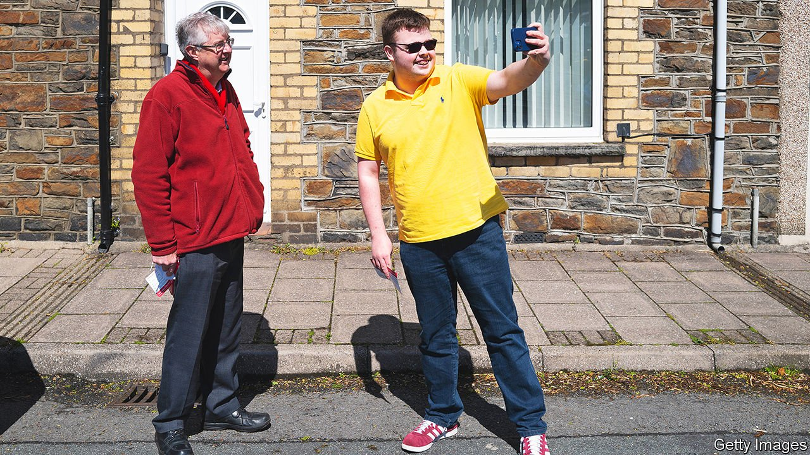

###### How red is my valley?

# Mark Drakeford wants to shake up Welsh politics 

##### Welsh Labour has remained strong, despite the party’s troubles elsewhere in Britain 

 

> Oct 14th 2021 

UNTIL RECENTLY allies of Mark Drakeford, the first minister of Wales, would have said he was neither recognisable nor photogenic enough to be centred in campaign materials. But since becoming first minister in 2018, the grey-haired former social worker with a penchant for ill-fitting suits has become a political star. At the Labour Party’s recent conference in Brighton he was both warmly welcomed at a far-left fringe meeting and applauded rapturously when the party’s leader, Sir Keir Starmer, lauded his electoral success. Celebrity, says Mr Drakeford, is not necessarily an asset. But it gives him a chance to shift the policy agenda in Wales—despite strong headwinds and a devolution settlement that reserves to Westminster some of the powers he would like to use.

Next year Labour will celebrate a century of dominance in Wales. So it may not seem all that impressive that in May’s elections to the 60-seat Senedd Cymru (Welsh Parliament), it raised its haul of seats from 29 to 30, enabling it to form a minority government. But the country is Brexit-leaning, and support for independence is rising. In 2016 53% of voters in Wales backed leaving the European Union, and in February Savanta ComRes, a pollster, found 35% supported an independent Wales. These twin nationalist forces have brought Labour low in England and Scotland. Before May’s election, polling predicted such a bad showing that Mr Drakeford might lose his seat. Party members talked nervously about a coalition with Plaid Cymru, which campaigns for Welsh independence.


It was Mr Drakeford who turned the tide. His cautious approach during the pandemic contrasted with that of the prime minister, Boris Johnson. At times he warned Welsh people not to hop across the border for a pint in an English pub when Welsh ones were closed. He was recorded saying that Mr Johnson “really is awful”. Under his leadership, Welsh Labour doubled down on its long-standing message that it is a defensive force protecting the country against Westminster’s recklessness. Richard Wyn Jones of Cardiff University, who is studying May’s election results, has found the words most used by voters to describe why they backed Labour are “Welsh”, “Mark” and “Drakeford”.

The turnaround gives Mr Drakeford considerable authority to set the political agenda. He comes from his party’s radical-socialist tradition, having supported Michael Foot and Jeremy Corbyn, far-left Labour leaders whose tenures ended in catastrophic defeats in 1983 and 2019, respectively. But he also served as finance minister under his predecessor, Carwyn Jones, who distanced himself from Mr Corbyn. He became first minister promising “21st-century socialism”, but apart from nationalising the railways in February there has been little sign of it. “He doesn’t fit neatly into any mould,” says Mr Wyn Jones. “Neither the right nor left of the Labour Party quite know what to make of him.”

And being radical in Wales is hard, because the Welsh first minister, unlike his Scottish counterpart, lacks control over justice and welfare spending. His borrowing powers are limited, and though in 2019 Wales gained the right to vary income-tax rates, it has not yet done so. Since the founding of the Senedd in 1999, Labour has focused on small-bore, crowd-pleasing measures, such as making medical prescriptions and hospital parking free to everyone, and on blocking controversial New Labour or Tory policies, such as the academies programme, which gave state-funded schools greater independence to manage themselves.

This timidity is in part because support for Welsh devolution is still shallow. A fifth of the electorate want the Senedd abolished, according to Beaufort Research, a market-research firm, and turnout in Senedd elections has never passed 47%. By limiting its reach into people’s lives, it has avoided raising the hackles of those who think it is an expensive talking-shop.

Instead, Mr Drakeford is planning Corbynista policies that can be implemented on a shoestring. Plans to make workers more involved in public-sector bodies’ decision-making, and to encourage more collective bargaining, fall short of Mr Corbyn’s manifesto pledge to force companies to give a third of seats on their boards to workers, but are inspired by the same belief in the power of employee engagement. Free meals will be provided during school holidays to eligible children, and he has promised to build 20,000 new environmentally friendly homes for rent.

The most radical-seeming policy is a planned trial of universal basic income. But since it will be restricted to young adults leaving care, and the Welsh government lacks the power to expand it to all adults, it is more a potentially useful way to support a disadvantaged group than a transformation of the welfare state.

Crempog and eisteddfods

Talks with Plaid Cymru about an electoral pact might be more consequential. Rumours swirl that it might lead the Senedd into uncharted territory, for example by increasing the number of seats and implementing a Plaid manifesto pledge to raise council tax for wealthy households. That would test the limits of what the two-thirds of Welsh people who oppose independence want the Senedd to do.

The opportunity to change Wales has come rather late in Mr Drakeford’s career. He is 67 and has said that he plans to step down before the next election to the Senedd in 2026. But he is eager to push against the confines of his office, believing that the pandemic showed people the ability of the Welsh government to act on big issues. Having a deadline only adds to his determination, he says. “This may be ‘old man in a hurry’ stuff.” ■

