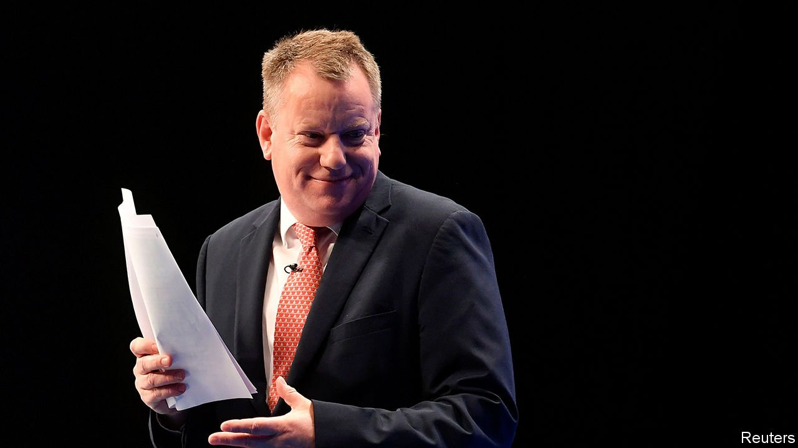

###### Back to the past

# The Northern Ireland protocol is up for discussion. Again 

##### The Conservative government starts another game of chicken with the European Union 

 

> Oct 13th 2021 

BREXIT BATTLES are back. And not surprisingly the biggest is over Northern Ireland, the hardest issue in previous negotiations. It was supposedly solved in the withdrawal treaty of 2020 by the Northern Ireland protocol, which averts a hard border with the Republic of Ireland by keeping the North in the EU’s single market and customs union for goods, even though Great Britain is out of both. But that inevitably means border and customs controls between the two, in the Irish Sea. The Democratic Unionist Party (DUP) complains that 20% of EU border checks in the first quarter were in Northern Ireland, and wants the protocol scrapped. In July the British government proposed instead a radical revision that would dispense with almost all controls.

On October 13th the European Commission offered a compromise to keep the protocol but pare back checks, notably for chilled meats and medicines, and scrap those on products clearly destined for consumption in Northern Ireland. It claims this would end half today’s controls. Yet as in a game of chicken, Lord Frost, Boris Johnson’s EU negotiator, pre-empted this offer a day earlier by reiterating his demand for a complete rewrite of the protocol, placing much emphasis on British insistence, on grounds of sovereignty, on eliminating the role of the European Court of Justice (ECJ) in policing it.


The protocol was central to the Brexit deal that Mr Johnson presented to voters in December 2019 as a triumph, because it got rid of the Northern Irish backstop negotiated by his predecessor, Theresa May. That would have kept the whole of the United Kingdom in a customs union with the EU. Mr Johnson said his deal gave Northern Ireland the best of both worlds. But Lord Frost now says the protocol was accepted at a moment of negotiating weakness and has proved unsustainable. The suspicion in the EU is that the government acted in bad faith by agreeing to the protocol with no intention of applying it—a notion confirmed this week by Dominic Cummings, Mr Johnson’s then chief of staff.

Flouting one treaty hardly makes it easier to win agreement to another. And it is also unlikely that the EU could accept the removal of the ECJ, which is essential to the single market’s legal order. Other countries might then seek similar treatment. It was Mr Johnson and Lord Frost who rejected alternatives: not only Mrs May’s backstop but also the Norwegian one of joining the EFTA court that mirrors the ECJ or a Swiss-style veterinary deal to avoid food checks. And despite the DUP’s campaign, business and most voters in Northern Ireland support an improved protocol if uncertainty over its future can be settled. There is no popular demand to scrap the ECJ’s role.

Now weeks of talks will start. Brussels is wary of a British habit of pocketing concessions only to ask for more. Trust is lacking all round. Lord Frost’s labelling of Britain’s EU membership as a “bad dream” rankles. So do his threats to invoke Article 16, which allows unilateral suspension of parts of the protocol if trade is badly disrupted. It is unclear how this would help either to increase certainty or to end the ECJ’s involvement. It might well trigger retaliation, including suspension of part or all of Britain’s trade deal with the EU. Unilaterally stopping controls on goods flowing to Northern Ireland might force a hard north-south border instead. And Mij Rahman of the Eurasia Group, a consultancy, notes that, if this is rejected on political grounds, it would create pressure for customs controls between Ireland and the rest of the EU, which would be unacceptable to Dublin as well as the EU.

Better than risking a trade war would be to co-operate on simplifying checks under the existing protocol. Yet Mr Johnson and Lord Frost believe that bloody-mindedness towards the EU is the only way to win out. The evidence for this is thin: it was Britain, not the EU, that made the most concessions in the withdrawal treaty and trade agreement. Perhaps more worrying is the view that fights with the EU may bolster domestic support for Mr Johnson’s government, just as they may for the DUP in Northern Ireland, which faces a tough election battle against other unionist parties and Sinn Fein, the main nationalist one, next May. This winter may be frosty. ■

For more coverage of matters relating to Brexit, visit our 

