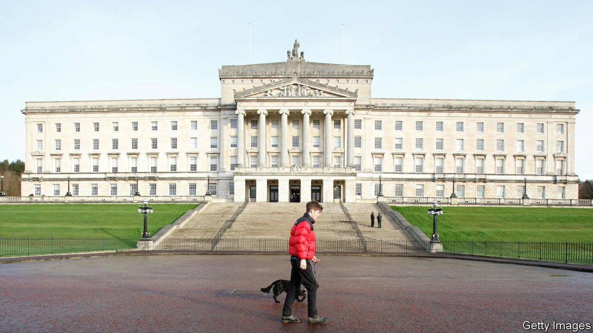

###### All talk and no trouser

# Why Stormont has dithered endlessly on corporation tax 

##### A window of opportunity to attract investment to Northern Ireland will not stay open forever 

 

> Oct 14th 2021 

IN BRANDING TERMS, Ireland is a superpower, from world-famous writers and musicians to the Irish-themed pubs scattered across the globe. But for business, as its government’s department of finance cheerily acknowledges, the 12.5% corporate-tax rate introduced in 2003 is “at the centre of the ‘Irish brand’”. Irish operations are central to the tax planning of many multinationals, among them Google, Apple, Pfizer and Johnson &amp; Johnson. And they, in turn, have been so central to Ireland’s economy that its government long held fast against demands to raise the rate, despite endless complaints from other members of the European Union about undercutting and unfair competition.

On October 7th Ireland finally buckled, agreeing to raise its corporate-tax rate for large companies to 15%, a proposed global baseline, as part of a broader attempt to crack down on corporate tax avoidance. It was not only a big policy shift for the Republic, but a reminder, if one were needed, of the weakness of the devolved administration in Northern Ireland, and its politicians’ inability to seize opportunities and make trade-offs.


For the six counties of the island that remain part of the United Kingdom, the Republic’s low-tax policy has long provoked envy and an urge to emulate it. In 2015, after more than a decade of lobbying Westminster, the devolved administration in Stormont gained the power to lower its corporate-tax rate. It was the sole big idea for transforming a region that had been left painfully dependent on the public sector by 30 years of sectarian violence. When it was first mooted, the UK-wide rate was 30%. But by 2015 it had fallen to 20%. Nevertheless, Stormont announced that year that it would cut its rate to 12.5% in 2018.

Under European Union state-aid law, such a policy was permissible only if Northern Ireland bore the cost, estimated at the time as around £275m ($375m) a year, or 0.6% of its GDP. The British Treasury imposed another condition: that the devolved administration got its finances in order. But in 2016 the “cash for ash” scandal came to light. A scheme intended to boost renewable energy was so badly designed that people who burned wood pellets received subsidies higher than the cost of the fuel.

The scandal caused the devolved government to collapse, and Northern Ireland did without an administration for three years. In the meantime came the vote to leave the European Union. Then covid-19 struck. But as the province emerges on the other side of both Brexit and pandemic, a corporate-tax cut looks as distant as ever.

Under the Brexit withdrawal agreement, European state-aid law still applies to swathes of Northern Ireland’s economy. And post-covid belt-tightening means that Westminster would in any case be unlikely to make up a revenue shortfall. Cutting corporate taxes “would only be possible if it was affordable,” says Conor Murphy, the finance minister for the devolved government, “which it is not at this time, given the very constrained budgetary position we face and the huge pressures on public services, particularly health”.

In March the Northern Irish administration appointed Paul Johnson, the director of the Institute for Fiscal Studies, a London-based think-tank, to examine whether more tax powers could be devolved to the province. Last month he told an audience in Belfast that although low corporation tax had played a role in the Republic’s prosperity, other policies had mattered, too: a long-term economic strategy and stable tax system, investment in technology and education, access to the single market, and plenty of immigration. “You need to pull that lever alongside a whole bunch of other things to be effective,” he said, “and it may be less effective now than it would have been 20 years ago.”

Hold me back and let me at him

That highlights Northern Ireland’s dilemma. Even if it slashes corporation tax, it does not have the Republic’s consensus on keeping the rate low. Companies considering investing in Northern Ireland would worry that politicians would change their minds. Sinn Fein, the main nationalist party, which is expected to gain the largest number of seats in next year’s elections to Stormont, likes the idea of cutting corporation tax mainly because it likes harmonising policies across the island, never mind what those policies are. But on corporate tax, that nationalistic principle clashes with its left-wing economic ideology (it regards leftists in Cuba and Venezuela as fellow-travellers, though has been much less radical in government).

In April 2023 the UK-wide corporation-tax rate is slated to rise to 25%, re-widening the gap that the tax rise in the Republic is about to narrow. A higher mainland rate means the possibility of gaining a larger competitive advantage—but also a bigger loss of revenue, unless the lower taxes are more than counterbalanced by an ensuing boost to investment and economic activity. But given the chance to test their big idea, politicians used to other people doing the taxing while they do the spending have failed to screw up the courage. ■

