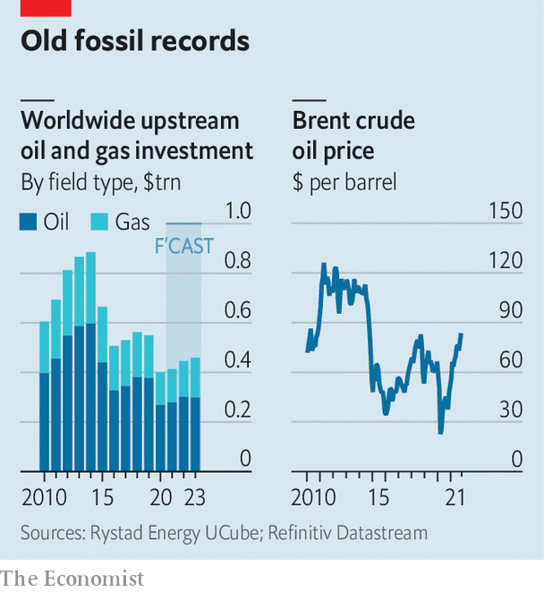

###### Playing for time

# Don’t expect big oil to fix the energy crunch 

##### Underinvestment highlights the complexities of shifting to clean energy 

 

> Oct 16th 2021 

POWER CUTS in China. Coal shortages in India. Spikes in electricity prices across Europe. A scramble for petrol in Britain. Blackouts and fuel blazes in Lebanon. Symptoms of dysfunction in global energy markets are everywhere.

In recent days the mayhem has pushed oil prices in America above $80 a barrel, their highest level since late 2014. Natural-gas prices in Europe have tripled this year. Demand for coal, supposedly on the slag heap of history, has surged. The chief executive of one commodities-trading firm says he comes into the office at 5am in order to get the latest news on blackouts in one Asian country or another. And winter, with its need for heating, has yet to arrive in the northern hemisphere.


A few years ago producers of fossil fuels would have responded to such price signals by swiftly ramping up output and investment. In 2014, with crude above $100 a barrel, Royal Dutch Shell, a European supermajor, put more than $30bn of capital expenditure into upstream oil and gas projects. It then splurged $53bn on BG Group, a British rival, to become the world’s biggest producer of liquefied natural gas (LNG).

Not this time. Climate change has led to unprecedented pressure on oil and gas firms, especially European ones, to shift away from fossil fuels. As part of Shell’s long-term shift towards markets for lower-carbon gas and power, its upstream capital spending this year has shrunk to about $8bn. Last month it flogged its once-prized shale assets in the Permian basin in Texas to an American rival, ConocoPhillips, for $9.5bn. It is withdrawing from its onshore operations in Nigeria, a country where it first set foot in 1936. It recently said it would reduce oil production by 1-2% every year until 2030. Asked what the energy-price spike means for investment, Wael Sawan, its head of upstream oil-and-gas production is blunt. “From my perspective, it means nothing,” he says.

This view is pervasive throughout much of the oil industry. In Europe, listed oil companies are under pressure from investors, primarily on environmental grounds, to stop drilling new wells. More upstream investment as prices rise could “delegitimise” their public commitments to cleaner energy, says Philip Whittaker of BCG, a consultancy. In America, publicly traded shale companies, which used to be all too eager to “frack” whenever oil prices spiked, are now under the thumbscrew of shareholders who want profits returned via dividends and buybacks rather than poured down a hole in the ground.

 


State-owned oil firms are under budgetary constraints, too, partly because of the covid-19 pandemic. Only a few, such as Saudi Aramco and Abu Dhabi National Oil Company (ADNOC) are expanding production. The result is a worldwide slump in investment in oil and gas exploration and production, from above $800bn in 2014 to just about $400bn, where it is expected to stay (see chart).

Keeping it in the ground

Meanwhile, demand has returned with surprising buoyancy as the pandemic eases. For the first time ever the oil market could briskly reach a point of lacking any spare capacity, according to Goehring &amp; Rozencwajg, a commodity-investing firm. That might be only a temporary state of affairs; Aramco and ADNOC could respond rapidly. But temporarily at least it would push prices of crude sharply higher, adding further strains to economies already suffering from soaring costs of natural gas for homes and energy-intensive activities, from steelmaking and fertiliser production to blowing glass for wine bottles.

From an environmental standpoint, higher prices may be welcome if they sap demand for fossil fuels, especially in the absence of a global carbon tax with bite. In its “World Energy Outlook”, published on October 13th, the International Energy Agency (IEA), an energy forecaster, said that the rebound in consumption of fossil fuels this year may cause the second-biggest absolute increase in carbon-dioxide emissions ever. To reach a goal of “net zero” emissions by 2050, the IEA says there is no need for investment in new oil and gas projects after 2021. Instead it calls for a tripling of clean-energy investment by 2030.

The IEA’s argument that no new natural-gas projects, which are less grubby than with other hydrocarbons, are needed rests in part on investments in low-emission fuels, such as hydrogen. But, it admits, these are “well off track”. This points to the risk of treating all fossil fuels, each of which bears the blame for carbon emissions, as equal culprits. Reducing natural-gas supply with no backup could be counterproductive.

For one thing, gas is currently the main substitute for thermal coal in countries like China and India that are keen to lower their power-related emissions. Bernstein, an investment firm, predicts China’s imports of LNG could almost double by 2030, making it the world’s biggest buyer. In the absence of investment in new projects, Bernstein expects global LNG capacity to be 14% short of what is needed by then. That would hamper Asia’s exit from coal.

Moreover, natural gas serves a vital function in maintaining the stability of the electricity grid, especially in places reliant on intermittent wind and solar power (at least until the world’s grids become more interconnected). In such markets the marginal cost of natural gas often sets power prices, even if most electricity comes from renewables with zero marginal cost. The higher the price of gas, the higher the electricity bills. This could dampen popular support for clean power.

Whether new supply will be forthcoming remains up in the air. As the boss of another commodities-trader observes, “because natural gas has been put in the dirty-fuels column, no one is investing.” For the private-sector supermajors, the problem is that they are all more or less evenly split between producing oil and natural gas. Because both often come out of the ground together, the two fuels tend to be inter twined in investors’ minds. This is frustrating. “It’s an incredibly myopic view that we lump oil together with gas,” fumes one supermajor executive. Yet his firm does not seem likely to defy investors by ramping up gas output significantly.

An executive at another big oil company says the higher prices may add pressure to invest a bit more—but not to deviate from long-term climate commitments. Instead, he says new investment is likely to come from two sources that are not exposed to public pressure: the state-owned oil companies and privately held firms. The executive notes that the bulk of the recent increase in rig counts in the Permian basin has come from unlisted frackers, rather than publicly traded ones. Some compare this to bootlegging in the prohibition era. The higher the price of oil and gas, the more incentives there will be to produce them. Provided, that is, this happens out of the public eye. ■


