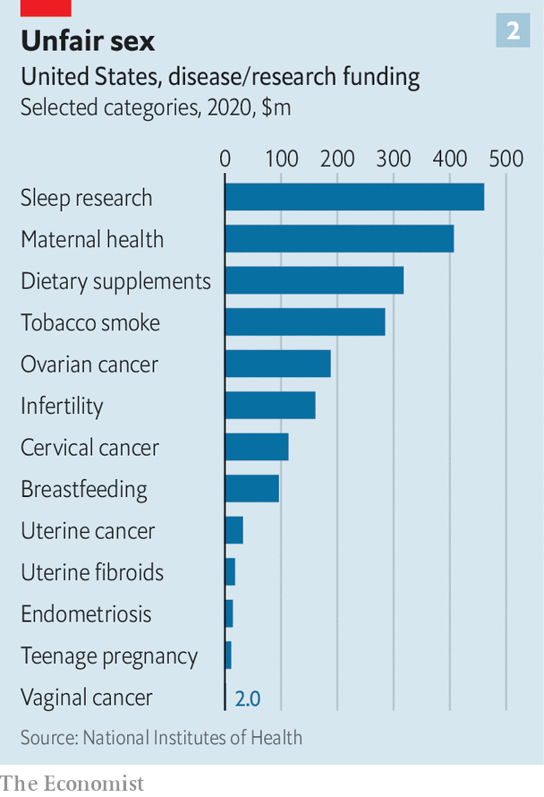

###### Girls uninterrupted

# Femtech firms are at last enjoying an investment boom 

##### Not a moment too soon 

 

> Oct 16th 2021 

A  HORMONE CALLED relaxin helps loosen up pregnant women’s hips. Without it, the pain of delivery would be unbearable. Its job done, however, relaxin lingers in female bodies for up to a year, when softer ligaments make new mothers more prone to injury, as Jessica Ennis-Hill, an Olympic champion heptathlete, discovered in training after giving birth in 2014. Five years later Dame Jessica started Jennis, a fitness app to help other women perform safe post-natal workouts. It now lets users optimise workouts for the different phases of their menstrual cycles, and has just concluded a successful funding round.

Dame Jessica’s startup is part of a wave of “femtech” firms coming up with ways for women to overcome health problems specific to their sex. The market could more than double from $22.5bn last year to more than $65bn by 2027, reckons Global Market Insights, a research firm. Having ignored it for years—in 2020 femtech received only 3% of all health-tech funding, and a modest $14bn has been invested in it globally to date—venture capitalists are at last waking up to the opportunity. So far this year they have invested nearly $1.2bn in the industry, nearly half as much again as the annual record in 2019 (see chart 1).


Last year Bayer, a big German drugmaker, paid $425m to buy KaNDy, a British developer of a non-hormonal treatment for menopause symptoms, and Bill Gates, Microsoft’s billionaire co-founder, backed BIOMILQ, a startup that has produced cell-cultured human breast milk and aims to bring both parents closer to their newborns. In August Maven Clinic, an American startup which began as a femtech but has expanded to other areas of health, raised $110m and achieved “unicorn” status, with a valuation of more than $1bn. In September Elvie, another British firm, raised $97m from venture-capital firms.

 


Unlike heath tech aimed at men, which often focuses on erectile dysfunction, a condition that afflicts perhaps one in ten potential users, femtech offers products like period trackers, which could be of value to virtually all of the world’s 4bn women at some point in their lives. Moreover, women are 75% likelier than men to adopt digital tools for health care. That makes for a huge potential market.

A big reason femtech has been slow to grow has to do with the underlying medical science. For conditions that affect all humans, men are more commonly studied, largely owing to misplaced worries that women’s hormonal fluctuations can confound results (male mice are favoured for the same reason). In the few more inclusive studies, results are seldom disaggregated by sex, obscuring how diseases—and the drugs used to treat them—affect women differently. “We have been operating as if women are just smaller versions of men,” observes Alisa Vitti, a hormone expert whose work on the 29-day “infradian” body clock, which affects everything from metabolism to sensitivity to pain and is a uniquely female phenomenon, underpins many period trackers.

 


As a result, plenty of woman-specific health issues have, despite their ubiquity, been routinely neglected. Femtechs help fill this research gap. Noting that eight in ten women suffer from premenstrual pain but no treatments have been specifically designed to allay it, founders of Daye, a British startup, designed a tampon laced with cannabidiol, after observing that the vaginal canal has more cannabinoid receptors than any other part of the female body.

Hertility Health, also of Britain, offers non-invasive tests which can help diagnose nine common gynaecological conditions. Elvie’s silent wearable breast pump is a best-seller in America and Britain; its app-controlled pelvic-floor trainer reduces the chances of the typical intervention, whereby surgeons insert “a fishing net and lift up your pelvic organs because they are falling out of your vagina”, says Tania Boler, the firm’s founder.

Labour pains

That is welcome progress. But too many femtechs face an uphill struggle. Helen O’Neill, who runs Hertility Health, calls the $5.7m funding round her firm closed in June a “soul-destroying” process. “It was predominantly grey-haired men saying they are not sure there is a market for this,” she says. Never mind that all women with a reproductive system require gynaecological help at some point. ■

