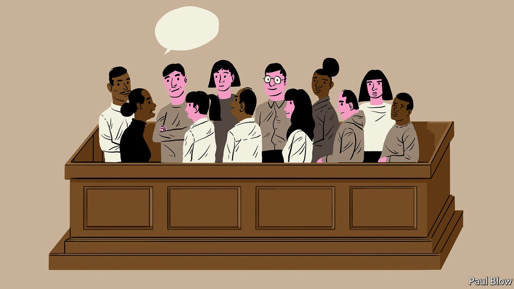

###### Bartleby

# How to run better meetings 

##### The jury system offers clues to managers everywhere 

 

> Oct 16th 2021 

MEETINGS ABSORB more time and drain morale more consistently than any other corporate activity. Before the pandemic managers were spending an average of 23 hours a week in meetings. Since then the barriers to calling people together have come down. Now that calendars are routinely shared, an empty diary slot attracts invitations like picnics do wasps.

Ideas abound for how to make meetings better. Make people stand up, so they cannot settle in for the long haul. Write a memo on the topic at hand that everyone silently reads together at the outset. Toss a ball to each other to make it clear who has the floor and to stop the loudmouths from dominating. Most desperately of all, set aside time at the start for “fun”.


Yet there is a form of meeting that reliably results in good decisions and that commands general respect, even reverence. That meeting is the jury. Any system in which people still believe after more than 800 years is worth a closer look. In its broad principles, if not in its details, it has five lessons for meeting-throwers and meeting-goers.

First, its purpose is clear. “Why are we here?” is a question that humans grapple with not just in the depth of their souls but also during most Zoom calls. No jury doubts the point of its existence, the nature of its task or the need for multiple people to be involved. That level of shared understanding is something to aspire to in other settings.

Second, its size is right. The 12-person formula dates back to 12th-century England and the reign of Henry II. Temporary courts known as assizes summoned this number of men to hear land disputes. It has largely stuck ever since. For good reason. More people would add voices, but not value. Fewer people would mean less diversity of views. The advantages of keeping meeting numbers tight are not lost on Jeff Bezos, who operated a two-pizza rule at Amazon to limit how many people were in a meeting. The one-jury rule works just as well.

The third lesson concerns the agenda. Jurors have one, very important, question to consider, and a limited number of choices to make. Clarity keeps people focused. No juror is likely to suggest backing up a bit in order to brainstorm what the criminal-justice system should look like. And whereas many pundits advise keeping meetings short, time is not a constraint: jury members do not leave until a decision is made. “Putting a pin in it” is just not an option.

The fourth lesson is about membership. Jurors are less prone to groupthink than the attendees of the average meeting. Prospective members are deliberately drawn from a wide pool, and anyone whose mind is already made up is supposed to be weeded out. Companies cannot convene a bunch of strangers to make decisions for them. But they can consciously try to bring in unfamiliar faces and call on different perspectives. And just as a jury foreman is not chosen by rank, a moderator need not always be the most senior person in the room.

The final lesson concerns psychological safety, the willingness of people to speak up. That can be hard when your boss is frowning at you. But structure helps. Trials are expressly designed to weigh lots of evidence and to take in opposing views. Before juries make decisions, they get to weigh competing accounts of what happened. The best firms echo this approach by structuring discussions in order to test arguments properly. Investment decisions at Blackstone, a private-equity titan, are probed at meetings that systematically focus on the risk factors surrounding a potential deal, as well as what makes it attractive.

Things can go wrong in juries. Jury selection can rig outcomes rather than improve them. Domineering personalities can sway meeker ones. Also, people really can be idiots. A murder conviction in a British courtroom in 1994 was quashed after it was found that some members had used a Ouija board to ask the obvious question of one of the deceased. (The defendant was reconvicted at a second trial.)

Evidently, firms are not the same as courtrooms. Many corporate pow-wows are designed to transmit information and build culture, not to deliver verdicts. Unanimity is no way to run an enterprise. And deciding the fate of a fellow citizen is bound to be more engaging than the average business call. But serving on a jury is not an interruption to work. If you get summoned, you can both do your duty and see what makes for a really good meeting.


