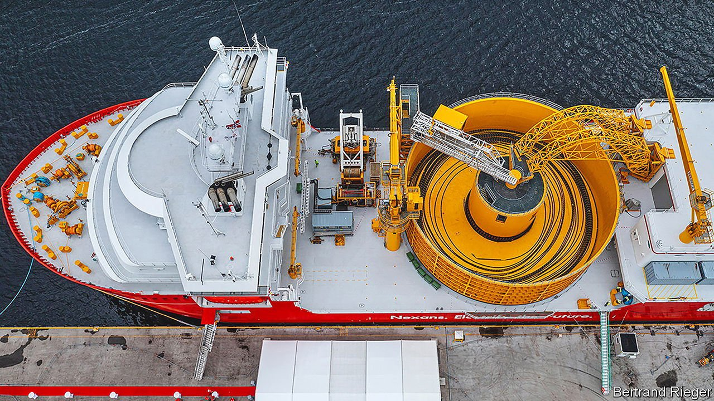
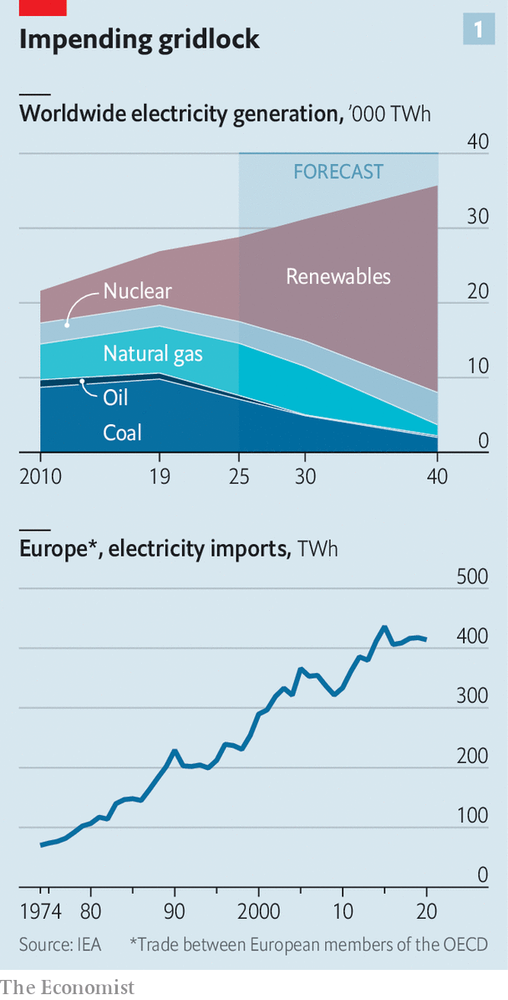
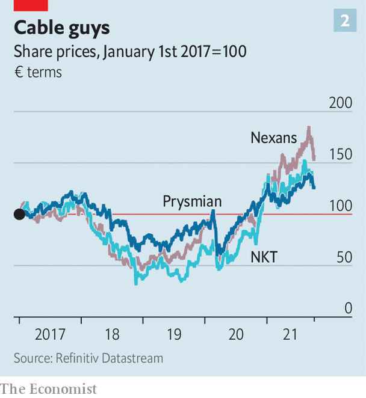

###### An undersea change

# The booming business of knitting together the world’s electricity grids 

##### Intermittent renewables and current mayhem in energy markets highlight the importance of firms that link up producers of power with faraway consumers 

 

> Oct 16th 2021 

IMAGINE A TOY boat that might fit in the palm of your hand. At mid-ship add a squat spool of sewing thread lying on its side. Scale that up about a thousand-fold and the result is the 150-metre-long Nexans Aurora. The thread in question is kilometres of high-voltage power line ready to be deployed from the aft of the ship across the sea floor. Each cable, weighing a hefty 150kg per metre and thick as a tree trunk, is a woven mix of aluminium, steel, lead and insulating material. The single stretch loaded up in a bobbin nearly 30 metres across is as heavy as the Eiffel Tower.

The ways electricity is both consumed (more of it, notably by cars) and produced (also more, increasingly through renewable sources, see chart 1) are changing. Balancing energy supply and demand is never easy, as mayhem in European gas markets has shown. It is all the more complex for electricity, which is trickier to store than not just gas, but also coal, diesel or wood chips. Renewables add more wrinkles: wind blows haphazardly; the sun can be obscured by clouds or night. As a result, most of the power that is produced has to be consumed immediately, and mostly in the place that produces it.


The idea of separating consumption from production in time—using giant batteries or other storage—has received plenty of attention from entrepreneurs, politicians and investors. But it is currently impractical at scale. So the notion of separating the two in space instead is gaining ground. It requires an upgrade in the behind-the-scenes wiring that carries power from where it is made to where it is used. The task can involve plugging an offshore wind farm into the grid. Also needed are connections joining up national networks, often within blocs where most of today’s electricity trade takes place, like the EU.

 


Either way, cables are required, and boats to lay some of them. The potential is vast. Just 4.3% of power generated in 2018 by members of the OECD, a club of industrialised countries, was exported, up from 2% in the 1970s but a far cry from a fungible commodity like oil.

All this has resulted in surging order-books for cable-makers and -layers like Nexans, the Nexans Aurora’s eponymous French owner. Credit Suisse, a bank, forecasts undersea wiring alone to bring in revenue of around €5.5bn ($6.4bn) in 2022, up from €4.5bn this year. It expects cable firms’ revenues from offshore wind installations to more than treble in size between 2020 and 2035. Investors’ enthusiasm around electric cables has sent share prices of Nexans and the industry’s two other European giants, NKT and Prysmian, up by 48-125% in the past two years (see chart 2). In February Nexans announced that it would soon spin out its non-electric cables business (catering to industry and data centres) to focus on transmission lines.

 


Satisfying see-sawing electricity demand is complicated but well understood. British grid managers have long known how to turn on power plants just as soap-operas end and tea-craving viewers turn on their kettles. Connecting power grids with different production and consumption patterns is equivalent, matching supply and demand by transferring electricity across distance instead.

Take Denmark. It has installed enough wind turbines that, when it blows, no other source of electric power is required. But it needs a Plan B, given the fickleness of wind. Without batteries it could keep old fossil-fuel plants open, and use them intermittently. A more elegant solution is a cable to Norway, which has ample hydroelectric potential. When the wind blows, both places can use Danish wind power, keeping Norwegian water in reservoirs. On calm days the Norwegian lakes are drained a bit faster to succour Denmark.

Further links from Denmark to the Netherlands, Sweden, Germany and Britain (planned for 2023) provide yet more options. Add enough links to enough places, and electricity becomes a tradable commodity. For a local grid manager, reducing carbon emissions becomes a case of buying and selling the right contract rather than building a solar or wind farm in the wrong place.

That prospect explains why interconnections are multiplying. Europe is the new frontier of cable-laying. Electrification, notably through renewables, is a key plank of its ambitions to reach “net zero” emissions by 2050. National grids have been compelled by EU rules to integrate into a single network, often backed with public cash. The continent’s scraggy coastline is ideal for wind power—and for deploying electric cables at sea, out of sight of anyone who might object to them.

Shifting power-generation dynamics play a part. Germany, for example, was once a big exporter of power but is becoming an importer as it finishes shutting down its nuclear plants and phases out coal. The green push also means electricity is being generated in all the wrong places. In Italy, power plants were built near where industry was located, mostly in the north of the country. Now the wind blows and sun shines mainly in the less-developed south. “The shift to renewables means we need more rebalancing, more transition,” says Stefano Antonio Donnarumma of Terna, an Italian manager of transmission lines.

As a consequence, the making and deploying of electric cable is one of the rare industrial sectors that European firms dominate. Besides France’s Nexans, Prysmian is Italian and NKT is Danish. They have around 80% market share outside China, where demand is largely met locally. Beyond merely manufacturing woven metal wires (among other products), they lay them as well, commissioning and operating ships like the Nexans Aurora, a €170m craft fitted up the coast from an existing Nexans factory in Halden, Norway.

Advances in undersea cable-laying have helped open up the prospect of new and novel interconnections. Whereas previous generations of ships risked tipping over if they were to send wires much below 1,200 metres, the Nexans Aurora and a flotilla of similar vessels from its rivals can lay the cables at depths of 3,000 metres. (An accompanying robot can dig a trench in shallower waters, the better to protect against stray anchors and fishing nets.) That opens up the Mediterranean. This week the Nexans Aurora was preparing to deploy her first cable, connecting the island of Crete to the Greek mainland.

Longer cables mean fewer legs of 100km or so that need to be stitched together. The viability of much longer interconnectors is being mooted as a result. A 720km Norway-to-Britain link started operating this month. Many are in various stages of planning, for example hooking up Greece and Israel, or Ireland and France. Others are more speculative, such as a 3,800km cable linking the sun-baked solar fields of Morocco with Britain. Another consortium wants to link Australia, Indonesia and Singapore, a 4,200km project.

Christopher Guérin, boss of Nexans, says 72,000km of such cables will be laid in the decade to 2030, seven times the current stock. That comes on top of wiring needed to upgrade antiquated connections on land, many of which are past their sell-by date. A power crisis in Texas earlier this year helped unlock stimulus funds for grid upgrades in America, too.

A more immediate opportunity is hooking up wind farms to onshore power grids. Cable salesmen are cheered by the fact more and more such facilities are being developed far out at sea. The possibility of floating wind farms, which could be farther away still, will add to their order books. The International Energy Agency, a rich-country energy club, estimates 80 gigawatts of offshore wind farms will have to be installed every year by 2030 to meet decarbonisation targets. Each gigawatt of offshore capacity requires around €250m of cable input including the installation, says Max Yates of Credit Suisse. The cable costs roughly as much as the foundations, behind only the turbine itself.

The urgency of this global rewiring effort is almost imperceptible from the deck of the Nexans Aurora. Spools release their wire at a leisurely pace: 10-12km a day is considered tidy work. But the future energy highways are at last becoming a reality. Steady as she goes. ■

