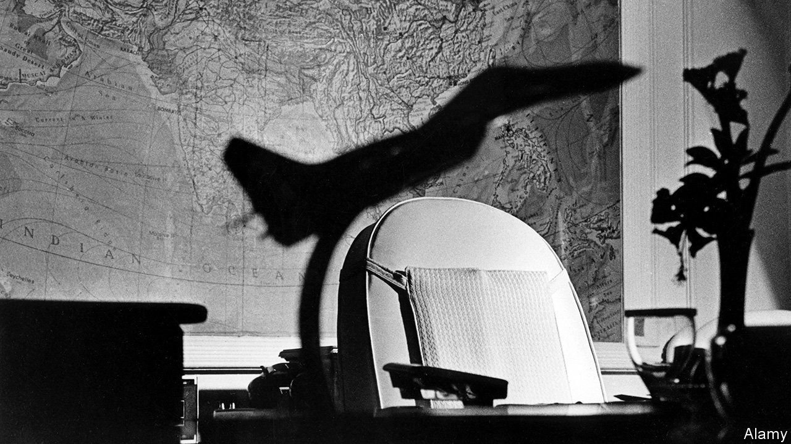

###### The longest layover

# Why does Tata Group want Air India back? 

##### After a long delay, the loss-making flag-carrier flies free of state ownership 

 

> Oct 16th 2021 

J.R.D. TATA recalled it as his saddest day. In 1978 the illustrious Indian industrialist opened the newspaper to discover that the government had fired him as chairman of Air India, the airline he founded in 1932 and managed even after its nationalisation in 1953. He called his secretary to ask if the story of his sacking was true. She replied that his successor, a former air marshal, was already making himself comfortable in his chair.

Tata, who died in 1993, frequently said that his job at Air India was to protect the airline from the central government in Delhi. No doubt the sentiment contributed to his sacking—and was justified. After his exit the flag-carrier entered a spiral. In recent years it was losing nearly $3m a day. Operating costs far exceed the industry average. So do customer complaints. Perhaps realising this, the government began trying to offload Air India in 2001, but deals repeatedly foundered over financial terms and demands that the state retain a residual stake, and possibly residual control.


On October 8th the drawn-out process finally concluded. The airline would return to Tata Group, today still one of India’s biggest conglomerates. Its bid of $2.4bn (including $2bn in debt) beat the only other, from the owner of Spice Jet, a heavily indebted low-cost airline. Some of Air India’s non-core assets, and its remaining $6bn in debt, will be transferred to a separate government-run holding company.

Given what has unfolded in India’s aviation since J.R.D.’s inglorious dismissal, it is not entirely unfair to conclude the government did Tata Group a favour by taking Air India off its hands. Private carriers have emerged only to go bust. Covid-19 travel restrictions have caused the industry to wallow in losses. Indigo, the most successful carrier with a market share of 57%, is embroiled in litigation between its founders and has ejected multiple top executives.

On the surface, Tata Group’s desire to return Air India to the fold looks foolish. The group already controls two smaller airlines through an 84% stake in AirAsia India (an affiliate of a Malaysian carrier) and a 51% stake in Vistara (co-owned with Singapore Airlines). Both have consistently lost money. Adding Air India to the mix seemingly deepens Tata’s aerial woes. The carrier burns cash as fast as its old and frayed fleet burns kerosene. The workforce is unionised, difficult to manage and resistant to change. The terms of the deal prohibit redundancies in the first year and after that only through voluntary attrition.

Still, Tata’s move is not without reason. Its current management sees its existing aviation operations as irredeemably subscale. The deal will double Tata’s domestic market share to 27% and give it a platform for growth through Air India’s network of landing slots abroad, particularly in London and New York. Air India owns a low-cost airline based in the state of Kerala that does a booming business ferrying Indian workers to and from the Persian Gulf, and could dovetail with AirAsia India.

Tata in turn may be providing Air India with capital and even more desperately needed good management. A pandemic-era depression in global aviation means aircraft are available. Boeing and Airbus are doubtless already pounding Tata’s door. Tata Consulting Services, India’s largest information-technology consultancy, could help tie together the various entities and enable savings in areas such as bookings and loyalty programmes. Tata’s hospitality division, Indian Hotels, could benefit from marketing links.

Managing this process will not be easy. Singapore Airlines is thought to have opposed the deal and hoped that Vistara would feed its own global network. Managing no-frills and full-service divisions makes sense in theory but no large airline has done it well. Crucial support for Air India comes from the country’s tight restrictions on foreign carriers, negotiated as bilateral treaties with their home countries. Those may be eased now that the airline is in private hands, reducing its advantage. Having reclaimed J.R.D.’s chair, Tata may find it not entirely comfortable. ■


