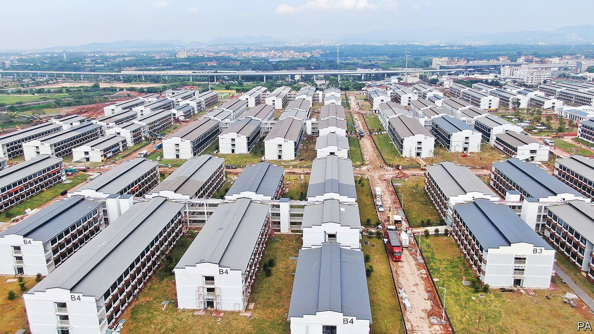
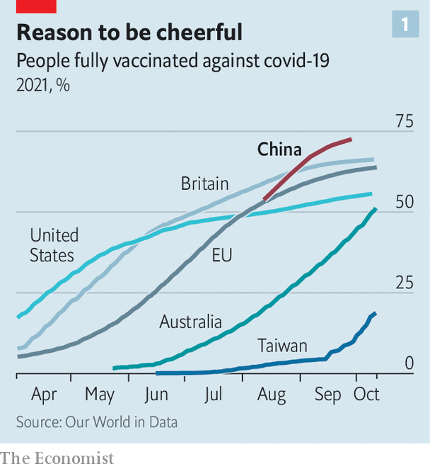
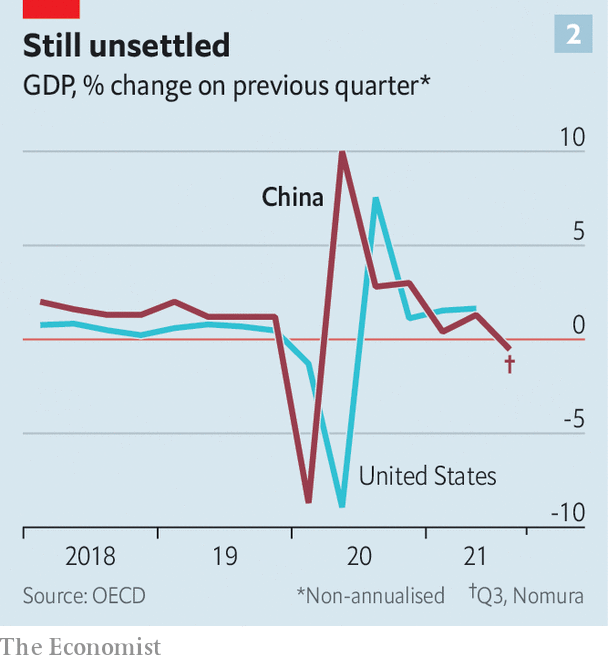
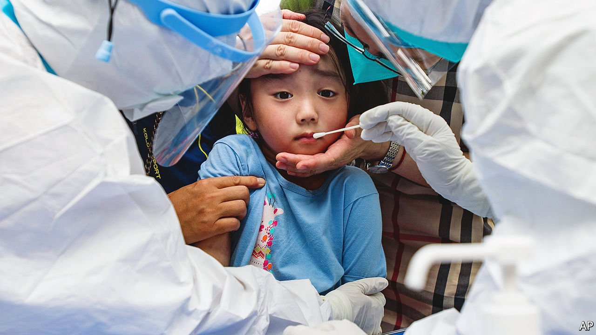

###### Protracted war

# How long can China’s zero-covid policy last? 

##### Unlike Australia, New Zealand and Singapore, it seems determined to keep it up 

 

> Oct 16th 2021 

FROM THE outside, it resembles an army base, an expanse the size of 45 football pitches filled with rows of austere, grey, three-storey buildings. The facility (pictured) on the outskirts of the southern city of Guangzhou is China’s first purpose-built quarantine centre for people arriving from abroad. Soon guests will begin moving in to its more than 5,000 rooms. For at least two weeks, whether fully vaccinated or not, they will live in isolation, their food brought to them by robots.

Since the early days of the covid-19 pandemic, China’s aim has been to eliminate the coronavirus entirely from within the mainland’s borders. Hong Kong and Macau have similar strategies. But even as the handful of other countries with “zero-covid” policies, including Australia, New Zealand and Singapore, move to relax them, China is holding out.


The point of Guangzhou’s $260m facility is to make it even harder for the virus to enter the country, by keeping people quarantined away from densely populated areas. People flying into the city from outside the mainland will be whisked there directly, instead of to normal hotels, for at least two weeks of confinement and frequent testing. Even the medical staff may not leave the premises. After working there for four weeks, they must do a week of quarantine and then, after returning home, spend another two weeks in isolation.

Chinese officials describe the complex as the latest example of “China speed”: it took just three months to build. Another dedicated quarantine centre (unlike Guangzhou’s, not built from scratch) is also due to open soon in the nearby city of Dongguan. It will have 2,000 beds. Officials have ordered cities elsewhere to follow suit. In September, at a training session for medical staff in Guangzhou’s facility, an official tried to fire them up with a well-known term used by Mao Zedong to describe a relentless, long-lasting campaign to wear down the enemy with guerrilla attacks. It would be a “protracted war” against the virus, he said. “It can only end when the disease is no longer around.”

China’s zero-covid policy involves keeping most foreigners out, meticulous quarantines, huge manpower, track-and-trace apps, intense lockdowns in areas where the virus is found and frequent mass testing. A recent traveller to China from New York describes having to submit photographs of her pre-departure covid test to the Chinese consulate-general to prevent any fakery. Two pictures, taken by a nurse, were of blood being drawn from her arm and a swab up her nose. Another, by clinic staff, showed her at the entrance, holding her passport and a test certificate.

Such efforts have achieved impressive results, given the size of the country and the porousness, in normal times, of its land borders with some of its 14 neighbours. By October 10th China’s official tally of covid-related deaths stood at 4,636. Only three had occurred since April last year. Some provinces have seen no fatalities at all, including Jiangsu on the coast. It has a population of more than 80m, nearly as big as that of Germany where the official death toll is 94,000. To the Chinese authorities, a big outbreak is one involving dozens or, rarely, hundreds of cases: barely a blip in the statistics of most other countries.

If the world were to face a similar outbreak again, knowing what it does now, many countries would choose China’s approach. But eventually they would face the same question: when to relax those measures? As the rest of the world begins to —always present but contained at a level that people consider acceptable—how long will China keep up its enormous campaign to crush it altogether?

It is an important question, of concern not only to China’s 1.4bn people, but worldwide. Consider just one side-effect of China’s zero-covid approach: the inability of world leaders to meet China’s president, Xi Jinping, face-to-face. Mr Xi has not received foreign visitors or travelled abroad since January 2020. He is unlikely to attend a meeting of the G20 in Rome at the end of October, or a subsequent UN climate-change conference in Glasgow. At a time of potentially dangerous tensions with America, he has yet to hold a formal summit with President Joe Biden. On October 6th China agreed to such a meeting later this year, but only by video link.

Mr Xi’s hard choice

Several factors will affect China’s decisions about when and how to change its policy. They include the way the virus mutates, the effectiveness of its vaccines (China does not allow the use of foreign ones), risks to the economy and the public mood. The Communist Party has hailed its success in crushing the coronavirus as evidence of the superiority of China’s political system. Accepting that the virus is endemic would involve a big change of tune.

The Delta variant, now dominant globally, is making China’s policy a lot harder to implement. It spreads two to three times more easily than the original strain, which was first detected in the central Chinese city of Wuhan. But such problems may be offset by a high rate of vaccination. By September 15th, the latest date for which data are available, 71% of Chinese had received two jabs and another 10% had received their first (see chart 1). By comparison, 56% of Americans and 64% of EU residents had got two shots by October 11th.

 


However, China is unlikely to relax its policy soon. The imminent opening of Guangzhou’s high-tech quarantine centre hints at this. The National Health Commission has recommended that workers at airports, borders and quarantine sites be given priority for booster shots. Such people are most likely to be exposed to infections brought from abroad. If the zero-covid policy were about to be abandoned, those most in need of booster jabs would be vulnerable people such as the elderly, who would be infected locally.

By September 15th China had given two jabs to nearly three-quarters of people over 60. But even if it succeeds in vaccinating almost all of them, as some countries in Europe have achieved, hospitalisations will still increase after the country starts opening up. By how much will depend on the jabs. China has approved seven vaccines, all of them produced by Chinese firms. The two most widely used are made by Sinovac, a private company, and Sinopharm, which is state-owned. Both have been endorsed by the World Health Organisation. They are based on a traditional kind of vaccine technology, using an inactivated form of the SARS-CoV-2 virus.

Like the West’s vaccines, China’s work well at preventing serious illness but less so at stopping covid’s spread. It is hard to compare them more precisely. Few studies have tried doing so among comparable groups of people, at the same time and in the same place. There are not enough infections in China to enable effective vaccine-testing. So most data have been gathered elsewhere. Most trials have involved exposure to non-Delta variants. A study of 61m vaccinated people in Brazil, conducted when most infections there were caused by the Gamma type, found that Sinovac’s vaccine was 75% effective against hospitalisation, and AstraZeneca’s 90%. In Chile, Uruguay and Indonesia Sinovac’s jab has been used in national vaccination campaigns. It has proved 85-95% effective in these against hospitalisation and death. Like the Western vaccines, it works less well among the elderly.

There are fewer data relating to Sinopharm’s shots. But they, too, seem less effective than some of the vaccines used in the West. In Bahrain people vaccinated with Sinopharm had higher rates of infection, hospitalisation and death than those who had received Pfizer’s or AstraZeneca’s jab—especially if they were aged over 50 at the time when Delta became dominant.

China could try to strengthen its defences by allowing the use of Western vaccines. But it is determined to rely on home-grown solutions. One reason is clearly political: the party wants to be seen as the sole enabler of China’s salvation from the virus. For a while, state media suggested that the West’s vaccines were shoddy. An application in China for approval of Pfizer’s vaccine, made in partnership with BioNTech using an advanced technology known as mRNA, has made little progress. Two million doses of it that were meant for China have been sent to Taiwan instead.

It is possible that China will develop better vaccines. Its army has been working with two private Chinese firms on an mRNA type. But it may not work well. China is a latecomer to the technology. An mRNA vaccine made by CureVac, a German company with long experience in the field, proved only 47% effective in trials. It may be a long time before China feels confident enough in its vaccines to consider scrapping the zero-covid policy.

Might economic malaise force China’s hand? The country’s repeated skirmishes in recent months with Delta-related outbreaks have prompted sudden and severe lockdowns. Combined with a longer-running campaign against property speculation, these may have sent the economy into a “double-dip” contraction, according to Ting Lu of Nomura, a bank. He thinks China’s GDP shrank by 0.2% in the three months from July to September (compared with the previous quarter), following a spectacular first dip when the pandemic struck (see chart 2).

 


Other recent data also look gloomy. During China’s national-day holiday from October 1st to 7th, people took about 58m trips a day across the country, official data show. That was about a third less than in 2019 and also 7.5% less than they took last year. By contrast, during this year’s five-day public holiday in May, the number of trips exceeded pre-pandemic levels.

But although China’s fight against covid has hurt services, its exports have been strong. Indeed China’s periodic, pointillist lockdowns have been less disruptive to its factories and trade than the more sweeping restrictions imposed in manufacturing rivals like Vietnam. China has benefited from covid-related shifts in buying patterns in foreign countries, where people stuck at home have been splurging on goods such as electronics and exercise gear. China makes such things aplenty.

How would the economy have fared if the Delta variant had spread more widely? China’s weak retail spending is in part due to covid-related controls. But it is also caused by fear of the virus, which would only deepen if China were to lower its guard. Chinese people are right to worry. Huge social stigma surrounds anyone who gets the virus and thereby triggers a lockdown. Such a person also faces legal sanctions. And the health-care system is weak. The number of intensive-care beds per 100,000 people in China—about 3.6—is much closer to the level of India than to that of rich countries. In overseas markets, Chinese shares have suffered heavy sell-offs in recent weeks, wiping more than $1trn off the value of some of the country’s biggest tech firms. But this has reflected anxiety about new regulatory moves, not about China’s economic prospects under an indefinite zero-covid regime.

Foreign businesspeople in China certainly grumble. One reason is that the government is reluctant to grant visas to spouses or children. An American who runs two businesses in China had a baby in America during the pandemic. He cannot return even though he and his wife have a visa. The total population of non-mainlanders in Beijing and Shanghai fell from about 316,000 a decade ago to just 226,800 last year, census data show. Those who remain are often treated with suspicion by strangers, who view them as potential virus-carriers. A campaign encouraging people to report foreign “spies” does not help.

But despite such gloom, foreign direct investment in China amounted to nearly $114bn in the first eight months of 2021, more than one-quarter higher than in the same period of 2019. Less than one-tenth of European firms are thinking of diverting investment away from the country, the European Chamber of Commerce in China reports. In 2015 about one-sixth were.

Some Chinese experts have aired suggestions that, when vaccination rates are high enough and death rates low, China should abandon zero-covid. In a recent on-camera interview with a Chinese magazine, China’s most senior disease-control official, Gao Fu, said the country may reach a vaccination rate of 85% by early next year. At that point, Mr Gao asked: “Why don’t we open up?” He also said China should study Mao’s protracted-war idea in the fight against the virus. But he suggested this would involve living with it.

Mr Gao, however, is not a member of the ruling Politburo, whose members may have considerations unrelated to epidemiology. One is that there appears to be strong public support for the zero-covid approach. In June online commentators excoriated one of China’s most respected scientists, Zhang Wenhong, for suggesting that the country should relax the policy next year. Official media appeared to echo such criticism by publishing the views of a former health minister (whose background is in finance) expressing “astonishment” at the idea of easing controls. In August a teacher was detained for 15 days after suggesting that Yangzhou relax its lockdown. He, too, was vilified on the internet.

People applaud the lengths to which the government goes to keep the virus out and stop it from spreading. Some wealthier Chinese may resent the difficulty they now face going abroad on holiday, or even getting a passport (the police have become much more reluctant to issue them). But many people have little sympathy with their travails. Travelling internally can involve much hassle. At motorway checkpoints on the edge of Beijing cars often have to join lengthy queues so that police can scan the ID cards of people entering the city, check their health apps and record other details. But if there is anger over such bothersome procedures, people swallow it.

 


As for the enforcers, many of them have a stake in the status quo, too. During the pandemic, grassroots Communist Party committees have been re-energised. Their chiefs, once sidelined by rapid social and economic change, have gained new authority to mobilise people and deploy resources to control covid. They will not readily return to their often-marginalised pre-pandemic state, nor does the party want them to. It hopes that its street-level workers will play a bigger role in maintaining order in urban neighbourhoods, using skills honed during the pandemic.

The party may see other political benefits from keeping the zero-covid policy. It faces a series of big public events that it will not want overshadowed by outbreaks that raise embarrassing questions at home about its vaunted ability to defeat the virus. In February Beijing will host the Winter Olympics; the annual session of China’s rubber-stamp parliament, the National People’s Congress, will be held in March; and late in the year the party will convene a five-yearly congress which Mr Xi (bathed in glory, he surely hopes, for his victory over covid) will use as a launching pad for five more years, at least, in office.

A human-rights storm is already brewing around the winter games. Activists and politicians in the West have called for boycotts in protest against China’s human-rights abuses in the far-western region of Xinjiang and its repression in Hong Kong. On September 29th, however, the International Olympic Committee announced China’s decision that, to keep the virus in check, no spectators will be allowed from outside the country—the same restriction that applied to this year’s summer games in Tokyo. This will much reduce the risk of foreign visitors marring the events with protests. As for possible boycotts by Western leaders, China may avoid that problem by not inviting them.

Again, many Chinese applaud. As China’s leaders consider possible harm that may be caused in the long term by clinging to their zero-covid policy, the rise of nationalism at home is not among their concerns. The party has deliberately fed it with West-blaming and West-scorning rhetoric, suggesting that the only morally correct approach is to eliminate the virus entirely. Many Chinese, encouraged by state media, believe the West has been peddling falsehoods about the origins of the virus in order to make their country look bad. Such sentiments have made the poisonous atmosphere surrounding China’s relations with the West, evident well before the pandemic, even more toxic.

When China does eventually declare that the virus need not be eliminated, its reopening to the world will not necessarily be greeted with joy by many of its citizens. They see a West that has rejected China during the pandemic, not the other way round. Their bitterness will be long-lasting, and not about the zero-covid policy. ■

Dig deeper

All our stories relating to the pandemic can be found on our . You can also find trackers showing ,  and the virus’s spread across .

