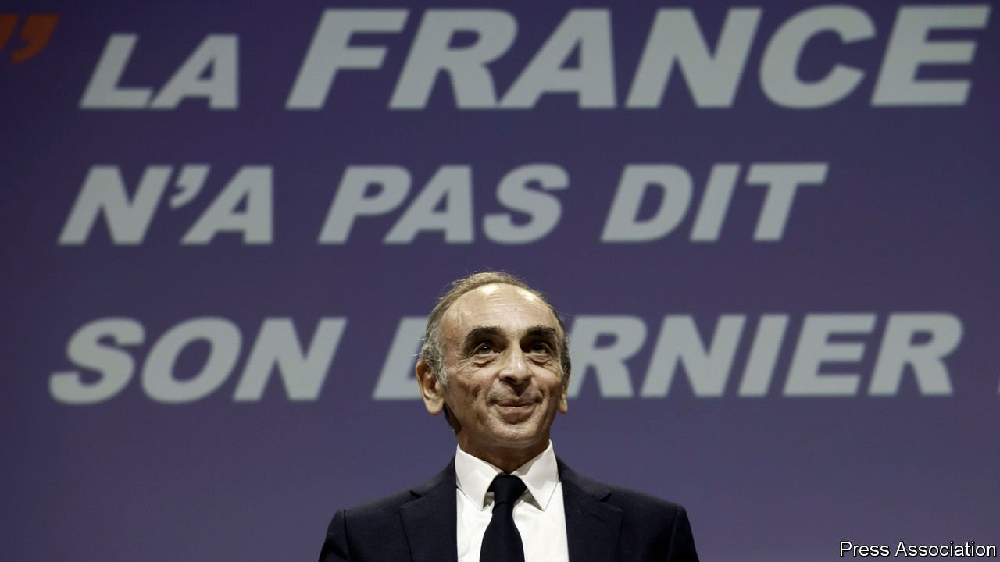
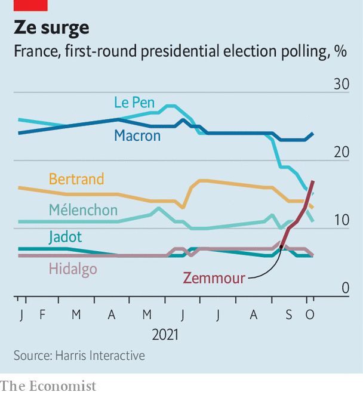

###### France’s wannabe Trump

# Eric Zemmour, the anti-immigrant radical who could supplant Marine Le Pen 

##### He says Islam has no place in France. Many voters seem to agree 

 

> Oct 12th 2021 

“T HE FRENCH Trump, it’s you!” a Parisian ally of the former American president once told Eric Zemmour. Or so the outspoken anti-immigrant polemicist claims in his latest bestselling book. A few weeks ago, such an assertion appeared self-serving and fanciful. But a recent poll surge by this Vichy apologist and television personality has taken established French political parties by surprise. Mr Zemmour is seeking nothing less than to turn nationalist party politics upside down and , by making the hard-right leader look too soft.

Ahead of next April’s two-round presidential election, two recent first-round polls have put Mr Zemmour in second place, ahead of Ms Le Pen and behind . This has transformed him from a commentator on frenzied TV talk shows into the subject of them. Which is exactly where the radical nationalist, who has been convicted of inciting racial hatred, wants to be. Polls still suggest Mr Macron will lead in the first round and win in the second. But they also suggest that Mr Zemmour, who has yet to confirm he is running, could upset presidential ambitions on the left and the right.


The 63-year-old Mr Zemmour has been a controversial pundit for a quarter of a century. His décliniste books predict the collapse of French civilisation, with titles such as “French Melancholy” and “French Suicide”. More recently he has grabbed attention as a provocateur on CNews, a cable channel that some liken to America’s Fox News. “Zemmour président” posters have been pasted to lamp posts and walls. Last month Mr Zemmour was forced to quit his nightly TV show under French rules that require broadcasters to give equal airtime to political figures. The broadcast regulator judged that he was already more politician than journalist, and so his appearances would have to be counted as such.

 


Whereas Ms Le Pen has tried to sanitise her party’s xenophobic image and distance it from its roots, Mr Zemmour seeks to radicalise, provoke and frame the debate around his own obsessions. He is “counter-feminist”, anti-woke, and blends erudition with outrage, simple sentences and rant. Of Jewish-Algerian descent, he has declared that Vichy France in fact protected French Jews, that foreign first names (such as Mohammed) should be banned, and that Islam is not compatible with France. Jean-Marie Le Pen, founder of the party his daughter now leads, said approvingly that Mr Zemmour says “things that nobody dared say, except me”.

Mr Zemmour’s popularity may yet prove fleeting. But the polemicist, who claims he is a Gaullist, seems to have found a potent pitch. It mixes a veneer of intellectual respectability with crude populism, in a way that links the ultra-Catholic bourgeois vote to the working-class electorate. Ms Le Pen, by contrast, appeals to those on tight budgets, from the populist right to the ex-Communist left. In 2017 Ms Le Pen scored fully 34% in the second round, against Mr Macron. But she  at elections this year, and her star has waned. Now she and Mr Zemmour are competing for many of the same disillusioned, hard-right voters. The provocateur, who has styled himself as a sort of French Trump with more brains, could take votes from the nationalist fringe of the mainstream right as well as from her, and threaten her place in the run-off.

Mr Zemmour’s surge is further confirmation of the weakening of political parties in French presidential politics. Mr Macron showed to spectacular effect in 2017 that it is possible to seize the presidency under the fifth-republic constitution without an established party. “There will be a before and an after Macron,” says a voter: “The old parties of left and the right, they don’t exist anymore. People don’t identify with them. They feel lost.”

The Socialists, whose candidate in 2017, Benoît Hamon, scored just 6%, are not polling much better this time, even under their current hopeful, Anne Hidalgo, the mayor of Paris. The Greens’ nominee, Yannick Jadot, is also struggling. A clutch of other candidates lie even further to the left. None shows any inclination to give way to any other, and even if they did this might not be enough for the left to make it to the second round.

On the centre-right, the Republicans will vote for their nominee on December 4th. The three favourites are Xavier Bertrand, head of the northern Hauts-de-France region, Valérie Pécresse, head of the Ile-de-France region around Paris, and Michel Barnier, the former EU Brexit negotiator. Mr Bertrand is preferred by the French as a whole. But the 70-year-old Mr Barnier, who is less well-known in France than in Britain and fancies himself as an elder statesman, has made a calculated pitch for the anti-immigration vote. For card-carrying members, who will vote for the nominee and tend to be on the party’s right, this could be just their champion. Meanwhile, Edouard Philippe, a centre-right former prime minister, launched his own new party, Horizons, on October 9th but promises to use it to help Mr Macron in 2022.

By splitting the hard-right vote, Mr Zemmour could in fact end up helping Mr Macron’s re-election prospects. No poll yet suggests that Mr Zemmour could win a run-off. “He’s capturing attention as the curiosity candidate,” says Emmanuel Rivière of the Kantar polling group: “It’s far harder to run a real campaign than to appear on TV or attend a book-signing.” All the same, the president’s party is warning against complacency. “It’s going to be tough,” says Roland Lescure, one of Mr Macron’s deputies: “It’s winnable, but it’s not won yet.” With six months to go and France in a febrile mood, Mr Zemmour is dragging politics onto toxic ground, and contributing to what could be a nasty, divisive campaign. ■

