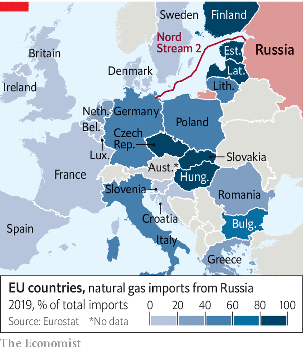

###### Uncomfortable truths

# It is tempting to blame foreigners for Europe’s gas crisis 

##### The main culprit is closer to home 

 

> Oct 16th 2021 

“RUSSIA IS ABOUT bears now, it’s not about bullies.” So joked Sergei Ryabkov, Russia’s deputy foreign minister, this week, speaking about the crisis in Europe’s natural-gas market. His country favours stability and lower prices over runaway prices, he insisted: “We would prefer to have here a bear market.”

Russia is responding to a view gaining currency in European capitals that Gazprom, the state-controlled energy goliath that is the continent’s biggest supplier, has been stoking the continent’s energy crisis by withholding exports of natural gas. European parliamentarians are demanding that Gazprom be investigated for not shipping more gas, allegedly as a ploy to secure final regulatory approval for the controversial Nord Stream 2 pipeline designed to ship Russian gas to Germany.


The Cassandras get it half right. Europe is indeed mired in an energy crisis. The price of natural gas has skyrocketed of late across Europe. This has led to panic in Britain, where the government is now considering offering subsidies and other state support for steel, chemicals and other heavy energy users. On October 12th E.ON, a German energy firm, took the extraordinary step of suspending new gas-supply contracts for residential customers.

Worse yet, the continent looks headed for a bleak winter with a possibility of severe gas and power shortages. Matt Drinkwater of Argus Media, an industry publisher, observes that official forecasters are concerned that the La Niña weather phenomenon may produce an especially harsh winter not only in north-west Europe but also in north-east Asia and North America, which would spark further global competition for energy.

Europe’s stores of natural gas were well above the five-year average at the start of 2021, but a long winter combined with lower production in Norway and Britain (in part due to pandemic-related snags) means storage is now at worrying levels. Edward Morse of Citigroup, an American bank, predicts that if this winter is indeed a bitter one, those stores could run out.

Fuel switching was an option in the past, but that is difficult now. For example, green activism has stymied Europe’s nuclear development. James Huckstepp of S&amp;P Global Platts Analytics, a research firm, notes that the region “can’t flip back to coal plants easily because some of them have been closed—and the rest made unattractive because of carbon policies.” And as recent painful episodes of low wind and depleted hydroelectric reserves across parts of Europe have made clear, renewable energy is not yet a reliable substitute for gas.

Using less gas will be difficult, at least in the short term. But is it possible for Europe to get hold of more gas? One way is to try to bully Russia into exporting more. Ursula von der Leyen, the president of the European Commission, recently praised Norway for helping with the gas crisis, but pointed an accusing finger at the Kremlin: “This does not seem to be the case in Russia.” But analysts reckon that the gas giant is actually exporting more gas to Europe this year than it did before the pandemic, and its big continental customers have recently confirmed that it is meeting its contractual obligations. There is little hard evidence that Russia is a big factor in Europe’s current gas crisis.

Another possible way to boost supply would be to increase imports of liquefied natural gas (LNG) by ship. Over the past two decades, Europe’s strategy of reducing reliance on Gazprom led to big investments in LNG, which now makes up some 20% of the continent’s gas (up from none a few decades ago). When the global gas market was well supplied a few years ago, Europe enjoyed low gas prices thanks to access to surplus cargoes. But the combination of stagnant investment in new production and a sudden spike in global gas demand linked to the global economic recovery has led to a mad scramble for LNG of late.

 


That has some in Europe pointing, with a bit more justification, to another foreign bogeyman. Mr Morse notes “a tendency among European officials to put the blame on China”. LNG imports have shot up in the Pacific region, with mainland imports soaring by 25% of late. Cargoes from America and the Middle East are spurning European ports, lured by the hefty price premium offered by Asian buyers. One advantage they have is explicit state support. In China, energy-security concerns have led officials to ensure adequate winter supplies “at all costs”.

The other advantage they have, explains Michael Stoppard of IHS Markit, a research firm, is that most Asian gas is still procured on long-term contracts linked to the oil price—a practice Europe abandoned as it liberalised gas markets. Since Asian buyers are hedged, they feel less pain than do European counterparts fully exposed to today’s astronomical prices. Mr Putin has, with some justification, ridiculed Europe’s embrace of “market-based” pricing for gas as the work of some “smart alecs” at the European Commission, and suggested that Gazprom stands ready to revive the old-fashioned type of oil-linked contract.

In the end, no foreign bogeyman offers a satisfying explanation for Europe’s gas crisis. There is another plausible, albeit controversial, explanation found closer to home: the continent’s headlong rush to decarbonise its energy system. Mr Morse argues that what Europe’s leaders are hiding from on the eve of the UN’s big climate summit next month in Scotland is the first crisis of the energy transition. As it shifts away from fossil and nuclear power and embraces renewables, the region has not properly dealt with the need for redundancy on the grid. America has such problems too, but he notes that it is self-sufficient in energy. Europe is far from it. ■


