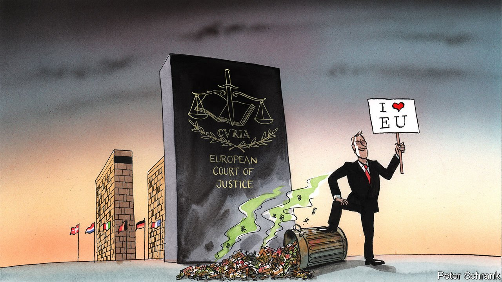

###### Charlemagne

# Poland is a problem for the EU precisely because it will not leave 

##### Unlike Britain, Poland will remain inside the tent causing trouble 

 

> Oct 14th 2021 

B REXIT, BEFORE it happened, was imagined in many forms. Hard, soft, Norwegian, Swiss or Turkish. Briefly, an Albanian option was discussed. Often it was just “clean”. A “clean Brexit” would free Britain from the EU’s single market, customs union and its courts, advocates said. Just as there are many ways of leaving the EU, there are many ways of remaining. There is the clean version, in which countries quietly accept the EU’s strictures. Then there is the messy version, where governments foul up the club. Think of it as “dirty remain”.

To see dirty remain in action, look at Poland. Its Constitutional Tribunal challenged the legal order of the club in a ruling on October 7th. In a case brought by the Polish prime minister, the court, which is stuffed with allies of the government, ruled that fundamental parts of EU law do not trump Poland’s constitution. The judgment, which was exactly what the government wanted, has punctured six decades of European case law. In short, the EU’s supreme court is no longer supreme, as far as Poland is concerned.


Poles protested in droves, claiming that the government was attempting to drag the country out of the bloc against their will. But anyone expecting a British-style “Polexit” will be disappointed. Support for the EU within the country is among the highest in the union. Standing for an election in Poland on a platform of quitting the EU would be akin to a manifesto promising to drown puppies. The problem is not that Poland is trying to leave the EU; the problem is that it intends to stay.

Dirty remain is more pernicious than Polexit. The risk is that the EU’s legal order in Poland slowly fades, argues Daniel Sarmiento of the Complutense University of Madrid. A domino effect takes over. If courts across the EU cannot trust their Polish peers, then the EU’s legal system starts to gum up. An arrest warrant here is not honoured there; a banking licence granted in one country may not be honoured in another. Over time, an area over which people, goods, capital and services can flow freely turns into one where they can move only with trouble.

Bad behaviour can spread. Eurosceptics have mostly given up on leaving the EU. It is, as Britain has shown, rather stressful. Eric Zemmour, the nationalist radical mulling a run in the French presidential election, has pledged to restore the primacy of French law over EU law. Even more mild-mannered figures, such as Michel Barnier, the EU’s Brexit negotiator, toy with the same idea. If one government can avoid abiding by unpopular rulings by the EU’s top court with little fear of sanction, it becomes a tempting option for all.

As an idea, “dirty remain” has a veneer of respectability. Its Polish proponents argue that everyone else does it, but only Poland is attacked. Polish judges are fond of citing their German counterparts, who have accused the European Court of Justice (ECJ) of overstepping the mark in recent years. In such rulings, the medium counts as much as the message. No one doubts the independence of Germany’s constitutional court. No one believes in the independence of Poland’s.

The messages are different, too. The German court accused the ECJ of exceeding its mandate in approving a programme of bond-buying by the European Central Bank. The Polish court said the country’s constitution trumped fundamental parts of EU law, such as “ever closer union”, a much more sweeping ruling. The German court was playing with matches; its Polish counterpart doused the EU’s legal system in petrol and deliberately started a fire.

On paper, the solution to such a disagreement is simple: leave the EU. Britain made things easy for the club when it departed. Rather than hanging around blocking things and generally causing a fuss, it followed the procedures as laid down in Article 50 of the treaties it was so keen to leave. Doing this without a clear plan was “like putting a gun in your mouth and pulling the trigger” according to Dominic Cummings, the man who led the Vote Leave campaign. Yet to the surprise of EU diplomats this is exactly what the British government did.

Instead, Poland is following a strategy that played out in Watchmen, a comic. In it, Rorschach, a vigilante, is sent to jail, where he greets a fellow inmate in the canteen by tipping the contents of a deep-fat fryer over his head. “None of you seem to understand,” he says to his now-crispy foe. “I’m not locked in here with you. You’re locked in here with me.” In the EU, destinies are linked. If one person starts hurling a fryer, everyone must duck. David Cameron, Britain’s prime minister at the time, begged for concessions from the EU ahead of Britain’s referendum on leaving it, including an opt-out from “ever closer union”. Poland threw its fryer without warning.

Such dirty tricks are difficult to deal with inside the club. A nation-state can enforce its will internally, sending in the police or even, in extremis, the army to quell insurrection. The EU has no such tools. The European Commission could refuse to sign off on Poland’s share of its covid-19 recovery fund, depriving the country of €57bn ($66bn), for instance. The danger is that this will prompt Poland to bring the EU’s workings to a halt in protest.

Amicable divorce or poisonous marriage

Bad behaviour outside the club is less of a problem. After doing things by the book as a member, Britain has discovered a rebellious streak, trying to renege on the terms of its deal with the EU. This causes little trouble for the EU. Rather than an existential problem, Brexit is a tedious one involving the movement of sausages across the Irish sea. Britain has been cauterised. By contrast, the rule of law in Poland is an open wound. It is a long-term threat, which needs to be solved if the EU is to thrive. Just as a financial crisis in one country can spread to another, so can a constitutional crisis. Dealing with a departure is relatively easy for the EU. Handling dirty remain is much harder. ■

