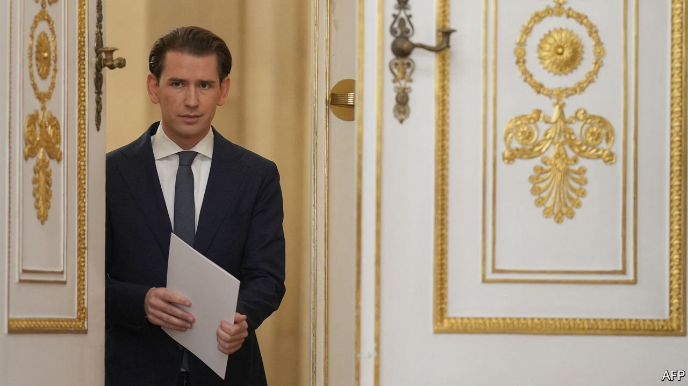

###### Viennese walks

# Sebastian Kurz is forced out of the Austrian chancellery—again 

##### The Czech prime minister is on the way out, too 

 

> Oct 16th 2021 

HE MAY ONLY be 35, but Sebastian Kurz has been involved in enough political intrigue for several lifetimes. On October 9th Mr Kurz was toppled as Austria’s chancellor for the second time in three years, amid claims that he had masterminded a conspiracy to buy himself favourable media coverage. In America Mr Kurz would barely be old enough to run for president. But his career at the top of Austrian politics may already be approaching its end.

Mr Kurz and nine others stand accused of an elaborate plot to upend the leadership of the conservative Austrian People’s Party (öVP), and ultimately of the country. Prosecutors allege that, starting in 2016, the finance ministry siphoned taxpayers’ money to fund bogus opinion polls, published in a compliant newspaper, to help Mr Kurz unseat Reinhold Mitterlehner, then head of the öVP, and take his job. Fake invoices are said to have disguised the ploy. The evidence is in a stash of 300,000 text messages discovered on the phone of Thomas Schmid, a supporter of Mr Kurz who was working at the finance ministry. They show Mr Kurz egging on Mr Schmid; at one point he describes Mr Mitterlehner as an “arse”. (On October 12th a pollster was arrested in connection with the case. Mr Kurz protests his own innocence.)


Mr Kurz tried to cling on when the news broke, but resigned under pressure from the Greens, the öVP’s coalition partner, and his own party’s regional barons. He proposed as his replacement Alexander Schallenberg, an ally who had served as his foreign minister since 2019. A career diplomat, Mr Schallenberg shares his erstwhile boss’s tough views on migration but not his instincts for populist tub-thumping, nor his obsession with media coverage. This will relieve other EU leaders, many of whom were tiring of Mr Kurz.

Yet will Mr Schallenberg really be in charge? Moments after being sworn in he insisted on Mr Kurz’s innocence and said he would continue to consult him closely. Insiders say he does not want to trample on Mr Kurz’s democratic mandate. Mr Kurz says he will not be a “shadow chancellor”. But he immediately appointed himself head of the öVP’s parliamentary group, a position that affords him a seat at the cabinet (and immunity from prosecution, although he says he will seek to have this lifted). He will hope to return as the party’s candidate for chancellor at the next election. That is due in 2024, though so delicate is the political mood that few believe the öVP-Green coalition can survive that long.

Still, if the obsequies for Mr Kurz are premature, so are expectations he can simply ride out the storm, says Marcus How at VE Insight, a Vienna-based political consultancy. Even if there is no smoking gun linking Mr Kurz to the poll-buying conspiracy, further revelations are likely as prosecutors wade through Mr Schmid’s messages. Their investigations, and thus possible criminal charges, will rumble on for years. Once Mr Kurz loses his aura of political invincibility, his party’s regional chiefs will drop him quicker than a hot Knödel.

The broader stench engulfing Mr Kurz has become hard to ignore. Once feted as the Wunderkind future of European conservatism, his freshness appealed to voters tired of the grubbiness that has long bedevilled Austrian public life. Instead he has been embroiled in endless scandal. The first coalition he led, a controversial alliance with the far-right Freedom Party (FPö), collapsed in 2019 when an FPö leader was ensnared in a video sting. In May Mr Kurz was accused of perjuring himself before a parliamentary committee investigating corruption. In his brief political life the former chancellor has been in coalition with three of Austria’s four other main parties; all of them have ruptured. That is a warning for anyone else who might think of going into government with him.

Mr Kurz’s fall coincided with a comparable defenestration in Prague. On October 9th Andrej Babis, the Czech Republic’s billionaire prime minister, lost an election to a five-party alliance. Mr Babis has also faced allegations of corruption, linked to EU subsidies channelled to his agricultural empire. (He denies wrongdoing.) Yet Milos Zeman, the erratic president, may try to delay the exit of Mr Babis, an ally, as long as possible. One day after the election Mr Zeman was rushed to hospital, leaving the country in constitutional limbo. Like Mr Kurz, Mr Babis is down—but not yet out. ■

