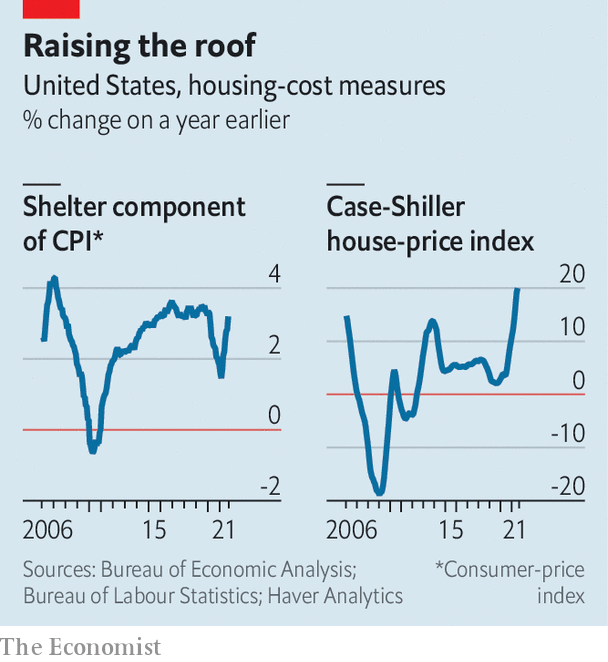

###### Rental resurgence

# Another upward force on American inflation: the housing boom 

##### Property could join energy, shipping, used cars and wages as a contributor to rising consumer prices 

 

> Oct 16th 2021 

FROM ENERGY and used cars to wages and shipping, the list of factors pushing up American inflation is growing fast. Could housing be next? According to figures published on October 13th, the consumer-price index (CPI) rose by 5.4% in the year to September. Its shelter component increased by 3.2%, up from 2.8% in the year to August. And it has further to run.

Shelter has the biggest weight in the CPI, making up 32% of the basket of goods and services used to construct the index. The component is broken into two main buckets: regular rents paid by tenants, and the imputed cost of living in owned homes. Although house prices rose by 20% in the year to July, they do not feed directly into the CPI. That is because statisticians treat home purchases as investment rather than consumption. Instead they capture homeownership by estimating “owners’ equivalent rent”, the amount an owned property could collect based on leased ones nearby. The rental market, therefore, is what drives shelter inflation.


For much of the pandemic both rents and shelter inflation were depressed. But there are two reasons to think the latest pickup in shelter costs will continue. The first is the expiry of the government’s eviction moratorium. The policy had helped renters stay in their homes in 2020, even as lockdowns meant some were unable to work. Many tenants also negotiated lower rents during that time. Now that the moratorium has lapsed, Goldman Sachs, a bank, expects about 750,000 evictions by the end of year. That could lead to a jump in rents. The largest rises occur when a new tenant moves in, says Randal Verbrugge of the Federal Reserve Bank of Cleveland. Rents for new leases are up by 17% compared with what the previous tenant paid, suggests RealPage, a rental site.

 


The second reason why shelter inflation might rise further is that market prices feed through to the inflation figures only slowly. Landlords tend to charge more rent when the value of their property goes up, but with a lag. Rises in new rents also take time to appear in consumer prices, because leases tend to last a year, and the CPI samples rents only every six months or so. President Joe Biden’s Council of Economic Advisers estimates that a one-percentage-point increase in house-price inflation leads to a rise of 0.11 percentage points in the shelter component in 16 months’ time.

A timely measure of rents, published by Zillow, a property site, is up by around 10% on the year. Further rises could follow as more new leases are signed. Laura Rosner-Warburton of Macro Policy Perspectives, a research firm, expects shelter inflation to climb to 4-6% by the end of 2022. That would contribute 1.3-1.9 percentage points to headline inflation, twice its average contribution in the decade before the pandemic. The next inflationary force could be home-grown. ■


