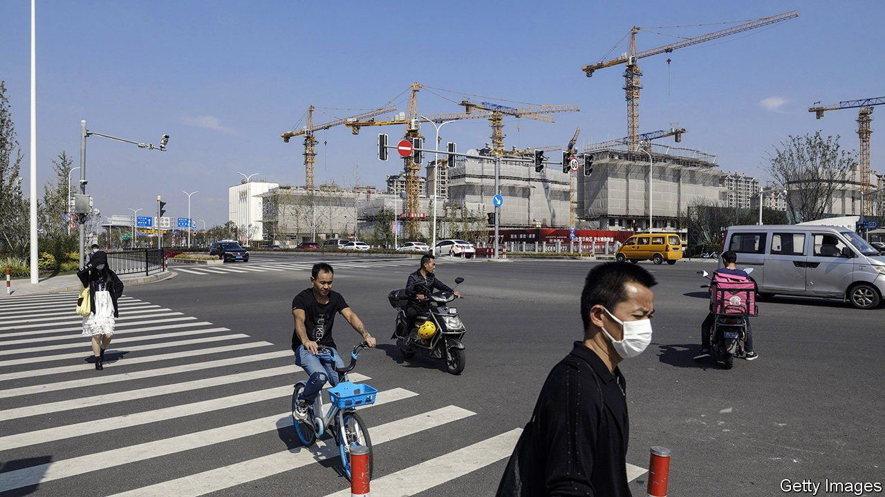
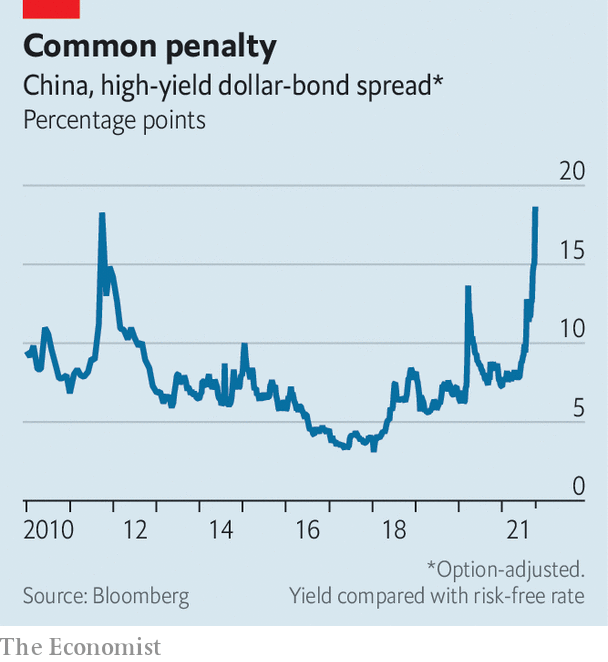

###### Xi’s premium

# Chinese companies suffer an intense cash crunch in offshore bond markets 

##### Spreads on junk bonds are at their highest ever 

 

> Oct 16th 2021 

GLOBAL INVESTORS are all too aware of the discount on the valuations of mainland firms as a result of Xi Jinping’s aim to lower leverage, house prices and inequality in China. Borrowers, for their part, must contend with a “Xi premium” on sorely needed capital. The Chinese leader’s policies may have led to a perilous credit crunch for many companies, especially property developers, in global markets.

Regulators have shaken the foundations of China’s property market by toughening up on the amount of leverage developers can take on. This has pushed Evergrande, a home builder with more than 1,000 projects across China and $300bn in liabilities, towards collapse. It has missed five payments on offshore-dollar bonds in the past month. Several rivals have followed suit. Fantasia defaulted on offshore bonds on October 4th. Sinic Holdings said on October 11th that it would probably default soon. Modern Land and Xinyuan Real Estate are hoping to delay payments on offshore bonds.


This wave of distress has led to a crunch in the offshore junk-bond market. Spreads (ie, yields compared with the risk-free rate) have reached nearly 17 percentage points, the widest gap on record. The market has for the most part shut to developers hoping to refinance their debts in October, says Sandra Chow of CreditSights, a research firm. One investment manager at a global institution says even non-property companies are being priced out, noting that “this is the definition of contagion.”

 


The problems run much deeper than the string of missed payments. One fear is that Chinese authorities are pressing companies to ignore the interests of creditors and to sell offshore assets and siphon cash back home, in a desperate attempt to ensure that unfinished properties that have already been sold to Chinese people are completed. The leading theory among investors goes that Evergrande is buying time to prevent its offshore assets being frozen by offshore creditors. A “privately negotiated” resolution on a yuan bond was announced on September 22nd in order to prevent an instant cross-default on dollar bonds. Although the group has since missed dollar-bond payments, a 30-day grace period gives the group until October 23rd before it is deemed to be in default and creditors can move to seize its offshore assets. In the meantime, it is selling all it can, including a large stake in its property-services unit and its offices in Hong Kong.

Other groups may be considering a similar strategy. In recent weeks developers such as Fantasia and Sinic have been reluctant to pay offshore coupons. Some instances have surprised investors, suggesting that companies may be able but not willing to make these payments, says Arthur Lau of PineBridge, a Hong Kong-based investment manager.

If such behaviour is tolerated, or even encouraged, by the authorities, the impact could be devastating for the $1trn market for dollar bonds issued by Chinese companies. More defaults could come if yields stay high. Having crushed many private conglomerates that sought to buy overseas assets, and impeded Chinese share sales in New York, Mr Xi may now be putting his stamp on the offshore-bond market. ■

