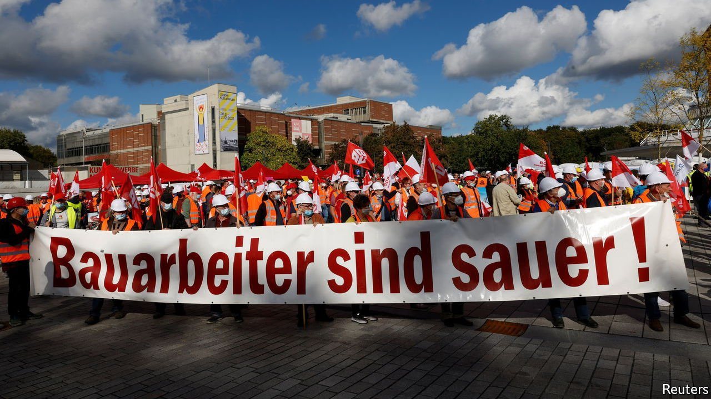

###### Hard bargains

# Germany’s workers are in the strongest position in 30 years 

##### And they are demanding more pay 

 

> Oct 16th 2021 

A HIGHLY SKILLED workforce, harmonious labour relations and restrained wage growth: all have long underpinned Germany’s economic success. But, as the recovery from the ravages of covid-19 continues, the three pillars are looking wobbly. A shortage of skilled workers is becoming more acute. Pay is rising against the backdrop of higher inflation. And some disgruntled unions are even threatening to strike.

Average wages in Germany rose by 5.5% in the second quarter, compared with the previous year. That may in part reflect a base effect: pay fell by 4% in the same period in 2020, when the economic shock from the pandemic hit. Still, workers today are in their strongest position in 30 years, says Gabriel Felbermayr of the Kiel Institute for the World Economy, a think-tank. Bosses are chasing after skilled staff in particular. Automation and migration cannot make up the shortfall, says Carsten Brzeski of ING, a bank.


Trade unions are not shy about using their increased power. “We are demanding a 4.5% pay increase for wood and plastic workers immediately, plus extra early-retirement funds,” says Frederic Striegler of IG Metall, Germany’s biggest union. Industry bosses are offering an increase of only 1.2% next year, and 1.3% the year after. That’s not enough, says Mr Striegler, as it will not compensate workers for inflation. Consumer prices rose by 4.1% in September, the highest rate in 28 years (though some of that reflects one-off factors, such as a temporary value-added-tax cut in 2020).

Unions used to prefer preserving jobs to securing pay rises, and so tended to come to an agreement with bosses who were unable to afford higher wages. Things are now more fractious. Workers at Carthago, a maker of motorhomes, went on strike this week, demanding a fair share of a surge in profits from booming demand for caravans. More strikes are planned at other makers of caravans and furniture.

The boss of IG Bau, a union representing some 900,000 construction workers, warned that it would call its first nationwide strike in 20 years if employers did not meet demands for a wage increase of 5.3% next year, as well as higher payments for travel to sites and a pay rise for east German construction workers to match rates in the west. Germany’s 16 states are in talks with unions about higher pay for more than 2.3m public-sector workers. Unions are demanding a 5% pay increase, with a rise of at least €150 ($173) a month for the least-paid and of €300 for health-care workers.

All told, an average wage increase of 5% next year seems “realistic”, reckons Mr Felbermayr. Pay in industries that rely on skilled workers may rise by even more. But the increases will not fan inflation further, at least not in the short term, says Mr Brzeski. Even after the rises seen so far this year, real incomes are still below pre-pandemic levels. And most firms in most industries can afford reasonable pay increases, as the state shouldered a large chunk of the cost of the pandemic. Yet staff shortages may well return as the population ages: the supply of labour is set to dwindle from 2023. Restoring harmony between workers and bosses could be a tall order.


