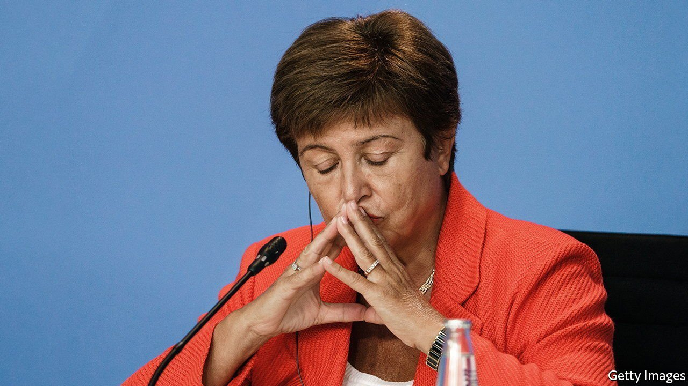

###### The International Monetary Bank

# The IMF decides to keep its boss 

##### But not everyone is happy 

 

> Oct 16th 2021 

IT TOOK 24 days and seven bureaucratic steps to start a business in Beijing, according to the World Bank’s report on the ease of doing business in 2017. But an investigation released last month concluded that the bank’s leaders, including Kristalina Georgieva, its former second-in-command, had pressed staff into doctoring the report to flatter China. The allegations left Ms Georgieva fighting to save her current job as head of the IMF. On October 11th the fund’s board finally decided her fate. The evidence, it said, “did not conclusively demonstrate” that Ms Georgieva “played an improper role”. It had taken almost 26 days and eight meetings for the board to finish its business. But at the end of it all, she could keep her job.

Ms Georgieva, a former EU commissioner, had won the backing of Britain, France, Germany and Italy, the powers that installed her in the first place. The finance ministers of 17 African countries praised her “human touch”, as well as the $30bn the IMF mobilised last year to help the continent in its fight against covid-19. Two former chief economists of the bank (Lord Nicholas Stern and Joe Stiglitz), one of whom has a Nobel prize, also expressed strong support. Mr Stiglitz described the investigation as a “hatchet job”.


Arrayed against her in fearful symmetry were two other former chief economists of the bank (Anne Krueger and Paul Romer), one of whom has a Nobel prize. She also had to win over America’s Treasury, led by Janet Yellen. It was under pressure from both sides of Congress, which are united in alarm about China’s growing global influence. In a call with Ms Georgieva on October 11th, Ms Yellen said there was not now “a basis for a change in IMF leadership”, but that the investigation raised “legitimate issues” and that the Treasury will “evaluate any new facts or findings”. (Investigators are still working on a report for the bank’s human-resources department on potential misconduct by former or current staff.)

Ms Georgieva also benefited from the perception that the changes made to the report in 2017 were mere judgment calls. But a separate investigation by the bank released in December 2020 established that the tweaks were, in fact, not judgment calls but errors. To take one example: the seven steps and 24 days required to start a business in Beijing had been incorrectly cut from nine and 26 at the last minute.

The manipulation of the data in this report and the one published in 2019 was bad enough that eight World Bank staff members eventually blew the whistle, triggering the investigation. Both the fund and the bank will have to ensure future whistleblowers feel protected enough to raise the alarm earlier. Ms Georgieva will have to prove that she is not a pushover for the fund’s bigger members and can insulate its technical judgments from politics. The fund is supposed to review the voting structure of its board by the end of 2023. It is hard to imagine Ms Georgieva persuading America to back any redistribution of votes to China, as the country’s growing economic weight would warrant.

If Ms Georgieva feels ill-treated by the bank, she may get the last laugh. Even before she took over the fund, it was encroaching on the bank’s turf, tackling issues such as inequality, climate and gender. Its response to the pandemic demonstrated its ability to lend more money, faster than the bank possibly can. Insiders share a joke loosely inspired by an old French quip about a divided Germany. Is Ms Georgieva unhappy with the bank? On the contrary. She loves it so much she would be glad to see two of them—the one she used to work for and the institution she is, still, leading. ■


